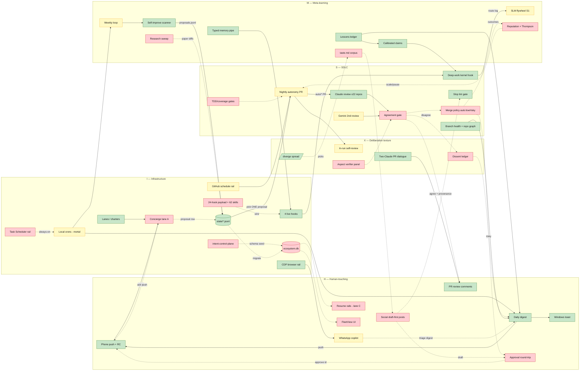

# SYSTEM MAP — the whole Claude OS, honestly scored

Status: living map (re-audit when a phase lands). Created 2026-07-24 by a fresh-context
mapping agent, from direct reads of: `tools/*`, `dot-claude/*` (hooks/rules/commands/
agents/skills/bin), live `~/.claude/settings.json` + `~/.claude/hooks/`, `.github/
workflows/`, `state/*`, `docs/{prd,adr,specs,analysis}`, `intent-control-plane/`,
`work-docs/`, CronList, digest/scanner/flywheel outputs.

Evidence classes (calibrated-claims.md): rows marked from direct file/command reads are
VERIFIED; rows relying on TODO/PRD claims I could not independently smoke are noted.
Key verified ground truths this map corrects against the prose:

- **Only 4 hooks are LIVE-wired** in `~/.claude/settings.json` (session-recall,
  kernel-anchor, precompact-handoff, notify-toast) + `~/.claude/hooks/` holds 9 files.
  The 24-hook set in `dot-claude/hooks/` is payload: staged/imported, not enforcing. VERIFIED.
- Live global model is `claude-fable-5[1m]` (pending operator flip to sonnet). VERIFIED.
- Both local crons (digest 07:03, weekly loop Mon 08:17) are **session-only** — they die
  with the session; no Task Scheduler job exists. VERIFIED via CronList.
- `docs/taste.md` does not exist → zero /diverge picks ever recorded. VERIFIED.
- Flywheel has 3 router decisions logged (target ~10k before training). VERIFIED.
- Nightly autonomy workflow exists in v2 form; **first scheduled run has not happened**. VERIFIED (workflow file + PRD row STAGED).
- 22-repo OAuth rollout + PR #2 live review demonstration: TODO/PRD claims, not re-smoked here (STAGED evidence).

Scoring: `inv` = effort invested 0-5 (0 = nothing, 1 = spec/ADR only, 2 = artifact exists,
3 = works + ran at least once, 4 = works + repeatedly exercised, 5 = hardened). `need` =
effort the component's role in the north star actually requires. **Δ = need − inv is the
priority signal.** Spec-only rows score inv ≤ 1 by rule.

Status vocabulary: `live` (wired + fired at least once), `staged` (artifact exists, not
fired / blocked), `spec-only` (ADR/spec/prose, no working artifact), `imported-unwired`
(work-archive import present on disk, nothing binds it).

---

## H — HUMAN-TOUCHING (everything that reaches a human)

| Cat | Component | What it does | inv | need | Status |
|---|---|---|---|---|---|
| H | Phone push (PushNotification + agentPushNotif) | approvals + P0 alerts land on the phone; verified round 2026-07-22 | 3 | 3 | live |
| H | Windows toast (notify-toast.ps1, the ONE async Notification hook) | desktop attention rail | 2 | 2 | live |
| H | Daily digest (tools/digest/build_digest.py + 07:03 cron) | deterministic <200-char push + digest.md over TODO/branch-health/lessons/pending-decisions; ran + pushed 2026-07-24 | 3 | 4 | live (delivery mortal: session-only cron) |
| H | PR review comments (claude-code-review.yml, 22 repos) | always-fresh full review on every PR push; PR #2 caught 4/4 seeded defects | 4 | 4 | live (rollout evidence = TODO claim) |
| H | Approval round-trip (inbound "approve <id>" → approved_at) | the ONLY inbound human gate for risky merges + social publish; push is outbound-only today | 1 | 5 | spec-only (spec §P0.5) |
| H | WhatsApp copilot (tools/whatsapp: cdp_driver, wa_read_group) | read rail proven against live DOM 2026-07-22; triage digest / voice drafts / coaching NOT built; send path deliberately unbuilt | 2 | 4 | staged |
| H | Social posts (post_queue + social-media-agent.bundle, ADR-0014) | draft-first LinkedIn/X pipeline in Shoval voice; bundle (44 refs) unexcavated | 1 | 4 | spec-only |
| H | Resume rails to lane C (AUTO-15) | crons/review-workflow/push-approvals serving new-recruit; not split into verifiable rows | 1 | 4 | spec-only (policy set) |
| H | FleetView UI (spec 2026-07-24-command-center-superior) | control surface where self-improvement is visible + one-click approvable; ancestors (tower, ICP) imported | 1 | 4 | spec-only |
| H | Voice/visual explainers (skills + trigger hooks + pop-voice/pop-visual) | trigger-word media aids; hook files deployed in ~/.claude/hooks but NOT bound in settings | 2 | 1 | imported-unwired |
| H | Operator runbook + pending-decisions list | the manual-unblock surface (token, keys, Task Scheduler, model default) | 2 | 2 | live |
| H | Learning-card emitter → הסדנה (SETUP-OS #10) | bridge from shipped work to lane D study queue | 0 | 2 | spec-only |

## M — META-LEARNING (the system improving itself)

| Cat | Component | What it does | inv | need | Status |
|---|---|---|---|---|---|
| M | Lessons ledger (state/lessons.jsonl, 9 rows L001-L009) | incident → lesson → enforcement artifact; digest surfaces the 3-4 open ones | 3 | 3 | live |
| M | Calibrated-claims register (rules/calibrated-claims.md + kernel-anchor v2) | VERIFIED/STAGED/ASSUMED tags injected EVERY prompt; downgrades = logged calibration losses | 3 | 4 | live (injection); downgrade logging still manual |
| M | Self-improve scanner (tools/selfimprove/scan.py → proposals.jsonl) | reads real signals (TODO, git drift, hook health, test gaps, flywheel volume) → 11 ranked typed proposals | 3 | 4 | live (signals still shallow — mostly TODO echoes) |
| M | Weekly self-improvement loop (cron Mon 08:17) | rerun scanner + propose harness diffs | 2 | 4 | staged (session-only cron; loop = scan only) |
| M | Research loop (AUTO-17, research_sweep.py) | papers → practice-diff proposals into the queue | 0 | 3 | spec-only (file unbuilt) |
| M | SLM flywheel S1 (reflex_router + route_classify + router_decisions.jsonl) | logs route/risk/escalate per prompt as future training data; 3 rows vs ~10k target | 2 | 3 | staged |
| M | Reputation (ADR-0008 + reputation table + Thompson routing AUTO-20) | external-truth-only track record steering allocation | 1 | 3 | spec-only |
| M | /diverge (dot-claude/commands/diverge.md) | verbalized sampling, 5 candidates w/ p_conventional, operator picks | 2 | 3 | live (command exists; zero recorded uses) |
| M | taste.md corpus | accumulated picks + reasons conditioning future creative work | 0 | 3 | spec-only (file absent — VERIFIED) |
| M | Memory + web write pipe (auto-memory + tools/memory/web_to_memory.py) | typed reference cards w/ source+staleness; one real card written + recalled | 2 | 3 | live (thin) |
| M | Capability honesty matrix (L1) | table of what each rail verifies vs claims | 0 | 2 | spec-only (this map is its first draft) |

## S — SDLC (forge loop, review fabric, autonomy discipline)

| Cat | Component | What it does | inv | need | Status |
|---|---|---|---|---|---|
| S | Deep-work kernel injection (kernel-anchor.sh, UserPromptSubmit) | acceptance-checklist-first, loop-until-covered, evidence-format done — every prompt | 3 | 3 | live |
| S | Forge-loop / TDD gates (tdd-enforcement, coverage-enforcer.sh, verification-before-completion.sh) | RED→GREEN + no-done-without-proof at tool level; present in payload, NOT in live settings | 2 | 3 | imported-unwired |
| S | Claude review workflow (22 repos, always-fresh on synchronize) | fabric reviews all PRs incl. its own (dogfooding) | 4 | 4 | live |
| S | Gemini second reviewer (github/gemini-review.yml + a2a-gemini-call.py + rollout_gemini_key.sh) | different-family decorrelated review, free tier | 3 | 4 | staged — BLOCKED(operator: GEMINI_API_KEY) |
| S | Agreement gate comparator (ADR-0004) | compare two reviews → agree=post w/ provenance, disagree=escalate; NOTHING compares them yet | 1 | 4 | spec-only |
| S | Nightly autonomy (claude-nightly.yml v2: no-Bash agent, auto/* cap fail-closed, in-run review) | cloud rail works laptop-off; picks ONE proposal, opens labeled PR | 4 | 4 | staged (first scheduled run pending) |
| S | Merge policy (AUTO-11: auto:low auto-merge / auto:risky → phone) | closes the loop from review to landing | 1 | 4 | spec-only |
| S | Slop lint (tools/slop_lint.py + /slop command) | Antislop banlist gate, verified exit-1 on hits | 2 | 3 | live (on-demand; not bound to Stop/CI) |
| S | Branch health sweep (tools/health/branch_sweep.py) | 22 repos / 80 branches classified; 20 merged-deletable found; no schedule, no auto-delete | 3 | 3 | live (one-shot) |
| S | Repo portfolio graph + blast radius (tools/graph/) | 22 nodes/72 edges d2+sqlite; intra-repo import graph for reviewer scaling | 3 | 2 | live (one-shot) |
| S | Boundary-contracts / repo-topology / prod-means-smoked rules | review standards encoded as rules; enforced via review prompts, not automated gates | 2 | 2 | live (prose+prompt level) |
| S | OS repo's own test CI | claude-setup has NO test workflow; ICP's 48 test files never run in CI here | 1 | 3 | spec-only |

## X — DELIBERATION TEXTURE (visible multi-agent disagreement — the thin category)

| Cat | Component | What it does | inv | need | Status |
|---|---|---|---|---|---|
| X | Two-Claude review dialogue (PR #2) | GitHub-Claude reviewed, session-Claude replied — a visible agent-vs-agent exchange, once | 2 | 3 | live (demonstrated once, not institutional) |
| X | In-run self-review on nightly PRs | fresh-eyes second job reviews the nightly PR in the same workflow | 2 | 3 | staged |
| X | Dissent ledger / "agents disagreed" reporting | durable record of verdict conflicts surfaced to operator (digest/FleetView) | 0 | 4 | spec-only (one designed line: "disagree → digest"; nothing built) |
| X | Agreement-gate disagreement path | the ONLY structural producer of dissent signal; blocked behind Gemini key + comparator | 1 | 4 | spec-only |
| X | /diverge candidate spread | 5 candidates with conventionality probabilities SHOWN to operator = deliberation made visible | 2 | 3 | live (unused so far) |
| X | Adversarial downgrade pass | own red-team pass downgraded 9/20 fresh PRD rows within hours — happened once, manually, no cadence | 1 | 3 | spec-only (as a practice) |
| X | Aspect-split verifier panels (Deep Work rule 12) | parallel single-aspect verdicts (correctness/security/contract/simplicity/slop), each binary + evidence | 0 | 3 | spec-only |
| X | Persona review economy (spec + 23 agent files) | contracts, reputation, PIP/firing — a debate ECONOMY; personas imported as prose | 2 | 3 | imported-unwired (spec active, market unbuilt) |

## I — INFRASTRUCTURE (state, schedulers, hooks, lanes, bridges)

| Cat | Component | What it does | inv | need | Status |
|---|---|---|---|---|---|
| I | ecosystem.db (ADR-0011, tools/eco/db.py) | system-of-record: sessions/proposals/runs/lessons/reputation/post_queue/repo_registry; named unblock for AUTO-04/14/19 | 1 | 5 | spec-only |
| I | Interim state files (claims.jsonl, lessons.jsonl, compact-log.md, proposals.jsonl) | scanner-safe JSONL carrying the OS until the db lands | 2 | 2 | live |
| I | Rail 1 — local CronCreate (digest 07:03, weekly 08:17) | local scheduled work; BOTH session-only → die on session death | 2 | 4 | staged (mortal) |
| I | Rail 2 — Windows Task Scheduler | always-on local rail (concierge relaunch, digest, WhatsApp) | 1 | 4 | spec-only — BLOCKED(operator, runbook §5) |
| I | Rail 3 — GitHub Actions schedule | cloud rail, laptop-off; nightly cron + event-triggered reviews | 3 | 4 | staged (schedule) / live (events) |
| I | Live hook set (4: session-recall, kernel-anchor, precompact-handoff, notify-toast) | boot recall, kernel injection, compaction handoff, toast — the actual enforcing surface | 3 | 3 | live |
| I | Staged hook payload (24 in dot-claude/hooks: stop-checklist, intent-capture, protect-infra, watchdog, eval-gate, hive-review-bridge…) | the work-grade enforcement mesh; present, not bound in live settings | 2 | 3 | imported-unwired |
| I | Lanes/charters (ADR-0013 + docs/charters.md + claims protocol) | structural anti-convergence: A concierge / B harness / C resume / D learning | 2 | 3 | live (doc + seed claim; L006 still open) |
| I | Concierge lane A (AUTO-05) | durable phone-facing intake session + relaunch job; kills the orphan-RC problem (L007) | 1 | 5 | spec-only |
| I | a2a bridges (gemini staged; codex retired ADR-0007; foundry/audit imported) | model-to-model call plumbing for the second reviewer + audit trail | 2 | 3 | staged/imported-unwired |
| I | CDP browser rail (cdp_driver.py, port 9224 owner; /cdp command) | logged-in-surface automation (WhatsApp proven); /cdp still carries WSL-era paths | 3 | 3 | live (needs purge) |
| I | intent-control-plane/ (114 files, 40 modules, 48 test files) | the excavated ancestor: intent ledger, spawn_grade, standards scorecard, tower backend; schema seed for ecosystem.db | 4 | 3 | imported-unwired |
| I | dot-claude payload (17 rules, 7 commands, 23 agents, 62 skills, 60 bin) | the deployable harness estate; rules/commands mostly live, agents/skills mostly unwired (estate triage = SETUP-OS #12, open) | 4 | 3 | mixed (live + imported-unwired) |
| I | dot-codex/ (87 files) | retired executor's harness (ADR-0007: Codex removed) | 3 | 0 | imported-unwired (archive candidate) |
| I | OAuth token fabric (CLAUDE_CODE_OAUTH_TOKEN on 22 repos) | subscription-billed auth for all cloud autonomy; nightly = its canary | 3 | 3 | live (per TODO; not re-smoked here) |
| I | Docs control plane (PRD×2, 14 ADRs, 4 active specs, INDEX, TODO, SESSION-BOOT) | the disk-is-memory spine; 60-second cold boot | 4 | 3 | live |
| I | work-docs/ + master-plans/ + research corpus (240+ docs) | provenance + excavation source, deliberately inert | 3 | 1 | imported (reference) |

---

## Diagram — real data flows, colored by status

Green = live, yellow = staged, red = spec-only / unwired. Dashed edges = designed but not
yet flowing.

(44 nodes. The red cluster in the middle of the flow — APPROVE, AGREE, MERGEPOL, ECODB,
CONC, DISSENT — is not decoration: every green producer currently dead-ends into a red
consumer. The system generates work and reviews but cannot yet close a loop without a
human hand-carrying state.)

---

## Top 10 imbalances (need − invested; the priority queue this map exists to produce)

| # | Component | inv→need | Δ | Why it is the bottleneck |
|---|---|---|---|---|
| 1 | Approval round-trip (H) | 1→5 | 4 | Push is outbound-only. Until "approve <id>" writes approved_at, BOTH gated loops (risky merge AUTO-11, social publish ADR-0014) are structurally impossible — every other investment upstream of them stalls here. |
| 2 | ecosystem.db (I) | 1→5 | 4 | The named unblock for work-claims (AUTO-04), post_queue (AUTO-14), FleetView (AUTO-19), runs/reputation. Every JSONL interim is a debt against this one artifact. Schema + ancestor code already imported (ICP) — this is excavation, not invention. |
| 3 | Concierge lane A (I) | 1→5 | 4 | L007 open: phone still spawns orphan sessions. The north star's first hop (intent from phone) has no durable landing. Spec §P0.5 is written; nothing runs. |
| 4 | Dissent ledger / disagreement surfacing (X) | 0→4 | 4 | The operator's X category is ~empty by design debt: one demonstrated dialogue, one staged self-review, and NO artifact anywhere that records "agents disagreed" or shows it. The agreement gate's disagree branch is the natural producer — build the ledger the day the gate exists, or verdicts stay invisible. |
| 5 | Agreement gate comparator (S) | 1→4 | 3 | Two review producers exist (one live, one staged) but nothing compares verdicts, posts provenance, or escalates conflict. Without it, "two-model review" is two monologues. |
| 6 | Merge policy auto:low/auto:risky (S) | 1→4 | 3 | Nightly PRs (staged) will pile up unmergeable; the autonomy loop opens work it can never land. Depends on #1 for the risky branch. |
| 7 | Windows Task Scheduler rail (I) | 1→4 | 3 | Both local crons are session-only (VERIFIED). Every local promise — digest, weekly loop, future concierge relaunch — silently dies with the session until this operator-blocked step runs. Cheapest unblock on the list (~10 min). |
| 8 | Research loop AUTO-17 (M) | 0→3 | 3 | The "system generates its own work" claim currently rests on a scanner that mostly echoes TODO.md. research_sweep.py is the second, genuinely generative source; unbuilt. |
| 9 | Social pipeline excavation (H) | 1→4 | 3 | 44 branches of prior art sit unexcavated in the bundle while the pipeline is spec'd from scratch — an excavate-before-building violation in waiting. Blocked behind #1 and #2 for its gate + queue. |
| 10 | taste.md + /diverge adoption (M/X) | 0→3 | 3 | The wide-then-curate mechanism is live as a command and has fired zero times (file absent, VERIFIED). Convergence/slop defenses that never run are prose (ADR-0005). |

Runners-up (Δ3): FleetView (waits on #2), resume rails AUTO-15 (waits on #2), OS repo test
CI (48 imported test files never run). Δ2 worth naming: WhatsApp triage/drafts on the
proven reader; hook-payload wiring (24 staged hooks vs 4 live — wire deliberately, not
wholesale); scanner signal depth.

**Negative deltas (over-invested vs need — archive/stop candidates):** dot-codex/ 87
files (need 0, retired ADR-0007); voice/visual explainer chain (need 1); 62-skill estate
carried unwired (estate triage SETUP-OS #12 is the open fix); repo graph re-runs beyond
digest input. Effort flowing here is effort not flowing into rows 1-4.

**The one-sentence read:** the system's green is concentrated in H/M/S observation-and-
review surfaces, its red is concentrated in the CONNECTIVE tissue (db, approval, gate,
concierge) — so today it observes, reviews, and reports like an OS, but closes loops
like a collection of scripts.
