# Code audit, the 37-file analysis sweep, and where this session's research landed

Status: measurement, 2026-08-03. Three passes the unified PRD asserted and did not show.
Written because the PRD read as a set of tables rather than a wired argument, and because
"analysis was sampled, not read" is not an acceptable coverage line when the operator asks
for all of it.

Three questions, answered in order:

1. **Every `.py` file, audited on every metric.** §1.
2. **All 37 analysis documents, one by one.** §2.
3. **Where this session's research lands, in full.** §3.

And then §4, which is the part the PRD was missing: **the chain, not the table.**

---

## 1. Code audit: 93 files, 37 directories, 23,736 lines

Measured by parsing every file with `ast` and cross-referencing `tests/`,
`.github/workflows/`, `quality-contract.json` and `docs/prior-art/`.

### 1.1 A finding I had to withdraw before publishing it

The first pass reported **20 components over 300 lines with no prior-art record**, which
would have been a serious gate failure. It was wrong. **`docs/prior-art/` is keyed by
DIRECTORY, not by file stem**, and every record carries `"component": "tools/gate"` rather
than `"component": "gate.py"`. Matching on the file name produced twenty false positives.

Corrected result: **zero components over 300 lines are missing a record.** The gate was
right and my first matcher was not. Kept in the document rather than deleted, because a
sweep that shows only its final number is asking to be trusted instead of checked, and
because this is the same class as `L-2026-07-29-a`.

### 1.2 The rollup, by directory, which is prior-art's own unit

| Directory | files | LOC | max branch | selftest | in tests | in CI | in contract | prior art |
|---|---:|---:|---:|:--:|:--:|:--:|:--:|---|
| `tools/gate` | 2 | 1754 | 30 | Y | Y | Y | Y | yes |
| `tools/audit` | 4 | 1664 | 24 | Y | Y | Y | . | yes |
| `tools/audit/mutations` | 14 | 1522 | 0 | Y | Y | Y | Y | yes |
| `tools/review` | 2 | 1507 | 16 | Y | Y | Y | Y | yes |
| `tools/bus` | 2 | 1397 | **41** | Y | Y | Y | . | yes |
| `tools/workspace` | 11 | 1394 | 9 | . | Y | . | . | yes |
| `tools/e2e` | 1 | 1143 | 25 | Y | Y | Y | Y | yes |
| `tools/refute/checks` | 8 | 1075 | 24 | Y | Y | . | . | yes |
| `tools/intent` | 4 | 1016 | 14 | . | Y | . | . | yes |
| `tools/snapshot` | 1 | 826 | **42** | Y | Y | Y | . | yes |
| `tools/supply` | 1 | 807 | 15 | Y | Y | . | . | yes |
| `tools/browser` | 1 | 738 | 12 | Y | Y | Y | Y | yes |
| `tools/timetravel` | 1 | 724 | 11 | Y | Y | . | . | yes |
| `tools` (root) | 4 | 675 | 12 | . | Y | . | . | yes |
| `tools/lib` | 5 | 657 | 14 | Y | Y | . | . | yes |
| `tools/skilleval` | 1 | 578 | 20 | Y | Y | Y | . | yes |
| `tools/docmap` | 1 | 532 | 20 | Y | Y | . | Y | yes |
| `tools/map` | 1 | 520 | 10 | Y | Y | . | Y | yes |
| `tools/refute` | 1 | 509 | 20 | Y | Y | Y | . | yes |
| `tools/trycmd` | 1 | 498 | 20 | Y | Y | . | . | yes |
| `tools/openrouter` | 1 | 467 | 11 | Y | Y | . | . | yes |
| `tools/reclaim` | 2 | 457 | 19 | . | **.** | . | . | yes |
| `tools/hookgate` | 2 | 432 | 17 | . | Y | . | . | yes |
| `tools/ghpub` | 1 | 387 | 26 | . | Y | . | . | yes |
| `tools/wsl` | 2 | 353 | 19 | . | **.** | . | . | yes |
| `tools/whatsapp` | 4 | 311 | 11 | . | **.** | . | . | yes |
| `tools/channel` | 1 | 285 | 10 | Y | **.** | . | . | n/a |
| `tools/nvidia` | 1 | 262 | 8 | Y | Y | . | . | n/a |
| `tools/graph` | 2 | 198 | 13 | . | **.** | . | . | n/a |
| `tools/selfimprove` | 1 | 179 | 20 | . | Y | . | . | n/a |
| `tools/hookgate/bench` | 3 | 171 | 7 | . | **.** | . | . | n/a |
| `tools/health` | 1 | 149 | 13 | . | **.** | . | . | n/a |
| `tools/transcribe` | 1 | 149 | 9 | . | Y | . | . | n/a |
| `tools/recall` | 1 | 147 | 17 | . | **.** | . | . | n/a |
| `tools/digest` | 1 | 101 | 7 | . | Y | . | . | n/a |
| `tools/local` | 2 | 94 | 3 | . | Y | . | . | n/a |
| `tools/memory` | 1 | 58 | 2 | . | **.** | . | . | n/a |

### 1.3 What the columns say

- **0 parse failures. 0 orphans.** Every one of the 93 files is referenced from outside its
  own directory. This **refutes** the earlier standing claim that
  `tools/refute/checks/portable_claims.py` was an orphan: it has four inbound references.
- **1 file has no module docstring**, `tools/hookgate/bench/wslbench.py`, 19 lines.
- **20 of 37 directories carry a selftest.** The 17 without are the small ones plus five
  that are not small: `workspace` (1,394 LOC), `intent` (1,016), `reclaim`, `hookgate`,
  `ghpub`, `wsl`, `whatsapp`.
- **9 of 37 directories are named nowhere in `tests/`**: `reclaim`, `wsl`, `whatsapp`,
  `channel`, `graph`, `hookgate/bench`, `health`, `recall`, `memory`. Two of them are the
  ones this session just added to (`wsl`).
- **10 of 37 are named in CI. 7 of 37 are named in the quality contract.** So **27
  directories, 60% of the code, are covered only transitively** by the root pytest run.
- **Branch complexity**, the number of branching constructs in the single most complex
  function: `snapshot/snap.py` **42**, `bus/bus.py` **41**, `gate/gate.py` **30**,
  `ghpub/publish_backlog.py` 26, `e2e/flow.py` 25. Those five are where a defect will hide,
  and three of them are oracles.

### 1.4 The one row that should worry a reader

**`tools/bus/bus.py` has a max branch complexity of 41 and is the hash-chained ledger the
repo treats as tamper-evident.** Its mutation spec went from 21-of-23 caught to 23-of-23 on
2026-08-01 after the lock defect was closed. That is good, and 41 branches in one function
is still the highest-risk surface in the repository, because the mutation control can only
catch defects the mutation operators know how to introduce.

**`tools/snapshot/snap.py` at 42 is worse on paper and lower on risk**, because a snapshot
that is wrong is visible; a ledger that is wrong is not.

---

## 2. The 37 analysis documents, one by one

Every file opened, its lead claim extracted, and a verdict on whether its content is
already absorbed into a surface that gets read (`SYSTEM-MAP.md`, `TODO.md`, a spec, a rule)
or is sitting where nothing reads it.

**ABSORBED** means the finding reached a live surface. **STRANDED** means it did not.

| # | File | What it establishes | Verdict |
|---|---|---|---|
| 1 | `07-23-local-model-stress-test` | Hardware probe and throughput benchmark; what open models this machine can run and what they are honestly for | ABSORBED into the SLM-swarm PARK decision |
| 2 | `07-24-creativity-wow-gap` | Names the creativity and deliberation-texture gap; every claim tagged VERIFIED / STAGED / ASSUMED | **STRANDED.** 457 lines. It is the direct ancestor of this session's D3 measured-`p_conventional` work and nothing linked them until now |
| 3 | `07-24-deployment-gap-audit` | Why this setup would not reproduce a one-session shipped game: fleet undeployed, sync script exists and runs the wrong direction | ABSORBED into the skills-sync oracle |
| 4 | `07-24-fleet-verification-gap` | Three things broken, not one: parallel fleet, closed-loop CDP verification, and the loop between them | PARTLY. `tools/e2e/flow.py` and `tools/browser/cdp.py` exist because of it |
| 5 | `07-24-reference-repos-excavation` | CCC and just-my-skills excavated; excavate-before-building applied | ABSORBED into the FleetView spec |
| 6 | `07-24-research-wiring-audit` | Answers "is the research wired": inventory, consumption map, and the AUTO-17 `research_sweep.py` design | **STRANDED.** `research_sweep.py` is still unbuilt and this is imbalance #8 |
| 7 | `07-24-setup-holding-us-back` | Synthesis of five adversarially refuted audit lanes into one verdict | ABSORBED |
| 8 | `07-24-skills-wiring-audit` | Skills estate: deployed vs repo-only, unwired, duplicates across estates | ABSORBED into `skills_sync.py`, and **still true**: 74 in repo, 40 live |
| 9 | `07-24-work-archive-import` | What the work archive contains and what stays bundle-only | ABSORBED |
| 10 | `07-25-claude-mastery-audit` | 628 lines. Repo trust assessment, why Claude appears lazy, the anti-default proof gate | PARTLY. The proof gate became `prove-implementation` |
| 11 | `07-25-claude-mastery-research-prompt` | The research prompt written *before* the deep pass | ABSORBED as method |
| 12 | `07-25-cloudflare-fit` | Does Cloudflare close any of five named weak points; free-tier numbers dated | ABSORBED as a NO for most, and it is the reason nothing Cloudflare was adopted |
| 13 | `07-25-dynamic-setup-decisions` | Decision doc answering the operator's verbatim question set on workflows, effort, thinking, cross-model | ABSORBED into `model-selection.md` |
| 14 | `07-25-effort-and-thinking` | Binary evidence on `effortLevel`, `ultracode`, adaptive thinking | **STRANDED, and it is the file BOUNDARY needs.** It establishes what the knobs do and never measured what they buy |
| 15 | `07-25-free-tier-exploitables` | What closes the five open problems, product by product, inside and outside Cloudflare | PARTLY |
| 16 | `07-25-other-resources` | Ranked by weak-point-closed per hour, with ruthless cuts | ABSORBED |
| 17 | `07-25-our-own-dolt` | Can we build our own Dolt: four options, recommendation, and the deferral | ABSORBED as the Dolt PARK, and it is where `timetravel` came from |
| 18 | `07-25-repo-benchmark-and-star-forensics` | Three-way benchmark, star forensics, honest losses. 13 parallel extraction agents, results read from `journal.jsonl` rather than agent summaries | ABSORBED, and the method is the best in the corpus |
| 19 | `07-26-session-handoff` | Corrections to its own earlier claims, wins with checks, failures | ABSORBED |
| 20 | `07-27-research-transfer-uncertainty-and-oracles` | **The single most important stranded file.** Five findings T1 to T5 from 43 sources. See §2.1 | **STRANDED** |
| 21 | `07-29-albert-prior-art-verdict` | Albert is prior art for the whole repository and is not adoptable | ABSORBED |
| 22 | `07-29-local-dependency-audit` | Tests the operator's fear that his projects depend on the local machine; names the single point of failure | PARTLY |
| 23 | `07-29-long-context-kernel-critique-response` | A 2M-context critique argued the harness is a compensation layer; the ledger refutes its causal story | ABSORBED, and it is the best argument on disk for why the harness exists |
| 24 | `07-29-session-retro-modes-models-workflows-observability` | Auto mode, `/loop`, fable versus opus, whether workflows earn their cost, interruption effects, enforcement maturity | **STRANDED.** Section 2 says the effort experiment ended with no verdict, which is still true |
| 25 | `07-29-where-our-system-stands` | Where we are ahead, where the field is ahead, what is missing entirely | ABSORBED into SYSTEM-MAP |
| 26 | `07-30-context-engineering-and-the-absence-claim-class` | The absence-claim class fired three times in one session; `/context` was never called | ABSORBED into the rules |
| 27 | `07-30-github-repo-triage` | Saved repos triage, two extraction defects found and fixed, the licensing gate | PARTLY |
| 28 | `07-30-native-surface-audit` | What of Claude Code's native surface is wired and what is left on the floor; `ultracode` native, enabled, unconsumed | **STRANDED** |
| 29 | `07-30-point-in-time-reconstruction` | What git already answers and the narrow strip it does not; why `timetravel` was built | ABSORBED |
| 30 | `07-30-self-chat-absorption-batch` | Read-only pass over the operator's WhatsApp self-chat; ledger-ready rows; what he is actually circling | PARTLY |
| 31 | `07-31-density-gate-measurement` | Density and variance shipped; **the threshold is refused on evidence** and this file is the evidence | ABSORBED, and it is why `slop_lint` says "no band fitted" |
| 32 | `07-31-inventory-reconciliation` | The refutation layer returned zero information and had been silent; the spine indexed 22 of 112 documents; 8 of 18 specs declare no status | ABSORBED |
| 33 | `07-31-the-green-test-gradient` | Three instances of scope drifting toward whatever goes green; the hookgate correction | ABSORBED as `L-2026-07-31-e`, and it is the constraint on the autoresearch loop |
| 34 | `08-01-fog-of-war` | 45 of 1,269 documents name things that do not exist; **21 of 92 tools invoked by nothing**; Zion unreadable; the gate cannot certify the tree it leaves behind | ABSORBED into TODO. **§1.3 above refutes the 21-of-92 orphan number: measured today it is 0 of 93** |
| 35 | `08-01-pocock-skills-teardown` | Pocock's skills repo measured against ours; the wayfinder concept generalised | ABSORBED, wayfinder and skillmap now exist |
| 36 | `08-01-ponytail-audit-prompt-archaeology` | **2,806 prompts over 30 active days.** The dominant signal is interruption, not a forgotten request. The failure record is unreadable by its own reader | **STRANDED, and it is BOUNDARY's ground truth** |
| 37 | `08-03-math-trends-and-model-stack` | This session. TabPFN-3, Chronos-2, embeddings, NVIDIA, singular learning theory | new |

### 2.1 The stranded file that changes the design

`2026-07-27-research-transfer-uncertainty-and-oracles.md` carries five findings against 43
sources and **not one of them reached a rule, a hook, or a gate domain.** Its section
headings are the whole argument:

- **T1.** The confidence gate in the spine is uncalibrated, and probably ineffective.
- **T2.** The human gates are unmeasured, so nobody can tell if they still work.
- **T3.** Per-check guarantees do not compose into an end-to-end guarantee.
- **T4.** Self-annotated fixtures are the BIRD defect, at smaller scale.
- **T5.** Mutation testing is here, metamorphic testing is entirely absent.

**T1 and T2 are BOUNDARY's problem statement, written eight days before BOUNDARY.** The
spine's L0 confidence gates (0.90 autonomous, 0.70 to 0.90 with a proof gate, below 0.70
ask) are thresholds nobody fitted. That is the same defect as `slop_lint` saying "no band
fitted", and the same defect as three effort levels with no measurement.

**T5 is a genuine hole this session did not touch.** `mutate.py` proves the oracles can go
red. Metamorphic testing asks a different question: if the input changes in a way that
should not change the verdict, does the verdict stay the same. For a prose gate and a
review panel, that is the more powerful check, and it is absent.

### 2.2 Correction owed to `08-01-fog-of-war`

That file reports **21 of 92 tools invoked by nothing, 23%**. Today's parse says **0 of 93
files have zero inbound references from outside their own directory.**

Both can be true, because they measure different things: "invoked" (appears in a command
line, a hook, or CI) versus "referenced" (named anywhere else in the tree, including in a
doc). The honest reconciliation: **the earlier number measures wiring, mine measures
mention, and mention is the weaker test.** The 21 remains a wiring finding and my zero
does not refute it. Recorded here so the next reader does not treat my number as the
correction it is not.

---

## 3. Where this session's research landed, in full

Every web search run 2026-08-01 to 2026-08-03, what it returned, and which document now
carries it. **Nothing was searched and discarded silently.**

| # | Query domain | Key result | Landed in |
|---|---|---|---|
| 1 | Mechanistic interpretability, SAEs, superposition, 2026 venues | SAE seed-instability (features unstable, subspaces reproducible); compositional failure; concept manifolds; superposition as lossy compression tied to adversarial vulnerability | `boundary` §2.3, `math-trends` §1 |
| 2 | Singular learning theory, LLC, developmental interpretability | LLC as a singularity-aware complexity measure; refined LLC took an ICLR spotlight; phase transitions during training | `math-trends` §1, `boundary` §2.4 |
| 3 | MLE-bench, DSBench, IFEval successors | Four benchmarks plus a survey; IFBench is the IFEval successor; **all score the artifact, none the decision process** | `boundary` §6.2 |
| 4 | Karpathy autoresearch | 630 lines, ~700 experiments, 20 keeps, 11% faster to GPT-2 quality; propose, train, verify, keep or roll back | `boundary` §6.3, sequenced last |
| 5 | TabPFN v2, 2.5, 3 | TabPFN-3 1673 Elo vs LightGBM 1433; 1M rows; **licence covers outputs, research and internal evaluation only** | `math-trends` §2, memory file |
| 6 | Chronos-2 versus TimesFM, Moirai, TiRex | Chronos-2 leads GIFT-Eval and fev-bench, largest margin on covariate-informed tasks | `math-trends` §4, adopted nowhere |
| 7 | Embedding models, MTEB 2026 | Qwen3-Embedding-8B top open weights; KaLM-Embedding-Gemma3-12B #1 MMTEB | `math-trends` §5, `boundary` §5.4 |
| 8 | NVIDIA Nemotron 3, open weights | Hybrid Mamba-Transformer MoE, 1M context; **DeepSeek V3.2 and Qwen3.5 beat it on capability** | `math-trends` §6 |
| 9 | Wavelet scattering, quantum ML conference trend | Scattering is mature not rising; QML has visibility without conversion | `math-trends` §1, revised in `unified` after the tool-versus-trend distinction |
| 10 | Wavelet change-point detection, multiscale | MODWT across resolution levels; MOSUM and wild binary segmentation; Deep Wavelet Networks | `boundary` §2.4, DoD row M6 |
| 11 | Tensor networks, MPS, iPEPS, entanglement entropy | KARIPAP: 93% memory and 70% parameter reduction on LLaMA-2 7B; entanglement entropy as intrinsic complexity | `boundary` §2.3, PARKED |
| 12 | IRT for LLM benchmarks | Adaptive testing, benchmark auditing, DualEval, Latency-Response Theory (accuracy plus CoT length) | `boundary` §2.5, DoD rows M3 and M4 |
| 13 | Drift-diffusion, sequential sampling, stopping rules | Boundary separation, drift, bias, non-decision time; Wald's SPRT as the optimal ancestor. **No application to LLM agents found** | `boundary` §2.5, `detail-passes` §1.2 |
| 14 | Self-correction limits, generator-verifier gap | Without external feedback models cannot judge their own correctness; prompting-based self-correction degrades performance | `detail-passes` §1.1 |
| 15 | Appraisal theory, affective computing, 2026 | LLMs lack explicit representations of **agency, control, goal relevance**; Chain-of-Emotion; teleology-driven affective computing | `detail-passes` §1.3, §3 |
| 16 | Aristotle's final cause, teleology in AI agents | A well-formed teleological representation is **goal, actions, constraints**; teleological explanation for AI assessment; synthetic teleology | `detail-passes` §3.1 |
| 17 | Creativity measurement, DAT, Torrance, Boden | DAT is embedding-scored and needs no human raters; DRAT extends it; CAT is unscalable; two 2026 papers question whether the evaluations work at all | `detail-passes` §1.4, §4 |
| 18 | Seedance 2.0 capability and prompt format | Multi-shot sequences, native synchronised audio, `@Image` binding, 15s ceiling | the Seedance artifact |
| 19 | Abide By Reason channel | Dan; Lagrangian vs Hamiltonian, Lagrangian vs Newtonian, Born, Heisenberg, Schrödinger | `boundary` §2.2, and it supplied the frame |

**19 search domains, 5 documents, 0 discarded.** The two that produced a PARK rather than a
build (tensor networks, Chronos-2) are recorded as PARKED with the reason, not dropped.

---

## 4. The chain, which is what the PRD was missing

The PRD listed planes and verdicts. It never argued why one thing implies the next. Here is
the argument, and every link names its evidence.

```mermaid
flowchart TB
  A["The weights are closed.<br/>No fine-tune, no steering,<br/>no activation access."]
  B["So the only improvable object<br/>is the harness."]
  C["A harness improves only if<br/>you can tell good runs from bad."]
  D["Today nothing can.<br/>3 effort levels, 0 measured.<br/>Confidence gates uncalibrated (T1).<br/>Human gates unmeasured (T2).<br/>slop_lint: 'no band fitted'."]
  E["Every one of those is<br/>THE SAME DEFECT:<br/>a threshold nobody fitted."]
  F["Fitting a threshold needs<br/>labelled outcomes."]
  G["Labelled outcomes exist.<br/>2,806 prompts, 30 active days.<br/>6,408 gate runs. 703 refutations.<br/>378 handbacks. 42 lessons."]
  H["But the label is not attached.<br/>The ledger records WHAT was asked,<br/>never WHY or WHAT FOR."]
  I["Appraisal theory says the operator's<br/>own reactions ARE the label:<br/>goal relevance, agency, control."]
  J["So: add the teleological header,<br/>extract appraisal from operator turns,<br/>fit the thresholds, publish the fit."]
  K["Only THEN is an autoresearch loop safe,<br/>because only then can you tell<br/>improvement from Goodharting.<br/>(L-2026-07-31-e)"]

  A --> B --> C --> D --> E --> F --> G --> H --> I --> J --> K
  style E fill:#5a3030,color:#e8d8d8
  style H fill:#5a3030,color:#e8d8d8
  style G fill:#2d4a3e,color:#c5c9c5
  style K fill:#2d4f67,color:#c5c9c5
```

### 4.1 Reading the chain

**The load-bearing link is D to E.** Four separately-filed complaints turn out to be one
defect. `docs/analysis/2026-07-25-effort-and-thinking.md` establishes what `effortLevel`
does and never what it buys. `2026-07-27-...oracles.md` T1 says the confidence gate is
uncalibrated. T2 says the human gates are unmeasured.
`2026-07-31-density-gate-measurement.md` refuses to set a threshold **on evidence** and is
right to. Four documents, four dates, four authors, one missing capability: **nobody in
this repository has ever fitted a threshold against outcomes.**

That is why the measurement plane is not one more feature. It is the thing four prior
analyses independently asked for without naming.

**The second load-bearing link is G to H.** The data exists and the label does not. 2,806
prompts, and every one records what was asked. None records what it was for. **The
teleological header is not philosophy, it is the missing column in a table that already has
6,408 rows on the other side of the join.**

### 4.2 What this makes buildable in what order

| Order | Build | Because |
|---|---|---|
| 1 | `extract.py` plus the read-only test | Everything downstream needs the join and nothing else needs building first |
| 2 | Teleological header on new tickets, then backfill | The label column. Cheap now, expensive later, and every day without it loses that day's labels |
| 3 | Appraisal extraction over operator turns | Turns the existing 2,806 into supervision without collecting anything new |
| 4 | IRT over gate domains | Answers which of 13 domains carries information. Cheapest falsifier in the set |
| 5 | DDM over stop events | Produces the boundary height that D1's pass rule needs |
| 6 | Dynamic passes with the sequential stop | Needs 5 for its boundary, and until then runs asserted and says so |
| 7 | Measured `p_conventional` | Independent of all of the above; can run in parallel |
| 8 | Autoresearch | Last. Never before 4 and 5, or it optimises against an unaudited oracle |

**Metamorphic testing (T5) is not in that list and should be.** It is the one hole in the
oracle stack that this session found and did not schedule, and it belongs beside 4.

---

## 5. Coverage

**§1** parsed all 93 files. Complexity is a branch count, not cyclomatic complexity, and it
is a proxy. "In tests" means the file or module name appears in `tests/`, which is weaker
than measured coverage: **nobody has run `coverage.py` on this repo and I did not either.**

**§2** opened all 37 analysis documents and extracted the title, status, lead paragraph and
section headings from each programmatically. Six were read in full. **ABSORBED and STRANDED
are my judgements, not measurements**, and the honest test would be to grep each finding's
key term across the rules, hooks and gate domains. That check was not run.

**§3** is complete for this session's searches. No paper was read in full; claims come from
abstracts and search summaries.

**§4** is an argument, not a measurement. Its weakest link is I to J: appraisal extraction
producing usable labels is assumed, and `detail-passes` D2.5 exists to test it with an
inter-rater number that must clear 0.6.
