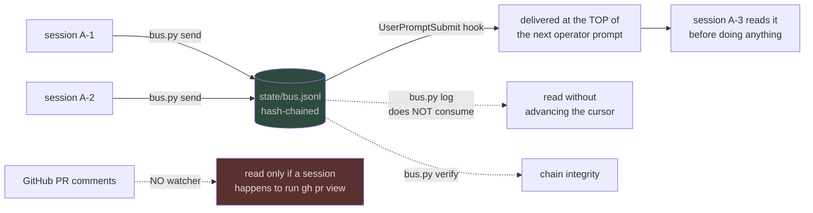
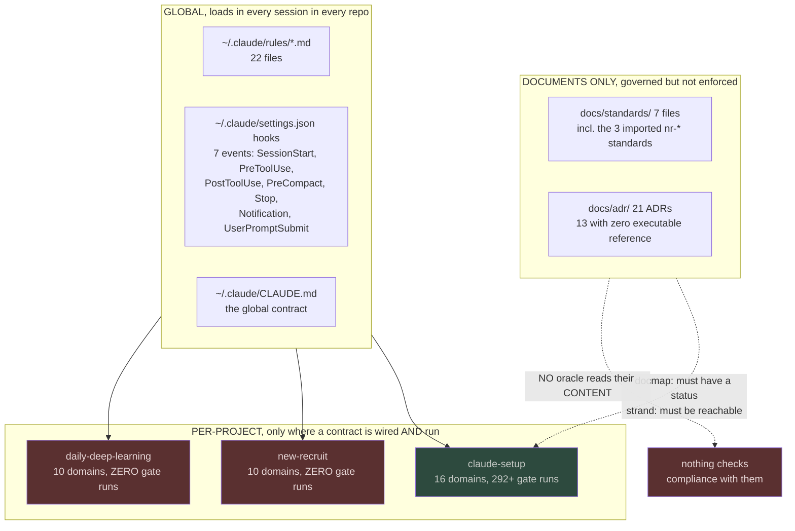
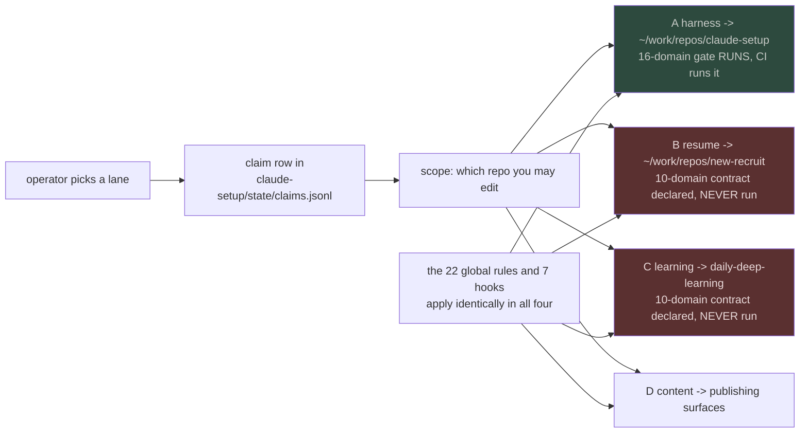
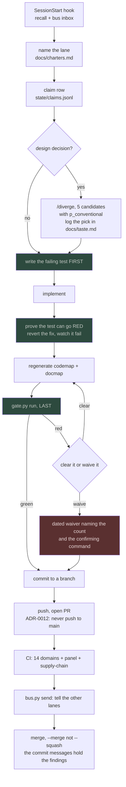

# Enforcement topology: what is global, what is per-project, and what is only a document

Status: measurement, 2026-08-05. Every number below names the command that produced it.
Written because four questions were asked at once and three of them turn on the same fact:
**a document being governed is not the same as a rule being enforced**, and this repo
currently conflates them.

## 1. The notification path between sessions

There is exactly one, and it is not GitHub.

`bus.py inbox` **advances a cursor**, so reading consumes. `bus.py log` does not.
`state/bus.jsonl` is hash-chained and `bus.py verify` checks it, so a rewrite of history
is visible.

**GitHub PR comments have no watcher.** kilo-code-bot and the Claude review action post
findings that reach a session only if that session runs `gh pr view` on purpose.

## 2. Global versus per-project, measured

The measurements behind that:

| question | command | answer |
|---|---|---|
| global rules live? | `ls ~/.claude/rules/*.md \| wc -l` | **22** |
| global hook events? | read `~/.claude/settings.json` | **7** |
| repos with a contract? | `ls */quality-contract.json` | **3 of 3** |
| repos that ever ran it? | `wc -l */state/gate-runs.jsonl` | **1 of 3** |
| standards referenced by an executable? | `grep -rl` over `tools/`, workflows, contract | `code-quality-standard` **0**, `harness-structure` **0**, `repo-standards` **0** |
| ADRs referenced by an executable? | same | **8 of 21**; 13 have zero |

## 3. The gap this exposes

`docs/standards/` IS referenced three times, and none of the three is enforcement:

- `docmap.py:60` classifies the directory so its files must declare a status
- `strand.py:47` puts it in `GOVERNED` so its files must be reachable from a read surface
- `repo_project.py:4` mentions one in a comment

So a standard in this repo must **have a status** and **be linked**. Nothing reads what it
says. The imported `nr-code-quality-standard-2026-07.md` sets a module hard limit of 500
lines and a function hard limit of 50, and `quality-contract.json` has no size or
complexity domain at all. Measured against `tools/**/*.py` by AST: **14 modules over 500,
71 functions over 50 of 678**, and nine of the ten longest functions are `cmd_selftest`,
headed by `tools/bus/bus.py:589` at **614 lines**.

That is the difference between a governed document and an enforced rule, and it is the
single largest gap in the topology.

## 4. What choosing a lane actually changes

A lane is a **charter**, not a mechanism. Nothing technical keys off it except the
SessionStart banner and the bus's `--to`. Concretely:

So the honest answer to "what changes if I pick the resume engine instead of the harness":
the global rules and hooks are identical, the claim ledger is the same file, and the only
real difference is that **lane A is gated and lanes B and C are not**. Work in
`new-recruit` is governed by 22 global rules and by nothing else that executes.

## 5. The complete intended workflow

The two steps that get skipped and cost the most, both observed today: **A8**, proving the
test can fail, without which you ship a test that passes for the wrong reason; and **A16**,
telling the other lanes, without which two sessions push to one branch in the same minutes
and each regenerates a map the other invalidates.

## 6. Coverage

Every number here is from a command run on 2026-08-05 against the tree at `aa4811a`.
Not measured: whether the 13 unreferenced ADRs are unenforced or merely unnamed in the
oracles that implement them, which needs reading each ADR rather than grepping its number.
The `enforced_by` counts are substring matches on `ADR-NNNN` and will miss an oracle that
implements a decision without citing it.
