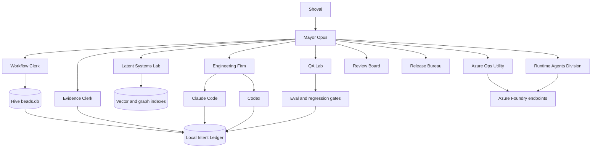
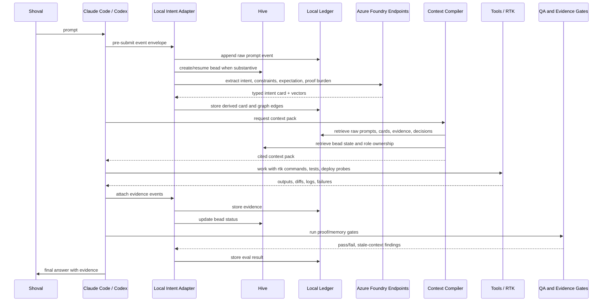
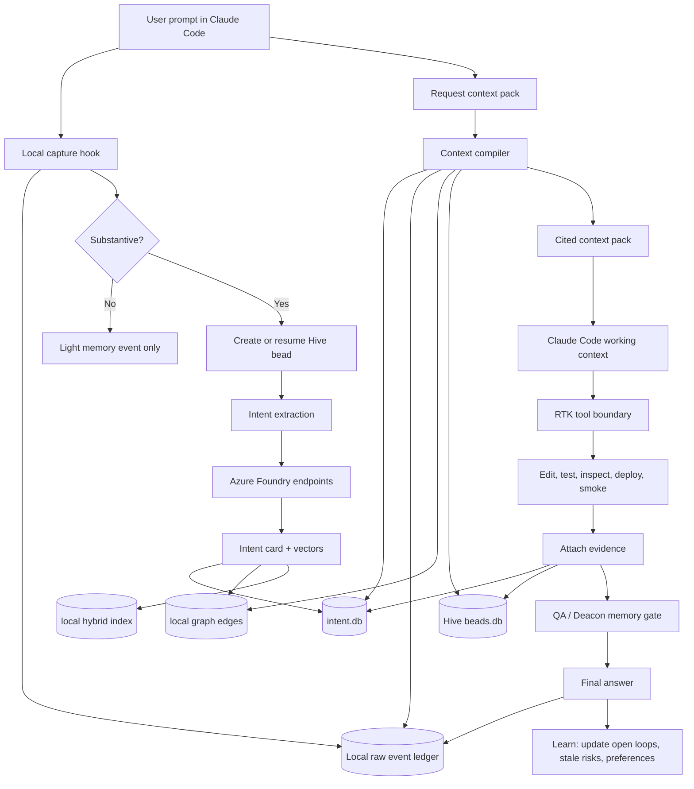

# Local Intent Control Plane for Claude, Codex, and Hive

Date: 2026-06-25
Owner: Shoval
Status: Spec delta
Related specs:
- `docs/specs/2026-05-13-hive-adoption-plan.md`
- `docs/specs/2026-06-14-agent-orchestration-rewire-plan.md`
- `docs/specs/2026-06-28-work-general-mojuco-artifixer-foundry-plan.md`
- `~/.claude/rules/gastown-company-registry.md`
- `~/.hive/rigs.yaml`

## Bottom Line

Build a local-first SDLC intent control plane. It captures every meaningful prompt, turns it into typed requirements and behavioral expectations, retrieves it for future Claude/Codex sessions, and attaches proof back to the same memory graph.

The storage, contracts, routing, and evidence ledger stay local under `/home/shovalbe`. Azure Foundry/OpenAI endpoints are used as model services for embeddings, extraction, scoring, and optional evaluators. Foundry is not the system of record.

This merges into the existing Gastown/Hive operating model:

- Company level: Gastown personas own the work.
- Work-bus level: Hive beads carry tasks, ownership, budgets, and closure state.
- Session level: Claude Code and Codex consume compiled context packs and write evidence.
- Model level: Azure Foundry endpoints provide embeddings, classifiers, extraction, and evals.
- Proof level: every completion claim links to tests, commands, logs, diffs, deploys, or review evidence.

## Maturity Verdict

Current maturity after this spec:

| Dimension | Maturity | Verdict |
|---|---:|---|
| Conceptual architecture | 4/5 | Strong. It correctly separates raw authority, derived vectors, Hive ownership, and proof. |
| SDLC contract design | 3.5/5 | Good, but must be enforced through schemas, hooks, gates, and tests before it is operational. |
| Local deployability | 2/5 | Not deployable yet. It needs concrete CLI commands, SQLite migrations, hook wiring, secret config, and smoke tests. |
| Foundry endpoint integration | 2.5/5 | Direction is right, but endpoint names, redaction rules, token attribution, and fallback mode are not yet specified as config. |
| RL / learning maturity | 1.5/5 | Measurement substrate is planned. Real RL is not implemented. RL-style reward/replay can be added after event and evidence capture exist. |
| Eval maturity | 2.5/5 | Basic gates are described. It still needs pass^k, replay sets, evaluator mutation, adversarial judges, and cost/latency budgets as hard criteria. |
| Security / privacy | 2.5/5 | Local-first and redaction are correct. Need canaries, PII tests, prompt-injection tests, and secret-scrub gates. |
| Company/Hive integration | 3.5/5 | Good alignment with Gastown roles and Hive beads. Needs bead schema migration and close-gate enforcement. |

Deployability definition:

```text
Design-ready: architecture and contracts are written.
Local-alpha: CLI can capture prompts, create intent cards, compile context packs, and attach evidence.
Local-beta: Claude/Codex hooks use it automatically and memory regression tests run.
Local-prod: Hive close gates, security tests, cost attribution, replay sets, and stale-context checks are enforced.
Cloud-prod: only if later promoted to APIM/Cosmos/Search; not a goal for v1.
```

This spec is currently **Design-ready**. The target for the next implementation plan is **Local-alpha**.

## Why This Exists

Long-horizon AI work currently loses user intent in three places:

- Context-window loss: old prompts disappear or are summarized weakly.
- Handoff loss: Claude, Codex, Hive, and subagents do not share a durable intent object.
- Proof loss: final answers claim completion, but the original expectation and verification burden are not always attached.

The new rule is:

> Human prompts are SDLC artifacts. They are requirements, constraints, preference signals, and proof contracts.

## Authority Model

The system must not become an opaque vector memory that overrides the user's words.

Authority order:

1. Raw user prompt
2. PRD/spec/task contract
3. Verified runtime/deploy/test evidence
4. Current repo state
5. Assistant final answer
6. Assistant summary or inferred memory
7. Vector similarity alone

Any extracted intent, vector, affect score, or behavior profile is a derived view. It can guide retrieval and routing, but it cannot supersede raw text or verified evidence.

## Research Enforcement Matrix

This section turns the existing local research into enforceable design rules. These are not optional references.

| Source doc | Local conclusion | Enforced in this spec |
|---|---|---|
| `docs/deep-research-report (2).md` | Agent eval must combine deterministic software tests, trajectory checks, adversarial tests, benchmarks, online monitoring, and replay. | Add layered eval gates: deterministic, component, contract, integration, trajectory, adversarial, mutation, human review, and production replay. |
| `docs/deep-research-report (3).md` | High-risk MCP/agent systems must test decision quality, tool choice, tool arguments, policy compliance, outcome state, trace lineage, and consistency over repeated trials. | Context packs and evidence attachments must record tool calls, arguments, downstream state, pass^k/retry consistency, and policy violations. |
| `docs/specs/2026-05-13-hive-adoption-plan.md` | Gastown gives roles/provenance; GBrain gives replay-from-real-queries; HyperAgents warns about eval gaming. | Hive beads become the work units; replay set grows from failed memory/eval events; Deacon gate runs adversarial judge/mutation checks before close. |
| `docs/specs/2026-06-14-agent-orchestration-rewire-plan.md` | Codex is source-of-truth runtime, Claude is compatibility worker, Hive is the shared bus, and agents must receive fresh context packs. | Claude/Codex adapters consume the same local context-pack contract; no raw transcript dumping into subagents. |
| `docs/audits/2026-06-09-stack-modernization-and-hive-upgrade.md` | Use Azure-native Functions/ACA/Bicep/ADO reality, not k8s/Terraform/Grafana. Require eval gates, OTel/App Insights, WIF, contracts, property tests, mutation, pass^k, and cost reporting. | Local v1 avoids k8s/Terraform/Grafana. Foundry calls must log token/cost metadata. Gates report task success, trajectory trustworthiness, cost, and latency. |
| `docs/FOUNDRY-EVAL-CI-PLAN.md` | Deterministic gates run before model judges. Foundry eval must be small, bounded, and staged: smoke, expanded, nightly, sampled continuous. | Memory eval follows the same phased pattern: deterministic every run, small smoke on local-alpha, expanded nightly, sampled LLM judge only when useful. |
| `docs/MODEL-MIGRATION-PLAN.md` | Per-project Foundry deployments give traceability, quota isolation, rollback, and cost attribution; high-reasoning nano can reduce cost. | Intent-plane config must support per-project deployment names and write Foundry deployment id, token usage, and endpoint class to every model-call event. |
| `docs/root-cleanup-2026-05-28/Q-Learning, Deep RL & March 2026 Research  Auditing MiroFish & AutoResearch.md` | Systems claiming learning need state, action, reward, transitions, replay buffers, overestimation control, exploration, and temporal credit assignment. | Do not claim RL in v1. Define an experience tuple and replay buffer first; later add reward models, held-out evaluation, tree rollouts, and offline policy updates. |
| `docs/root-cleanup-2026-05-28/Futuristic Learning Stack for an AI Engineer — April 2026 Edition.md` | Coding agents need reward machines, omega-regular objectives, training-free GRPO, token-space continual learning, Panini-style structured memory, and multi-objective RL. | Add a reward-machine layer for SDLC constraints and a token-space learning path. Training-free GRPO is a later reranking layer, not v1. |
| `docs/root-cleanup-2026-05-28/Autonomous Agentic Coding Systems with Semantic Self-Awareness  2025–2030 Deep Dive.md` | Mature agents need semantic coverage, golden datasets, UMAP/LanceDB/sqlite-vec, confidence-gated autonomy, fresh subagents, and production failure expansion. | Add semantic coverage metrics, confidence thresholds, golden memory datasets, coverage-gap-triggered subagents, and local vector DB choice. |

Enforcement rule:

> A future implementation plan must cite which rows it implements. A slice that does not implement or explicitly defer the relevant research row is incomplete.

## Company-Level Model: Gastown as the Operating Company

Gastown is the company metaphor and role taxonomy. The local intent control plane becomes the company's memory and contract office.



Persona ownership delta:

| Persona | New responsibility |
|---|---|
| Mayor Opus | Decides whether a prompt becomes a workflow, bead, or lightweight memory event. |
| Workflow Clerk | Owns session continuity, prompt capture, context packs, and Hive linkage. |
| Evidence Clerk | Owns provenance, proof requirements, citations, and final-evidence attachment. |
| Latent Systems Lab | Owns vectors, embeddings, behavioral control signals, and context compression. |
| QA Lab | Owns memory retrieval regression tests and stale-context tests. |
| Review Board | Owns anti-slop checks, contradiction handling, and close-gate review. |
| Azure Ops Utility | Owns Foundry endpoint configuration, Key Vault references, cost traces, and Azure telemetry. |
| Runtime Agents Division | Owns deployed Foundry agent/evaluator surfaces only; it does not become a coding persona. |

## System-Level Model: Local First, Foundry Assisted

Local surfaces:

- `/home/shovalbe/.intent/ledger/events.jsonl`: append-only raw events.
- `/home/shovalbe/.intent/intent.db`: SQLite normalized store for prompts, sessions, cards, edges, evidence, evals.
- `/home/shovalbe/.intent/index/`: local lexical/vector index cache.
- `/home/shovalbe/.intent/context-packs/`: generated session context packs with citations.
- `/home/shovalbe/.hive/beads.db`: task bus and ownership ledger.
- `/home/shovalbe/.claude/` and `/home/shovalbe/.codex/`: execution clients and local hooks.

Azure-assisted surfaces:

- Azure Foundry / Azure OpenAI embeddings endpoint for semantic vectors.
- Azure Foundry extraction endpoint for intent cards.
- Azure Foundry evaluator endpoint for optional memory-quality and proof-quality scoring.
- Key Vault or existing secret-sync rules for endpoint secrets.
- Application Insights or local telemetry export when live endpoint behavior must be audited.

No raw prompt history should be uploaded to Azure unless the local policy allows it for that class of data. The default should be: send only the minimum text needed for extraction/embedding, keep raw event authority local, and redact secrets before model calls.

## Session-Level E2E Flow



## Contract Objects

### Event Envelope

Every captured event uses the same envelope.

```json
{
  "event_id": "evt_20260625_...",
  "event_type": "user_prompt|assistant_final|tool_output|diff|test_result|deploy_result|decision|correction",
  "timestamp_utc": "2026-06-25T00:00:00Z",
  "actor": "shoval|claude|codex|hive|foundry|tool",
  "session_id": "claude_...|codex_...",
  "repo_path": "/home/shovalbe/projects/...",
  "branch": "feat/...",
  "bead_id": 123,
  "workflow_id": "wf_...",
  "raw_text_ref": "events.jsonl:offset",
  "redaction_state": "raw_local|redacted_for_model|safe_public",
  "authority": "raw_user_prompt|prd|verified_evidence|assistant_summary",
  "metadata": {}
}
```

### Intent Card

```json
{
  "intent_id": "intent_...",
  "event_id": "evt_...",
  "goal": "short task objective",
  "constraints": [
    {"text": "do not break OTP split-envelope", "hardness": "must"}
  ],
  "expectations": [
    {"name": "runtime_proof_required", "weight": 0.95}
  ],
  "affect_pressure": {
    "urgency": 0.7,
    "frustration": 0.4,
    "trust_deficit": 0.8,
    "ambiguity": 0.5
  },
  "proof_required": [
    {"type": "test", "required": true},
    {"type": "runtime_smoke", "required": true},
    {"type": "log_or_trace", "required": false}
  ],
  "decision_delta": {
    "amends": [],
    "supersedes": [],
    "contradicts": []
  },
  "scope": {
    "repos": [],
    "files": [],
    "endpoints": [],
    "personas": [],
    "beads": []
  },
  "vectors": {
    "intent_vector_ref": "local-or-foundry-vector-id",
    "expectation_vector_ref": "local-or-foundry-vector-id",
    "proof_vector_ref": "local-or-foundry-vector-id"
  }
}
```

### Context Pack

```json
{
  "context_pack_id": "ctx_...",
  "requested_by": "claude|codex|hive",
  "task": "current user request",
  "repo_path": "/home/shovalbe/projects/...",
  "bead_id": 123,
  "included_items": [
    {
      "source_event_id": "evt_...",
      "authority": "raw_user_prompt",
      "reason": "hard constraint matched current task",
      "excerpt": "exact short excerpt",
      "citation": "/home/shovalbe/.intent/ledger/events.jsonl:offset"
    }
  ],
  "active_constraints": [],
  "open_loops": [],
  "stale_risks": [],
  "proof_checklist": [],
  "routing": {
    "owner_persona": "Workflow Clerk",
    "support_personas": ["Evidence Clerk", "Latent Systems Lab"],
    "allowed_tools": ["rtk", "git", "uv", "bun", "az when scoped"]
  }
}
```

### Evidence Attachment

```json
{
  "evidence_id": "ev_...",
  "bead_id": 123,
  "intent_id": "intent_...",
  "evidence_type": "test|runtime_smoke|deploy|log|screenshot|diff_review|manual_decision",
  "command": "rtk uv run pytest ...",
  "status": "pass|fail|blocked",
  "summary": "short result",
  "artifact_ref": "local path, trace id, build id, PR id, or log query",
  "created_at_utc": "2026-06-25T00:00:00Z"
}
```

## Retrieval Math

The context compiler must use hybrid retrieval, not vector-only recall.

```text
score(m, q) =
  w1 * cosine(intent_vector_m, intent_vector_q)
+ w2 * cosine(expectation_vector_m, expectation_vector_q)
+ w3 * lexical_match(raw_text_m, query_q)
+ w4 * graph_relevance(edges_m, task_scope_q)
+ w5 * authority_weight(m)
+ w6 * project_scope_match(m, q)
+ w7 * unresolved_open_loop(m)
+ w8 * proof_requirement_match(m, q)
- w9 * staleness_risk(m)
- w10 * contradiction_penalty(m, q)
```

Default weight principle:

- Raw prompt and PRD authority beats semantic similarity.
- Current repo scope beats global preference unless the global preference is a hard user rule.
- Verified evidence beats planned evidence.
- Stale summaries must not crowd out exact older raw prompts.

## Global vs Project Scope

The intent plane has two knowledge levels, and they must not be collapsed:

| Level | Owns | Must not own |
|---|---|---|
| Global | Cross-project rules, reusable skills, hard user preferences, routing heuristics, global Jira/Hive relation gates, sparse/dense recall indexes over cited records. | Repo truth, file-tree authority, commit outcome truth, project architecture decisions, project-specific release gates. |
| Project | Current git root, branch, working tree, diff, file tree, package/test topology, ADRs, PRDs, architecture map, project adapters, project-specific fixtures and outcomes. | Universal policy, global persona ownership, unrelated project facts, cross-project preference overrides. |

Scope rule:

```text
global memory may route, warn, and suggest.
project knowledge must verify, cite, and decide for repo-specific work.
```

Practical consequences:

- A global context pack may say "this looks like video-understanding work", but the project adapter must inspect that repo's current tree before it can claim files, tests, or architecture.
- A global git index may find related commits, but project-level git ingestion owns the commit tuple, diff classification, test evidence, and outcome.
- Tree knowledge is not a single global map of `/home/shovalbe`. It is a per-repo architecture/file-tree snapshot with a global registry that points to project snapshots.
- If global rules conflict with project PRD/ADR evidence, the conflict is surfaced as a decision delta. The agent does not silently merge them.

Contradiction handling:

```text
if new_constraint conflicts old_constraint:
  create decision_delta.contradicts edge
  require explicit resolution before compiling the pack as authoritative
```

## Super Flow Integration

This spec adds an intent/memory stage to every substantive super flow.

```text
Reground -> Requirements -> Reduce -> Produce -> Prove
```

Becomes:

```text
Capture -> Retrieve -> Reground -> Requirements -> Reduce -> Produce -> Prove -> Learn
```

Stage contracts:

| Stage | New intent-control requirement |
|---|---|
| Capture | Store raw prompt before acting. |
| Retrieve | Compile cited context pack from local ledger, Hive, specs, and evidence. |
| Reground | Verify current repo, branch, PRD, and artifact state. |
| Requirements | Convert prompt and retrieved context into hard/soft constraints. |
| Reduce | Check whether existing flows, specs, or beads already solve it. |
| Produce | Work through Claude/Codex using RTK and scoped tools. |
| Prove | Attach command output, logs, tests, deploy status, or explicit blocker. |
| Learn | Store final answer, proof outcome, stale-context findings, and next pickup items. |

## Hive Integration

Substantive prompts create or resume beads.

Bead metadata should gain intent fields in v2:

```sql
ALTER TABLE beads ADD COLUMN workflow_id TEXT;
ALTER TABLE beads ADD COLUMN intent_id TEXT;
ALTER TABLE beads ADD COLUMN context_pack_id TEXT;
ALTER TABLE beads ADD COLUMN proof_required_json TEXT;
ALTER TABLE beads ADD COLUMN memory_eval_score REAL;
```

Until schema migration exists, these fields can live in `~/.intent/intent.db` with `bead_id` foreign-key references.

Bead lifecycle with intent memory:

```text
open -> claimed -> context_pack_compiled -> working -> evidence_attached -> deacon_gate -> closed
```

Close rule:

> A bead cannot be marked closed unless the proof attached satisfies the original proof_required set or the final answer explicitly says which proof is missing and why.

## Claude Code Integration

Claude stays the interactive operator shell and compatibility worker.

Required local hooks or wrapper behavior:

- `UserPromptSubmit`: append raw prompt event locally before Claude starts reasoning.
- `SessionStart`: request or build a context pack based on cwd, branch, and last active bead.
- `PreToolUse`: keep RTK boundary and attach command intent when a command is meaningful.
- `PostToolUse`: attach tool output summary and artifact reference when it proves or blocks a requirement.
- `Stop`: store final answer, proof claims, and open loops.
- `PreCompact`: snapshot active context pack, intent IDs, and unresolved proof requirements.

Claude should receive compact packs, not raw transcript dumps.

## Codex Integration

Codex remains the source-of-truth execution runner and independent review worker.

Required behavior:

- On task start, call local `intent context-pack` or equivalent.
- For implementation tasks, bind work to a `workflow_id` or `bead_id`.
- Attach verification evidence before final response.
- When reviewing Claude output, compare final claims against original intent card and evidence attachments.
- Use Azure Foundry endpoints only through local config/secret indirection.

## Azure Foundry Endpoint Usage

Foundry endpoints are utilities, not authorities.

Endpoint classes:

| Endpoint | Use |
|---|---|
| Embeddings | Generate vectors for prompt text, expectations, proof requirements, and artifacts. |
| Intent extractor | Convert prompt text into typed intent cards. |
| Evaluator | Score context-pack relevance, contradiction handling, and proof satisfaction. |
| Runtime agent endpoints | Project-specific runtime behavior checks where already deployed. |

Required controls:

- Endpoint names and keys must come from existing secret flow, not hardcoded files.
- Raw secrets, `.env` content, and credentials must be redacted before model calls.
- Every Foundry call must write a local event with endpoint class, prompt hash, token/cost metadata when available, and output hash.
- For sensitive prompts, local-only extraction must be allowed as fallback.

## Local Deployment Contract

V1 is a local service/CLI, not an Azure-hosted service.

Required local files:

```text
/home/shovalbe/.intent/
├─ config.toml
├─ intent.db
├─ ledger/
│  └─ events.jsonl
├─ indexes/
│  ├─ lexical/
│  └─ vector/
├─ context-packs/
├─ evals/
│  ├─ golden/
│  ├─ replay/
│  ├─ mutants/
│  └─ reports/
└─ logs/
```

Required `config.toml` keys:

```toml
[storage]
base_dir = "/home/shovalbe/.intent"
sqlite_path = "/home/shovalbe/.intent/intent.db"
raw_ledger = "/home/shovalbe/.intent/ledger/events.jsonl"

[foundry]
enabled = true
endpoint_env = "AZURE_OPENAI_ENDPOINT"
api_key_env = "AZURE_OPENAI_API_KEY"
embedding_deployment = "gpt-5.4-nano-intent-embed-or-configured-embedding"
extractor_deployment = "gpt-5.4-nano-intent-extract"
judge_deployment = "grok-4-1-fast-reasoning-2-eval"
audit_judge_deployment = "DeepSeek-V3.2"
max_input_tokens = 1500
max_output_tokens = 250

[privacy]
default_upload_policy = "redacted_only"
block_env_files = true
block_secret_like_text = true
store_raw_local_only = true

[retrieval]
backend = "sqlite_fts_then_sqlite_vec"
top_k = 30
min_authority_weight = 0.50
stale_summary_penalty = 0.25

[eval]
deterministic_every_run = true
llm_judge_sample_rate = 0.05
pass_k_trials = 3
pass_power_k_min = 0.80
mutation_kill_rate_min = 0.80
```

Required CLI surface:

```text
intent capture --event-type user_prompt --session <id> --repo <path>
intent extract --event <event_id>
intent context-pack --repo <path> --task "<task>" --format markdown,json
intent evidence attach --intent <intent_id> --type test --status pass --artifact <path>
intent eval smoke
intent eval replay
intent eval mutate
intent hive bind --bead <id> --intent <intent_id>
intent doctor
```

`intent doctor` must verify:

- SQLite database exists and migrations are current.
- Raw ledger is appendable.
- Hive DB is reachable when enabled.
- Claude hooks are present or explicitly marked unavailable.
- Codex startup convention is documented.
- Foundry endpoint config exists or local-only mode is active.
- Redaction smoke test blocks `.env` and secret-like strings.
- A context pack can be generated from a known fixture.

## Learning and RL Layer

This system must be honest about the difference between **measurement**, **learning from experience**, and **training**.

V1 implements measurement and replay. It does not train model weights.

### Experience Tuple

Every meaningful session produces an experience tuple:

```text
x_t = (s_t, a_t, r_t, s_{t+1}, e_t)
```

Where:

- `s_t`: context pack, repo state, bead state, active constraints, tool budget.
- `a_t`: plan, tool calls, edits, selected persona routing, proof strategy.
- `r_t`: scalar and vector reward computed from proof satisfaction, regression result, cost, latency, and user correction.
- `s_{t+1}`: final repo/session/bead state.
- `e_t`: evidence artifacts and trace.

### Reward Vector

Use a multi-objective reward vector before scalarizing:

```text
R = {
  proof_satisfaction,
  regression_safety,
  runtime_success,
  user_correction_penalty,
  cost_efficiency,
  latency_efficiency,
  context_relevance,
  privacy_safety,
  minimal_diff_quality
}
```

Default scalarization is lexicographic, not weighted-sum:

1. Privacy/safety constraints must pass.
2. Hard user constraints must pass.
3. Runtime/test proof must pass or be explicitly blocked.
4. Then optimize cost, latency, minimal diff, and context compactness.

This follows the local research direction that coding agents need safety-first temporal objectives rather than a single reward score.

### Reward Machines

Represent SDLC obligations as finite-state reward machines.

Example:

```text
State 0: captured prompt
  on context_pack_compiled -> State 1
State 1: requirements anchored
  on edits_started_without_requirements -> violation
  on tests_selected -> State 2
State 2: implementation running
  on hard_constraint_broken -> violation
  on proof_attached -> State 3
State 3: proof attached
  on deacon_gate_pass -> closed_success
  on missing_required_proof -> blocked_not_closed
```

The close gate must use the reward-machine state, not only final answer text.

### Replay Buffer

The local replay buffer lives under:

```text
/home/shovalbe/.intent/evals/replay/
```

It stores:

- failed retrievals
- stale-context mistakes
- user corrections
- bad close claims
- proof gaps
- tool-call errors
- Foundry endpoint drift
- high-cost or high-latency sessions

Replay records must include exact raw prompt citations and expected retrieval/proof behavior.

### Training-Free GRPO Path

After enough replay data exists, add a training-free GRPO-style reranker:

1. Generate `G` candidate context packs for the same task.
2. Score each candidate with deterministic reward-machine checks and sampled judge checks.
3. Compute group-relative advantage over candidates.
4. Store a token-space/context prior that improves future context-pack selection.

No model weights change. This is safe for API-only Claude/Codex/Foundry use and matches the local research path: token-space continual learning before fine-tuning.

### Tree Rollouts

For high-risk tasks, use tree-structured planning instead of one linear plan:

```text
root = current task
branches = candidate strategies
nodes = plan/tool/evidence states
reward = proof + safety + cost + user constraints
select = best branch after held-out/evaluator checks
```

This is not mandatory for every task. It is required only when:

- there are multiple plausible implementation strategies
- the task has high rollback cost
- prior replay shows uncertainty
- the context pack lands in a sparse semantic coverage region

## Semantic Coverage and Confidence Gates

The system must measure where it is competent.

Coverage store:

- embed prompts, context packs, tool traces, final answers, evidence summaries, and user corrections.
- store vectors locally in `sqlite-vec` for v1, with LanceDB allowed later if the TypeScript/IDE path matters.
- keep lexical search via SQLite FTS/BM25 because exact phrases and constraints matter.

Coverage metrics:

| Metric | Use |
|---|---|
| recall@k on golden prompts | Did retrieval find the known relevant memory? |
| top-1 stability | Did small wording changes retrieve the same authority item? |
| stale-context rate | Did old wrong summaries enter the context pack? |
| contradiction detection rate | Did conflicting requirements get flagged? |
| semantic coverage density | Is this task near known-good examples or sparse territory? |
| pass^k | Does the loop succeed repeatedly, not just once? |
| cost per successful context pack | Does memory improve quality without runaway tokens? |

Confidence gates:

```text
confidence >= 0.90: autonomous local work allowed
0.70 <= confidence < 0.90: work allowed, but final close requires explicit proof gate
confidence < 0.70: ask for clarification or spawn a focused exploration/review agent
```

Confidence is computed from:

- semantic distance to known-good tasks
- retrieval agreement between lexical, vector, and graph methods
- authority of retrieved items
- contradiction count
- stale-risk count
- prior success rate for the persona/repo/task type
- reward-machine state completeness

## Evaluation Gates

The local intent plane has its own testing pyramid.

| Gate | Cadence | Required before deployable local-beta |
|---|---|---|
| Schema tests | every change | event, intent card, context pack, evidence contracts validate |
| Deterministic redaction tests | every change | `.env`, token-like strings, keys, and PII canaries blocked from Foundry calls |
| Retrieval golden tests | every change | known prompt retrieves known prior intent |
| Context-pack smoke | every change | pack contains citations, constraints, proof checklist, stale risk |
| Hive binding test | every change | bead id links to intent id and evidence id |
| Foundry fallback test | every change | local-only mode works when endpoint unavailable |
| Replay tests | nightly or before release | old failures do not recur |
| Mutation tests | nightly or before release | weakened constraints/evaluators are caught |
| pass^k tests | nightly or before release | repeated runs remain consistent |
| Adversarial judge tests | before close gate rollout | evaluator cannot be trivially gamed |

Foundry judge policy follows the existing Foundry eval CI plan:

- deterministic checks always run first
- LLM judge is sampled at default 5%
- LLM judge runs on all deterministic failures
- `grok-4-1-fast-reasoning-2-eval` is primary judge when configured
- `DeepSeek-V3.2` is sampled audit judge when configured
- full raw transcripts are not sent unless multi-turn behavior is the thing being evaluated

## E2E Loop With Claude Code



## Acceptance Criteria

MVP is complete when all of these are true:

1. A Claude Code prompt creates a local raw event before the agent acts.
2. The prompt is linked to repo, branch, session, and bead/workflow when applicable.
3. A typed intent card is produced with goal, constraints, expectations, proof requirements, and scope.
4. A context pack can be generated for a repo/task with citations to raw events or specs.
5. A Claude or Codex final answer attaches proof evidence to the same intent/workflow.
6. A regression test proves that a future prompt retrieves at least one known relevant older prompt.
7. Contradictory context is flagged instead of silently merged.
8. Foundry endpoint calls are logged locally with redaction status and endpoint class.
9. The system can run in local-only mode when Foundry endpoints are unavailable.

## Non-Goals

- Do not fine-tune models in v1.
- Do not store authoritative memory only in vectors.
- Do not make Foundry the source of truth for prompts.
- Do not create one persona per project.
- Do not make Claude the sole orchestrator.
- Do not mark beads closed from summaries without evidence.

## Implementation Slices

Slice 1: Local event ledger and schema

- Create `~/.intent/ledger/events.jsonl`.
- Create `~/.intent/intent.db`.
- Add CLI commands for `capture`, `list`, and `show`.
- No embeddings yet.

Slice 2: Intent extractor contract

- Add typed intent card schema.
- Add Foundry-backed extractor.
- Add local fallback extractor.
- Store derived cards separately from raw events.

Slice 3: Context compiler

- Build `context-pack` command.
- Retrieve from raw ledger, specs, Hive beads, and recent evidence.
- Return cited markdown and JSON.

Slice 4: Claude/Codex adapters

- Wire Claude hooks where available.
- Add Codex task-start convention.
- Attach final answers and tool evidence.

Slice 5: Hybrid retrieval and vectors

- Add embeddings through deployed Foundry endpoint.
- Add local index cache.
- Add hybrid ranking and graph edge weighting.

Slice 6: Memory evals

- Add regression fixtures from real historical prompts.
- Test relevant retrieval, contradiction detection, stale-risk suppression, and proof satisfaction.

Slice 7: Hive close gate

- Prevent or flag bead closure when proof does not satisfy original proof_required.
- Add Evidence Clerk and Deacon views over memory/evidence.

## Company-Level Explanation

At company level, Gastown is the operating model. The personas are departments. Hive is the work queue and accountability ledger. The intent control plane is the company's memory, contracts, and evidence office.

At session level, Claude Code or Codex is an employee entering a room with a briefing pack. It should not rely on vague global memory. It receives a task-specific context pack, does the work, and returns evidence.

At model level, Azure Foundry endpoints are specialist services. They embed, classify, extract, and evaluate. They do not own truth. The local ledger owns truth.

At SDLC level, every meaningful prompt becomes a requirement event. Every requirement gets constraints and proof requirements. Every implementation links back to those requirements. Every close claim is checked against evidence.

This is the local version of an AI-native agile loop:

```text
prompt -> contract -> context -> work -> proof -> memory -> better next session
```

## Implemented Local v1 Surface - 2026-06-25

The local implementation lives in `~/projects/intent-control-plane` and stores runtime state under `~/.intent`.

Implemented commands:

- `intent capture`: append raw local prompt/final events to the ledger and redacted model text to SQLite.
- `intent extract`: create intent cards with goal, constraints, expectations, affect pressure, proof requirements, and scope.
- `intent context-pack`: compile cited context for a repo/task.
- `intent evidence attach`: attach test/runtime/blocker proof to an intent.
- `intent index rebuild`: build deterministic local sparse vectors for events and intents.
- `intent index search`: retrieve events/intents through local vector similarity.
- `intent session brief`: render the Claude Code TUI briefing block for startup/resume.
- `intent jira assess`: split Jira tickets into related/unrelated for the current cwd/session/task.
- `intent hive sync`: read `~/.hive/beads.db` into local bead references for session context.
- `intent foundry status`: check Azure/OpenAI/Foundry endpoint readiness without uploading payloads.
- `intent retention sweep`: sweep generated artifacts only; raw prompt ledger remains append-only.
- `intent eval smoke`: run golden retrieval fixtures.
- `intent doctor`: verify local store, schema, redaction, and local-only fallback.

Claude Code TUI integration:

- `UserPromptSubmit`: `~/.codex/hooks/intent-capture.sh prompt`
- `SessionStart`: `~/.codex/hooks/intent-session-brief.sh`
- `Stop`: `~/.codex/hooks/intent-capture.sh stop`
- Jira SessionStart and Stop hooks call the relation gate so unrelated global tickets do not pollute the active session or receive time attribution.

Current maturity:

- Local v1 is deployable for Claude Code sessions.
- Azure Foundry calls are readiness-gated, not live-enabled. Raw prompt upload remains blocked by policy.
- Vector search is local sparse vector retrieval, not Azure dense embeddings.
- Hive sync is read-only from the real Hive DB. Mutating bead status still belongs to the existing `~/.hive/bin/bead-*` commands.
