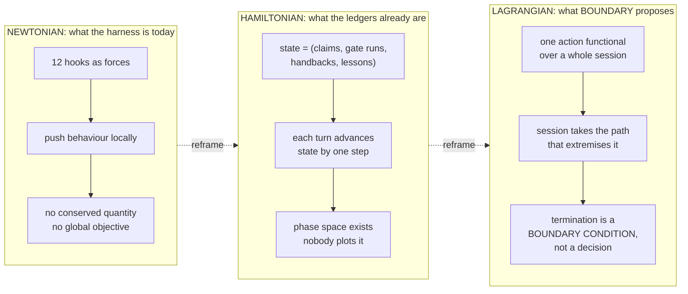
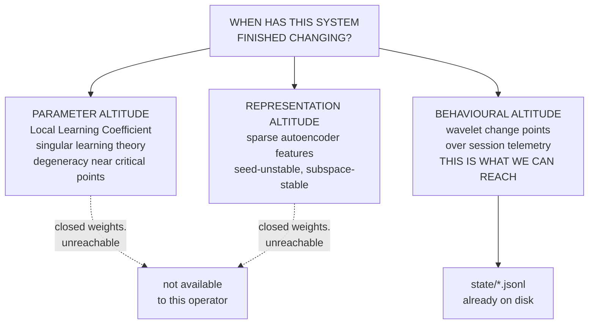
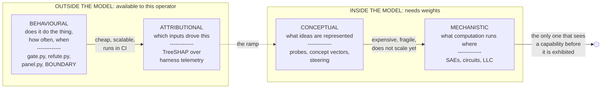
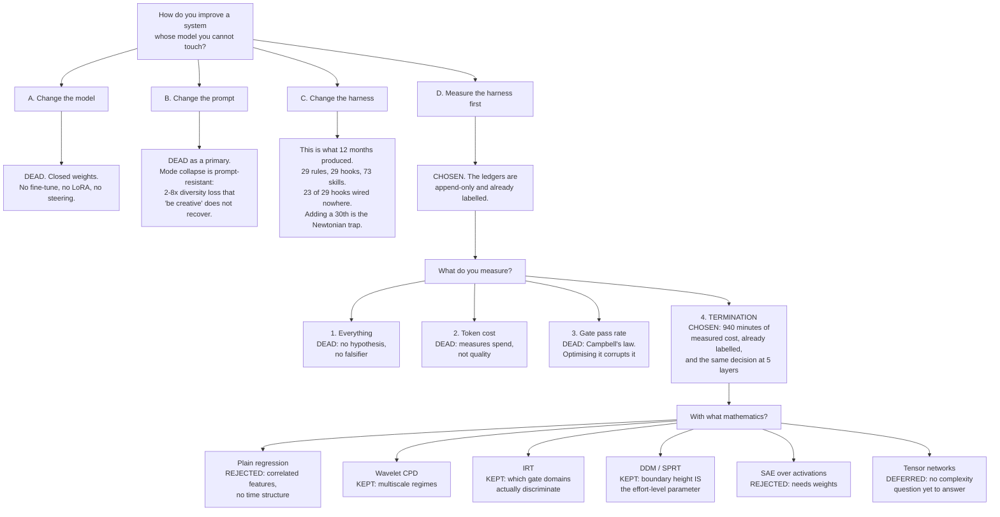
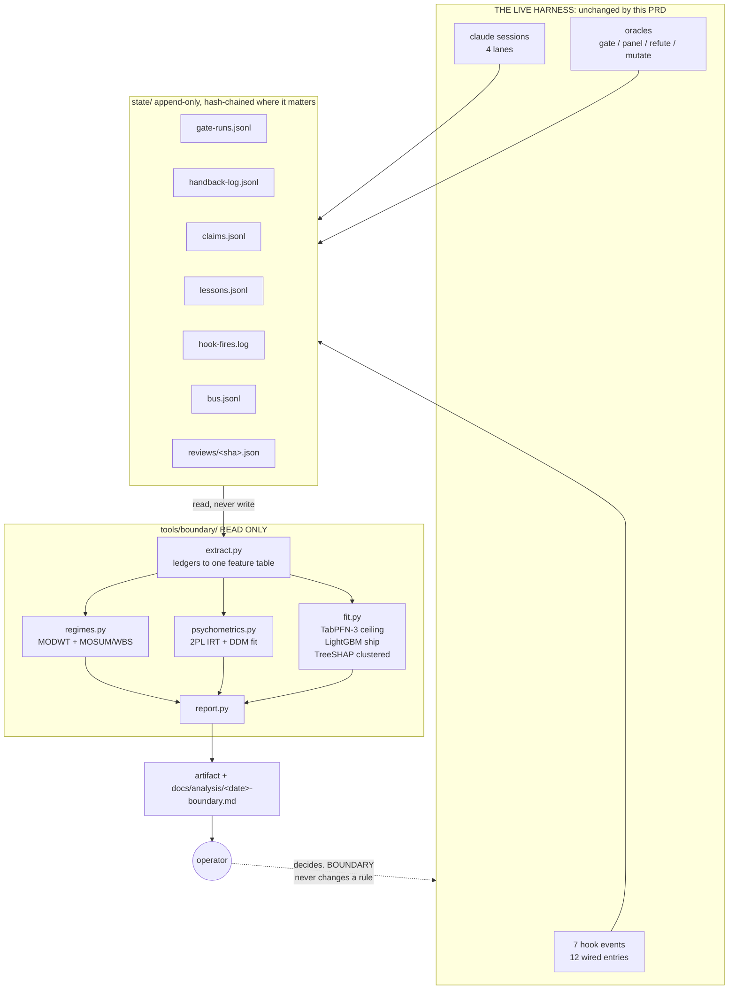
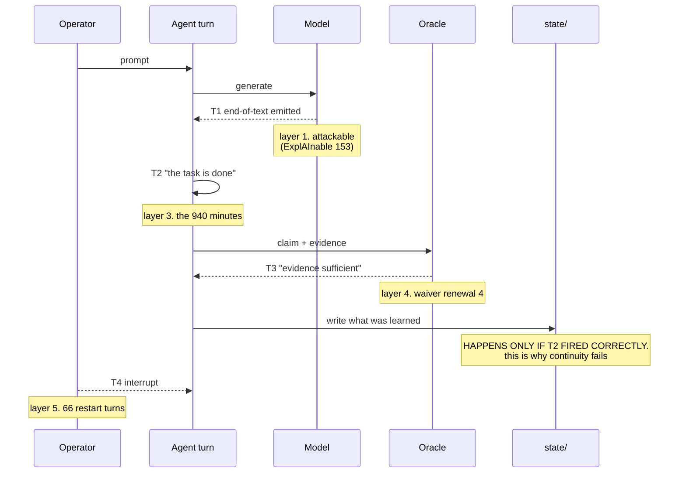
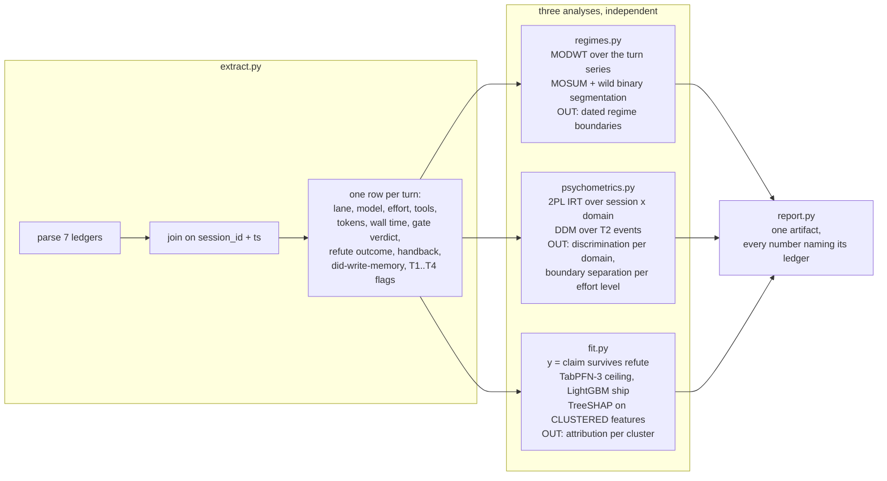

# PRD: BOUNDARY

An instrument that measures when this system stops, why, and whether it should have.

Status is **proposed**, not active. Nothing below is built. Every capability row carries
its evidence column empty on purpose, because a PRD that claims its own completion is the
defect this repo logs most often.

---

## 0. Regrounding: what was actually asked, across the whole session

Reconstructed from the transcript rather than from memory, because the request arrived in
nine pieces over three days and the architecture has to serve all of them, not the last one.

| # | Asked | Where it lands |
|---|---|---|
| 1 | kitty: the glyph, modern image and styling, one window not two, fullscreen, close button, three console errors | Shipped. Not this PRD. `tools/wsl/fix-kitty-launchers.ps1`, `tools/wsl/make_lane_logos.py` |
| 2 | Output styles | Answered. `shoval` is live, zero drift against the repo copy |
| 3 | Cross-session continuity: "I switched 3 sessions in the last hour" | **§6.4.** Continuity is a termination problem: what a session fails to write down before it stops |
| 4 | Seedance script from the WhatsApp corpus | Shipped as an artifact. Feeds §5 as a worked example of corpus-shape analysis |
| 5 | Why mech interp is hot; the place of each interpretability type; nearest hot topics per lane | **§2, §3.** The altitude stack |
| 6 | SAE, circuits, superposition; what 2026 venues accepted; "novel ideas at resonance monad theory level" | **§2, §4.** Quantum and wavelet included this time, properly |
| 7 | IF-Eval plus Karpathy autoresearch: notebooks as a deeper IF-Eval, tree of thought, LightGBM plus Optuna on decision making | **§6.2, §6.3** |
| 8 | Model stack: TabPFN, Chronos-2, embeddings, NVIDIA, is SHAP plus LightGBM plus Optuna still current | Answered in `docs/analysis/2026-08-03-math-trends-and-model-stack.md`. Bound into §7 |
| 9 | Full implementation, architecture, all diagrams, math and psychology domains, PRD updated to full intent | This document |

**The through-line, stated once.** Every one of those nine is a version of the same
sentence: *the weights are closed, so how do I improve the system I actually control.*
That is the problem this PRD exists for. Everything else is instrumentation.

---

## 1. Problem

The operator cannot train, fine-tune, or read the weights of the model he runs. What he
can change is the harness around it: rules, hooks, skills, oracles, the ledgers, and the
schedule. So "improving the model" here means **improving the closed-loop system**, and
that requires measuring it, which the repo currently does not do.

Three measured facts define the gap:

- **The harness enforces termination and never measures it.** The follow-through hook, the
  completion gate and the ship gate all adjudicate when a session may stop. The recorded
  cost of getting it wrong is **66 operator turns and about 940 minutes in one week**,
  spent only on restarting work that halted for no reason. That number exists. No model of
  it does.
- **Three effort levels have been proposed and none measured.** `xhigh` was live,
  `high` is prescribed, `low` was set as a trial on 2026-07-30 with operator judgement as
  the acceptance condition. The rule file itself says a comparison would need
  `state/handback-log.jsonl` and `state/gate-runs.jsonl` read at the end. Nobody has.
- **Continuity fails at the same seam.** Four sessions ran in ninety minutes on 2026-08-01.
  Three worked the identical kitty problem. The fourth received zero recall about it,
  because recall carries what a session *wrote down*, and a session writes down at the
  moment it decides it is finished.

All three are the same decision at three altitudes.

## 2. The idea, and where it comes from

### 2.1 Termination is one decision made independently at five layers

| Layer | The termination decision | Failure mode | Instrumented today |
|---|---|---|---|
| Token | emit end-of-text | runaway or truncation | no |
| Sampler | diffusion convergence, or beam stop | premature collapse | no |
| Agent | "the task is done" | the 940 minutes | no |
| Oracle | "the evidence is sufficient" | waiver renewal 4 | partly, by verdict only |
| Operator | interrupt | 66 restart turns | no |

**The claim, as originally written: the same features predict early-stop across all five
layers.**

**WITHDRAWN AND NARROWED, 2026-08-03, external audit finding (high).** The falsifier in §8
observes only the agent layer and the oracle layer. It never observes token, sampler or
operator termination, so it cannot test a five-layer claim, and **matching top-three
attribution rankings is not evidence of the same effect, direction, calibration or
mechanism** in any case; correlated-feature rankings are unstable and ranking agreement is
not an equivalence test.

What survives is the narrow version, which is what §8 actually tests: **the agent layer and
the oracle layer share predictive features.** The other three layers stay in the table below
as an observation that the same *decision shape* recurs, which is a reason to instrument
them, not a claim about them.

Two of these are already attack surfaces rather than curiosities. ExplAInable 153 describes
poisoning training data to *lower the probability of the end-of-text token*, which is an
attack whose entire payload is on layer 1. ExplAInable 155 describes diffusion language
models, where all positions refine in parallel and stopping stops being a token at all and
becomes a convergence criterion. Same decision, relocated.

### 2.2 The frame comes from the operator's own channel

Abide By Reason (Dan) publishes on exactly the material this needs: **Lagrangian versus
Hamiltonian mechanics**, Lagrangian versus Newtonian, and the founding quantum papers of
Born, Heisenberg and Schrödinger. That is not a coincidence to be decorated. It is the
correct frame, and using it is the anchor requirement of the out-of-distribution rule
satisfied by a real named source rather than by latent memory.

**Three mechanics, three views of a harness:**

The payoff is not aesthetic. In the Newtonian picture you add a hook every time something
goes wrong and you never learn whether the hooks are consistent with each other. In the
Lagrangian picture you write down **one** cost over an entire session trajectory and then
measure how far real sessions deviate from the extremal path. Twelve local forces become
one global functional and one residual, and the residual is a number you can plot.

And the endpoint reframe is the load-bearing part: **in a variational formulation the path
endpoints are given, not chosen.** Termination stops being a decision the agent makes at
the end and becomes a constraint the whole trajectory is shaped by. That is why the
instrument measures the boundary rather than the last turn.

### 2.3 The quantum material, with the disanalogies stated

Included because it was asked for and because two of the four connections are real. The
other two are stated as limits so the first two stay credible.

**Superposition. Real, and precise.** Mech interp borrowed the word from quantum mechanics
and the analogy is tight in one respect and broken in another. Tight: a state written as a
linear combination of components, where a measurement projects it onto one. **Broken, and
this is the whole point: in QM the basis is orthogonal; in neural network superposition it
is not.** A model represents more features than it has dimensions, so the feature
directions cannot be orthogonal. That single difference is *why* the tooling is a sparse
autoencoder (an overcomplete dictionary, solved by sparsity) rather than a change of basis.
Anyone who says "it is just like quantum superposition" has skipped the reason SAEs exist.

**Heisenberg, and this one is already on this machine.** Non-commuting observables mean
measuring one property disturbs another. The repo has a documented instance: the Stop hook
blocks after a green gate run **because a hook wrote to `state/` and invalidated the
fingerprint**. Measuring the system changed it. It is filed in memory as
`gate-fingerprint-self-invalidation` and the workaround is "gate LAST", which is a
commutation order. So the harness already has an observer effect, discovered empirically,
and BOUNDARY must not add a second one: **the instrument reads ledgers and never writes to
the ledgers it reads.** That is a hard architectural constraint, in §5, and it comes from
this analogy.

**The Born rule. Not applicable, stated so.** Feature magnitudes in an SAE are not
amplitudes. There is no normalisation and no unitarity, so nothing licenses treating a
squared activation as a probability. Anyone doing so is decorating.

**Quantum hardware. Not applicable, stated so.** A decade of quantum machine learning has
produced no result that changed a default pipeline. By this repo's own standard that is
staged, not verified.

**Quantum-inspired tensor networks. Applicable today, on classical hardware.** MPS, tree
tensor networks and iPEPS are used as learning architectures, and because they are explicit
quantum-state representations they give **direct access to entanglement entropy and quantum
mutual information as intrinsic complexity measures**. That is white-box interpretability
by construction rather than after the fact. KARIPAP reports up to 93% memory and 70%
parameter reduction on LLaMA-2 7B for 2 to 3% accuracy loss using iPEPS with tensor
renormalisation group contraction. Not needed for v1 of BOUNDARY. It is the answer if the
sparse-autoencoder-over-voice idea ever needs a complexity measure that is not a heuristic.

### 2.4 The wavelet material, and why it is the right instrument here

Previously assessed as "mature, not rising", and that holds as a *trend* judgement. As a
*tool* judgement it was the wrong question, because the instrument BOUNDARY needs is
exactly what multiresolution analysis is for.

**The problem shape.** Session telemetry is a nonstationary multivariate time series where
changes occur **at different timescales, on a subset of signals, with different durations**.
A rule change alters behaviour within one session. A model change alters it across days. A
habit change alters it across weeks. A single-scale detector picks one of those and is
blind to the others.

**The tooling that exists.** MODWT-based change detection reads wavelet coefficients across
resolution levels to locate both smooth and abrupt spectral changes. Scale-dependent
variance estimators combine with MOSUM and wild binary segmentation for multiple mean
shifts. Deep Wavelet Networks put trainable wavelet layers in front of a CNN for gradual
change points at multiple scales.

**The correspondence that makes it more than a filter choice.** Developmental
interpretability uses the Local Learning Coefficient to find **phase transitions during
training**: moments where internal structure reorganises. Wavelet change-point detection
finds regime shifts in behaviour. Same question, two altitudes:

The middle column is the whole strategic point of this PRD. **Two of the three altitudes
require weights the operator does not have. The third requires files he already wrote.**

**The one contrarian bet, kept separate from the above.** The scattering transform is the
oldest architecture family that is interpretable *by construction*, because its filters are
fixed and known rather than learned. If SAE seed-instability keeps replicating, "build
interpretable" becomes a live alternative to "interpret afterwards", and scattering plus
tensor networks are the two families already there. That is a bet, labelled as one, and
nothing in BOUNDARY v1 depends on it.

### 2.5 The psychology material, which turns out to carry the most weight

Psychology has spent seventy years on two problems this repo has: **how do you measure a
latent ability from noisy items**, and **when does a decision process stop**. Both have
mature mathematics and existing tooling.

**Item Response Theory, for the gate.** IRT models item difficulty, discrimination and
guessing alongside a latent ability parameter on a shared scale. It is already applied to
LLM evaluation: adaptive testing as a psychometric alternative to static benchmarks,
compact representations of LLM abilities, auditing benchmarks with IRT, and joint
model-item calibration.

The application here is direct and slightly embarrassing. **The gate has 13 domains and
treats them as equally informative.** IRT's first result is that they are not: a domain
everything passes has near-zero discrimination and contributes no information, while a
domain that separates good sessions from bad ones carries most of it. Fitting a 2PL over
(session x domain) outcomes gives a **difficulty and a discrimination per domain**, which
says which parts of the gate are load-bearing and which are ceremony. Note where this
points: `codemap` and `docmap` have passed on essentially every run in the ledger, so their
discrimination is probably near zero, and that is a claim the fit will confirm or refute
rather than an opinion.

There is also a bridge paper worth knowing: **Latency-Response Theory** scores models on
accuracy *and* chain-of-thought length together. Accuracy plus response time is exactly the
input a sequential-sampling model wants, which is the next row.

**The drift-diffusion model, for termination.** DDM is the standard account of how a
decision terminates: evidence accumulates as a diffusion process until it hits a boundary,
and the choice is whichever boundary was hit. Its parameters are named quantities with
direct meanings here:

| DDM parameter | Meaning in psychology | Meaning for an agent turn |
|---|---|---|
| boundary separation `a` | how much evidence before committing | how much verification before "done" |
| drift rate `v` | signal quality | how informative the tools actually were |
| starting point `z` | prior bias | the model's disposition to stop early |
| non-decision time `t0` | encoding and motor time | fixed overhead: recall, boot, gate |

The speed-accuracy tradeoff **is** the boundary height. That is the parameter the operator
has been arguing about since 29 July under the name `effortLevel`, without a model that
gives it a number.

Its optimal ancestor is Wald's 1945 **sequential probability ratio test**, which is the
correct formal object for "how many checks before I accept the claim" and is what the gate
is a crude discretisation of.

**Prior-art position, stated carefully.** The searches run on 2026-08-03 found IRT for LLM
evaluation well developed, and found **no** application of drift-diffusion or sequential
sampling to LLM agent stopping behaviour. That is weaker than "nobody has done it": a
search that misses is not an absence. It is enough to justify building, not enough to
claim novelty, and `prior-art-gate` must run before any such claim is written anywhere.

**Two more, smaller:**

- **Signal detection theory.** The review panel reports 3 high, 19 medium, 57 low and has
  no ROC. SDT separates **sensitivity (`d'`)** from **criterion (bias)**, which is precisely
  the distinction between "the oracle cannot tell good from bad" and "the oracle can, and
  is set too strict". Renewal 4 of the review waiver is uninterpretable without it.
- **Goodhart and Campbell.** The green-test gradient in `state/lessons.jsonl`
  (`L-2026-07-31-e`) is Campbell's law with a commit hash. This is the named constraint on
  §6.3: **an autoresearch loop optimising against the gate will corrupt the gate.**

---

## 3. Where each interpretability paradigm sits

The ordering is **altitude, not quality**. Behavioural is the only paradigm that survives
contact with a deployed system today. Mechanistic is the only one that can see something
that has not happened yet. BOUNDARY lives entirely in the left box, deliberately, because
the right box needs weights the operator does not have.

---

## 4. Tree of thought: the design decisions, with the branches that lost

Recorded because the losing branches are the part with information in them.

**The one decision most likely to be wrong:** choosing termination as the target. If the
falsifier in §8 fires (the same features do not predict early-stop across layers), then
termination is five unrelated problems wearing one word, and this whole PRD collapses to
"a SHAP report on session telemetry", which is still useful and much less interesting.

---

## 5. Architecture

### 5.1 System context

**The hard constraint, from §2.3.** BOUNDARY writes **only** to `docs/analysis/` and to an
artifact. It never appends to any ledger it reads. The gate-fingerprint bug is the proof
that a measurement which writes to `state/` disturbs the thing it measures, and one
observer effect in this repo is enough.

### 5.2 The five termination events, as one sequence

**Read the note on the write step.** A session records what it learned at the moment it
decides it is finished. If T2 fires early, nothing is written, and the next session
rediscovers the same thing. That is the mechanism behind "I switched 3 sessions in the last
hour and none of them knew what the last one did", and it is why continuity is not a
separate feature request. It is a symptom of the target of this PRD.

### 5.3 Pipeline

**Why TreeSHAP attribution is on clusters and not on raw features.** TreeSHAP samples from
the conditional rather than the marginal distribution, which violates the Shapley axiom
that a non-contributing feature receives zero attribution. The telemetry features are
correlated by construction: effort level, model, token count and wall time all move
together. Un-clustered, TreeSHAP spreads one effect across four features and the report
reads as four findings. Clustering first is not a nicety, it is the difference between a
result and an artefact.

### 5.4 Model choices, bound to the stack analysis

| Stage | Model | Why, and the catch |
|---|---|---|
| ceiling | **TabPFN-3** | 1673 TabArena Elo against tuned LightGBM's 1433, 4.97s per 1k rows with no tuning. **Licence permits research and internal evaluation only, and the restriction covers outputs.** Harness telemetry is internal analysis, so lane A is inside it. Anything user-facing is not |
| shippable | **LightGBM + TreeSHAP** | The explanation and the artifact you can run anywhere with no GPU and no licence question |
| tuning | **Optuna** | Still current, no successor. Note that TabPFN-3 needs none, so on this data size the HPO step may vanish |
| embeddings, if the SAE-over-voice branch is taken | **Qwen3-Embedding-8B** | Multilingual board only. The corpora are Hebrew and English code-switched inside single messages |
| forecasting | **not adopted** | Chronos-2 leads, and nothing here is a forecasting question. Adopting it now would be the eleven-biomedical-connectors mistake |

---

## 6. Capability rows

Status column is the acceptance surface. Evidence is empty because nothing is built.

| # | Capability | Depends on | Status | Evidence |
|---|---|---|---|---|
| 1 | `extract.py` produces one row per turn from 7 ledgers, writing nothing back | none | TODO | not built |
| 2 | 2PL IRT fit over session x domain; discrimination reported per gate domain | 1 | TODO | not built |
| 3 | DDM fit over T2 events; boundary separation reported per effort level | 1 | TODO | not built |
| 4 | MODWT change-point detection over the turn series, multiscale | 1 | TODO | not built |
| 5 | TabPFN-3 ceiling and LightGBM+clustered-TreeSHAP attribution for claim survival | 1 | TODO | not built |
| 6 | `report.py` emits one artifact where every number names its source ledger | 2,3,4,5 | TODO | not built |
| 7 | The §8 falsifier is executed and its result recorded whichever way it goes | 6 | TODO | not built |

### 6.2 The notebook-as-IFEval question, resolved

Asked: can a full professional notebook (EDA, preprocessing, feature engineering, model
selection, training, eval) serve as a deeper IF-Eval.

**Answer: yes, and it is an occupied field.** MLE-bench (75 Kaggle tasks), DSBench (466
analysis plus 74 modeling), DSAEval, TML-bench, LightAutoDS-Tab, plus a survey. IFEval's own
successor is **IFBench**, 58 unseen verifiable constraints testing generalisation rather
than memorised instruction types. Building another one is not the move.

**The seam that is not occupied.** Every one of those scores the **artifact**: final metric,
leaderboard percentile, did it run. That is outcome supervision. **None scores the decision
process**, because none has ground truth on which intermediate choice mattered.

The tree-of-thought instinct points exactly at the gap: branch at each pipeline stage and
score the **marginal information gain of the branch** rather than the endpoint. Did the
feature engineering move anything, or did the gradient-boosted tree recover the same signal
without it. That converts a data-science benchmark into process supervision.

**OVERCLAIM CORRECTED, 2026-08-03, external audit (medium).** The sentence "none scores the
decision process" was a universal claim from a non-systematic search with no operational
definition of "decision process". Narrowed to: **of the five benchmarks read, all score the
artifact.** Whether the space is exhausted is unknown and `prior-art-gate` must run before
this is repeated anywhere.

**And the ground-truth claim was worse, so it is corrected here rather than softened.** The
first draft called a later oracle ruling "the ground truth those benchmarks lack". **A
`refute.py` outcome is an oracle result, not ground truth**, it is available only for
claims that carried a falsifier, and training on it risks circularity: the model would
learn to predict the oracle rather than the outcome the oracle is a proxy for.

Worse, **no design here defines the counterfactual that "premature" requires**: whether
continued work would have materially changed the result. Nothing in the ledgers answers
that, because the counterfactual branch was never run.

The consequence for the whole PRD, stated plainly: **`y = claim survives refute` is a proxy
label with known selection bias, and every model fitted on it inherits that.** Two
mitigations, both required before any number is reported as more than a heuristic:

- **A second, differently-biased proxy. NOT ground truth, and the round-2 audit was right
  to reject the earlier wording.** The operator labels a stratified sample of turns for
  whether stopping felt premature. **A human rater cannot observe the counterfactual either**:
  nobody knows what continued work would have produced, because that branch was never run.
  So this is a proxy whose bias differs from the oracle's, which is useful precisely because
  the biases differ, and it is not a truth against which the oracle can be scored.
  The earlier "100 turns is enough" was a number with nothing behind it and is withdrawn.
  **Before this set is collected it must declare, in writing: the calibration metric, the
  observed base rate of premature stops, the strata and their allocation, the effect size
  worth detecting, and the acceptable error.** Without those five, no sample size is
  defensible and the exercise produces a number that cannot be interpreted.
- **The counterfactual, where it can actually be bought.** The only non-proxy signal is a
  deliberate continuation: take a sample of turns the agent declared done, **continue them
  anyway**, and record whether anything material changed. That is expensive and it is the
  one design here that observes what "premature" means rather than asking someone to guess.
  Small n, run rarely, and it anchors the two proxies to something real.
- **Report against all of them separately.** Every fitted number reports its score against
  the oracle proxy, the human proxy, and the continuation sample where one exists, and
  **the gaps between them are published**, never averaged into one figure. It is not general, it is personal, and personal is
sufficient for the stated goal of improving *this* closed loop.

### 6.3 Autoresearch, and the reason it is sequenced last

Karpathy's `autoresearch`: give an agent a real training setup, let it propose a change,
train five minutes, have a verifier grade it, keep or roll back. About 700 experiments over
two days, 20 kept, 11% faster to GPT-2 quality.

**The substitution is exact.** `gate.py run` is the verifier; `val_bpb` becomes a composite
of gate verdict, refute survival and handback count; the edit surface is rules, hooks and
skill bodies instead of `train.py`.

**And it must not be built first.** An autoresearch loop optimising against the gate will
find ways to make the gate green faster than anyone notices it stopped making the work good.
That is `L-2026-07-31-e` with a compute budget. Rows 1 through 7 exist to produce the
attribution model that can tell the difference. **Sequence: measure, then attribute, then
optimise. Never optimise against an oracle you have not audited.**

### 6.4 Continuity, which is a symptom and not a feature

Measured 2026-08-01: four sessions in ninety minutes, three on the identical kitty problem,
zero recall carried between them. `state/compact-log.md` last written 22 hours earlier.
`handback-log.jsonl` rows were Stop-hook verdicts (`{"action":"pass","reason":"clean"}`),
not handoffs.

Recall carries what a session *wrote*, and writing happens at T2. So continuity improves
when T2 fires correctly, and a separate continuity feature would be treating the symptom.
One targeted change is worth making regardless, because it is a bug and not a design
question: **`session-recall.sh` reads `OS_DIR=$HOME/claude-setup` while the memory index is
keyed off session cwd.** With three clones on disk, half of recall comes from one clone and
half from another.

---

## 7. Non-goals

- **Not touching the model.** No fine-tuning, no LoRA, no steering vectors, no activation
  edits. Closed weights is a premise, not an obstacle to route around.
- **Not a new hook.** BOUNDARY produces a report. It never changes a rule, and the operator
  remains the only thing that does.
- **Not a benchmark.** Rows 1 to 7 fit models to one operator's ledgers. Nothing here
  generalises and nothing here should be published as if it does.
- **Not quantum hardware, and not a wavelet architecture.** Wavelets appear as a change-point
  detector. Quantum appears as a frame and as a hard constraint on where the instrument may
  write. Tensor networks are deferred with no dependency on them.
- **No novelty claim without `prior-art-gate`.** The DDM-for-agents position in §2.5 is
  "a search did not find it", which is not the same sentence as "it does not exist".

## 8. Falsifier

Stated before the build, per ADR-0005, and it must be executed and recorded whichever way
it lands.

> **Claim.** The same feature set predicts premature termination at the agent layer (T2) and
> at the oracle layer (T3).
>
> **Test.** Fit row 5's model separately for T2 and T3. Compare the clustered-TreeSHAP
> rankings.
>
> **Refuted if** either model fails to beat its base rate on held-out sessions, or if the
> two models' clustered attributions disagree beyond a pre-registered threshold.
>
> **What this test does NOT establish**, per the external audit: agreement between two
> rankings is not equivalence of effect, direction, calibration or mechanism, and
> correlated-feature attribution rankings are themselves unstable. A pass here licenses
> "these two layers share predictive features" and nothing stronger. It says nothing about
> the token, sampler or operator layers, which this test does not observe.
>
> **If refuted**, the narrow two-layer claim is wrong: **the agent layer and the oracle
> layer do not share predictive features.** That is the whole conclusion available, and the
> round-2 audit was right that the earlier wording exceeded it. **A failed comparison of two
> layers says nothing about the three this test never observes**, so "five unrelated
> problems" is not a conclusion that can be drawn here and is withdrawn.
> On refutation BOUNDARY reduces to an attribution report on session telemetry: rows 1, 5
> and 6 survive, rows 2, 3 and 4 lose the justification that came from the shared-mechanism
> argument, and this section is what says so.

**Second falsifier, cheaper and worth running first.** IRT predicts that `codemap` and
`docmap` have near-zero discrimination because they pass on nearly every recorded run. If
the 2PL fit gives them *high* discrimination, the feature extraction is wrong, not the
theory. That is a one-hour sanity check on row 2 before anything depends on it.

## 9. Coverage and what is not established

Every capability row is **TODO**. No code exists. No fit has been run.

Every external claim is sourced below and **none was reproduced locally**. Elo figures, win
rates and MTEB scores are vendor or leaderboard reported.

The five-layer termination claim in §2.1 is a **hypothesis with a falsifier**, not a
finding. The 940 minutes and 66 restart turns are real and are from
`~/.claude/rules/work-cadence.md`. The four-sessions-in-ninety-minutes measurement is from
this session's own reading of `~/.claude/projects`.

The Lagrangian and Heisenberg framings are **analogies chosen for their disanalogies being
stated**. The Heisenberg one is load-bearing (it produces the read-only constraint in §5.1);
the Lagrangian one is a reframe that has not yet been written down as an actual functional,
and until it is, it is a way of thinking rather than a method.

## Sources

Interpretability and SLT: [Local Learning Coefficient](https://arxiv.org/pdf/2308.12108) ·
[Refined LLC and attention head specialisation](https://openreview.net/forum?id=SUc1UOWndp) ·
[devinterp](https://devinterp.com/) ·
[Unstable Features, Reproducible Subspaces](https://arxiv.org/pdf/2606.12138) ·
[Stop Probing, Start Coding](https://arxiv.org/html/2603.28744) ·
[Superposition as Lossy Compression](https://arxiv.org/html/2512.13568)

Psychometrics: [Adaptive Testing for LLM Evaluation](https://arxiv.org/pdf/2511.04689) ·
[Lost in Benchmarks? IRT](https://arxiv.org/abs/2505.15055) ·
[Auditing LLM Benchmarks with IRT](https://arxiv.org/pdf/2605.30504) ·
[DualEval](https://arxiv.org/pdf/2606.26429) ·
[Latency-Response Theory](https://arxiv.org/pdf/2512.07019) ·
[Compact Representations of LLM Abilities via IRT](https://arxiv.org/pdf/2510.00844)

Sequential sampling: [Testing the Drift-Diffusion Model (PNAS)](https://www.pnas.org/doi/10.1073/pnas.2011446117) ·
[Stochastic Choice and Optimal Sequential Sampling](https://arxiv.org/pdf/1505.03342) ·
[The Drift Diffusion Model (OECS)](https://oecs.mit.edu/pub/mvqjzy1w/release/1)

Wavelets: [MODWT change detection](https://www.scielo.org.ar/scielo.php?script=sci_arttext&pid=S0327-07932009000200009) ·
[Multi-Scale CPD in Multivariate Time Series](https://www.skleinberg.org/papers/ebrahimzadeh_TSW17.pdf) ·
[Sparsified binary segmentation](https://arxiv.org/pdf/1611.08639) ·
[Multiscale CPD with missing values](https://www.mdpi.com/2227-7390/12/20/3189)

Quantum-inspired: [Tensor Networks for Interpretable and Efficient Quantum-Inspired ML](https://spj.science.org/doi/10.34133/icomputing.0061) ·
[KARIPAP: iPEPS compression of LLMs](https://arxiv.org/abs/2510.21844) ·
[Quantum-inspired tensor networks in ML models](https://arxiv.org/html/2604.14287v1) ·
[No-Free-Lunch for Tensor-Network ML](https://arxiv.org/pdf/2412.05674)

Agentic ML and evals: [karpathy/autoresearch](https://github.com/karpathy/autoresearch) ·
[MLE-bench](https://arxiv.org/pdf/2410.07095) ·
[DSBench](https://openreview.net/forum?id=DSsSPr0RZJ) ·
[DSAEval](https://arxiv.org/pdf/2601.13591) ·
[TML-bench](https://arxiv.org/html/2603.05764)

Models: [TabPFN-3](https://arxiv.org/abs/2605.13986) ·
[Prior-Labs/tabpfn_3](https://huggingface.co/Prior-Labs/tabpfn_3) ·
[Chronos-2](https://arxiv.org/html/2510.15821v1) ·
[Nemotron 3 Nano](https://huggingface.co/blog/nvidia/nemotron-3-nano-efficient-open-intelligent-models)

Frame: [Abide By Reason](https://www.abidebyreason.com/) (Dan; Lagrangian vs Hamiltonian,
Lagrangian vs Newtonian, Born, Heisenberg, Schrödinger)
