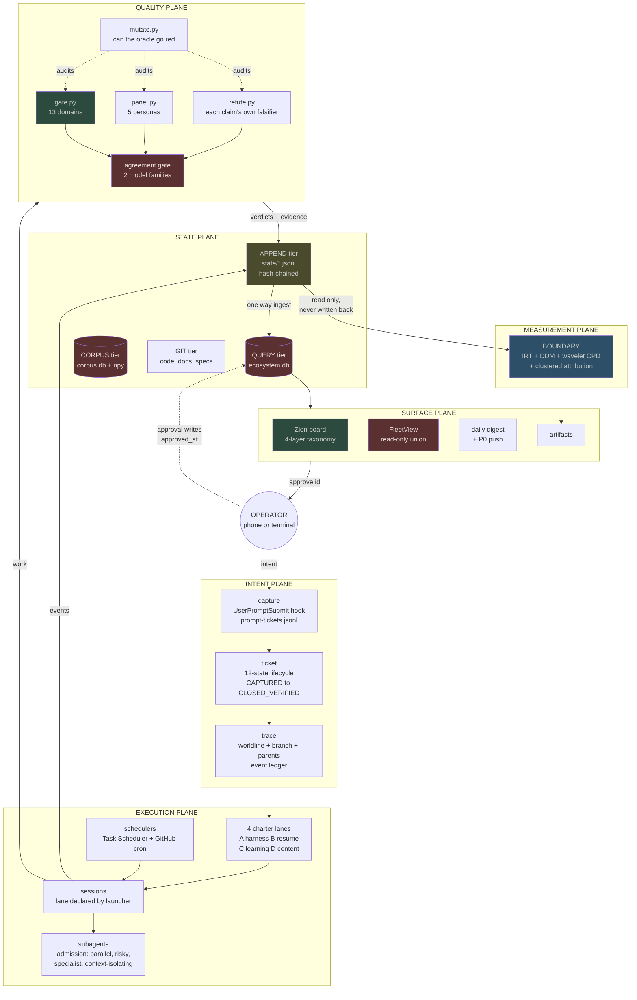
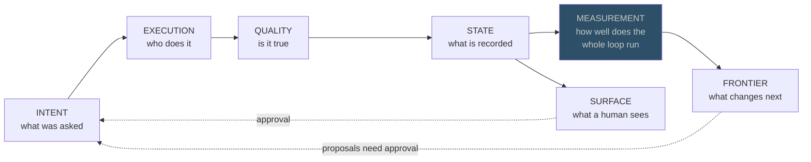
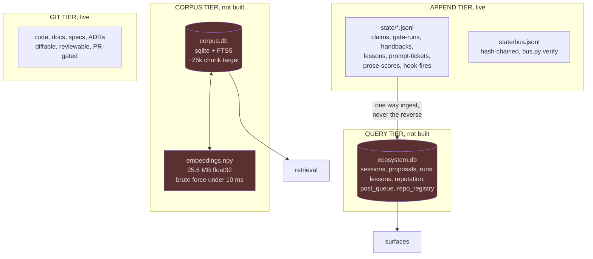
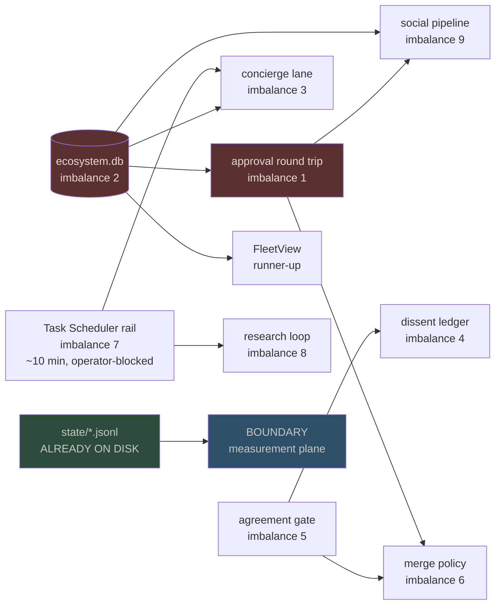

# PRD: Unified architecture

One document that holds the whole flow: every plane, every spec folded in with a
reasoned verdict, and the critical path that says what unblocks what.

Written because BOUNDARY (`docs/prd/2026-08-03-boundary-termination-instrument.md`) was
scoped to one plane of seven and reading it alone would misrepresent the system as a
measurement project. It is not. It is one plane, and it is the plane that was missing.

**Status is proposed.** Nothing here is a completion claim. Status per feature is carried
in §4's tables and every row that says LIVE names the artifact that proves it.

---

## 0. What this supersedes, and what it deliberately does not

It supersedes **nothing**. `CLAUDE-OS.md` remains the spine and its supersession table
remains authoritative. The 18 specs stay where they are and stay readable, because a spec
carries the reasoning and this document only carries the decision. Deleting the reasoning
to keep the decision is how a repository forgets why it chose something.

What this document adds is the thing none of the 21 existing design documents has: **one
place where every feature has a status and a position in a single flow.** They were written
one at a time, each correct in its own frame, and no two of them share a diagram.

| Existing document | Stays authoritative for |
|---|---|
| `CLAUDE-OS.md` | the layer definitions L0 to L8, the deep-work protocol, the supersession table |
| `docs/prd/claude-os.md` (SETUP-OS) | the harness acceptance table |
| `docs/prd/autonomy-ecosystem.md` (AUTO-01..20) | the autonomy acceptance table |
| `docs/SYSTEM-MAP.md` | the honest per-component score and the imbalance queue |
| the 18 specs in `docs/specs/` | the reasoning behind each design |
| `TODO.md` | the one ticket list |
| this document | the flow, the plane assignment, and the merge verdicts |

---

## 1. Method: how the merge was done

Every spec in `docs/specs/` (18 files, 6,118 lines), every PRD (the 4 that predate this
one), and the spine were opened and reduced to a feature list. Each feature got one of five verdicts:

- **LIVE.** Runs today and an artifact proves it.
- **OPEN.** Designed, not built, still wanted.
- **BLOCKED.** Designed, not built, waiting on a named unblock.
- **FOLDED.** The idea survives inside another feature and the standalone version is
  retired to avoid two implementations of one thing.
- **PARKED.** Deliberately not doing it, with the reason recorded rather than deleted.

**No feature was dropped without a verdict.** Where a spec's idea now lives somewhere
else, the row says where. `PARKED` rows are kept visible on purpose: a design that
disappears silently gets re-proposed in six weeks by someone who did not know it was
already considered.

---

## 2. The whole flow

The north star from `docs/prd/autonomy-ecosystem.md`, drawn end to end for the first time.
Colour carries status, not importance.



Green is live, blue is proposed and buildable now, red is designed and not built.

**Read the red.** It is all connective tissue: `ecosystem.db`, the agreement gate, the
approval round trip, FleetView. `docs/SYSTEM-MAP.md` states the same thing in one
sentence, and it remains the most useful sentence anyone has written about this repo:
the system *observes, reviews and reports like an OS, but closes loops like a collection
of scripts.*

---

## 3. The seven planes

Why planes and not only layers. `CLAUDE-OS.md`'s L0 to L8 is a **dependency stack**: what
sits under what. That is the right model for governance and it answers "what must exist
first". It does not answer "which component owns this responsibility", which is why
features have been landing in two layers at once. Planes cut the same system by
responsibility. Both models are kept, and §5 maps between them.



**Measurement is the plane that did not exist**, and its absence is why three effort
levels have been proposed with none measured, why the review waiver reached renewal four,
and why the 940 minutes of restart cost has a number but no model.

---

## 4. Merge: every spec, every feature, one verdict each

### 4.1 Intent plane

| Feature | Source | Verdict | Where it lands |
|---|---|---|---|
| Prompt capture at UserPromptSubmit | prompt-to-ticket-lifecycle | LIVE | `state/prompt-tickets.jsonl` is written by a wired hook |
| 12-state ticket lifecycle with guard table | prompt-to-ticket-lifecycle §2 | OPEN | `NOT_WORK` and `AMENDS` as states rather than a filter is the structural answer to "nothing gets lost". Needs the query tier |
| Backfill the 587 historical prompts | prompt-to-ticket-lifecycle §3 | OPEN | after the lifecycle exists, not before, or the backfill invents intent |
| `BLOCKED_OPERATOR` vs `BLOCKED_EXTERNAL` split | prompt-to-ticket-lifecycle §2.1 | OPEN | exists because L012 recorded two falsely-claimed operator blocks. The strictest guard in the table |
| Worldline, branch, parents event schema | trace-model-sacred-timeline §10 | OPEN | `seq` as order key, `timestamp_utc` explicitly not the order key |
| Canonical branch and pruning | trace-model-sacred-timeline §7 | FOLDED | into the ticket lifecycle. Two competing "what is the real history" mechanisms is one too many |
| Authority order as a sort key | trace-model §8, intent-traceability | LIVE as prose, OPEN as code | raw prompt beats spec beats verified evidence beats repo state beats summary beats vector similarity |
| Intent ledger at `~/.intent/` | CLAUDE-OS L2 | PARKED | superseded by `state/` plus the intent-control-plane subproject. Recorded rather than deleted because the path still appears in older docs |

### 4.2 Execution plane

| Feature | Source | Verdict | Where it lands |
|---|---|---|---|
| Four charter lanes, declared not inferred | charters.md, ADR-0013, ADR-0016 | LIVE | `start-claude.sh` exports `CLAUDE_LANE`; letters A to D since ADR-0016 |
| Phone RC concierge as durable front door | autonomy-implementation §P0.5, AUTO-05 | BLOCKED | imbalance #3. Phone still spawns orphan sessions |
| Subagent admission criteria, default 0 max 4 | CLAUDE-OS L3 | LIVE as rule | parallel, risky, specialist, or context-isolating. `ultracode` is a budget profile, not max-everything |
| One scheduler topology, WSL systemd retired | ADR-0006, AUTO-18 | BLOCKED | imbalance #7, and the cheapest on the list. Both local crons are session-only and die with the session |
| Hive bead bus for atomic multi-session claims | CLAUDE-OS L3 | FOLDED | into `state/claims.jsonl` plus `bus.py`, which is hash-chained and has a verifier |
| Standing personas with cadence | CLAUDE-OS L3 | OPEN | becomes real when standing agents exist. Today they are agent definitions, not schedules |
| SLM swarm, NVIDIA S1 to S6 flywheel | slm-swarm | PARKED | hardware fit was stress-tested 2026-07-23 and the honest read is that subscription Claude beats local small models for every task in these four lanes. Kept for the "do not" list, which is still correct |
| Nightly server-side autonomy pass | AUTO-07 | STAGED | workflow exists; DONE needs a PR URL plus a posted review from run 1 |
| Autonomous changes ship only via PR | ADR-0012, AUTO-08 | LIVE structurally | the agent step has no Bash and only `auto/*` is pushable |

### 4.3 Quality plane

| Feature | Source | Verdict | Where it lands |
|---|---|---|---|
| 13-domain quality contract | quality-contract.json | LIVE | `gate.py run`. Unconfigured is UNCOVERED and UNCOVERED fails |
| Per-oracle selftest | ADR-0005 | LIVE | 8 selftests run as named CI steps so a regression is attributable |
| Mutation control over the oracles | mutate.py | LIVE, with one hole | `--spec all` is green on 13 of 13 since the bus lock fix. It audits oracles, not features |
| Five-persona review panel | panel.py | LIVE, with a known defect | `py-shell-true` still matches inside comments. Filed |
| Claim falsifiers | refute.py | LIVE | each claim carries its own falsifier and the runner executes them |
| Two-model agreement gate | ADR-0004, AUTO-10 | BLOCKED | imbalance #5. Two producers exist and nothing compares them, so "two-model review" is currently two monologues |
| Dissent ledger, recording that agents disagreed | SYSTEM-MAP category X | OPEN | imbalance #4. The agreement gate's disagree branch is its natural producer. Build it the day the gate exists |
| Persona contracts, model-agnostic YAML | persona-review-economy | OPEN | one aspect per persona, no model named in the contract |
| Separate persona reputation and model reputation | persona-review-economy | OPEN | answers "is the ROLE wrong or is the ACTOR weak", which one combined score cannot |
| Thompson allocation over activated personas | persona-review-economy | OPEN | needs volume. AUTO-20 depends on AUTO-09 |
| PR-type routing to persona sets | persona-review-economy §0 | OPEN | cheap signals: changed paths, blast radius, diff size |
| PIP and firing, probation until N>=20 | persona-review-economy | OPEN | reputation from external truth only (ADR-0008) |
| Merge policy, auto-low vs approval-risky | AUTO-11 | BLOCKED | imbalance #6, behind the approval round trip |
| Eval gates non-blocking until trusted | CLAUDE-OS L5 | LIVE as rule | deterministic checks always run before LLM judges |
| Validity discipline for any shipped scorer | CLAUDE-OS L5 | OPEN | ground-truth calibration, stratified checks, test-retest, documented weights, or it is labelled a heuristic. **This is the rule BOUNDARY must satisfy about itself** |
| Deterministic preflight | deterministic-preflight | OPEN | explicitly a proposal needing `/diverge` on the recipe before build |
| Blast-radius graph feeding reviewer count | CLAUDE-OS L5b | OPEN | wide diff gets more reviewers |

### 4.4 State plane

Four storage classes and the rule that assigns them, from `data-architecture-and-orchestration`.



| Feature | Source | Verdict | Note |
|---|---|---|---|
| Append tier, hash-chained where it matters | live | LIVE | `bus.py verify` makes rewriting history visible |
| `ecosystem.db` as system of record | AUTO-06, ADR-0011 | BLOCKED | **imbalance #2, and the highest-leverage single artifact in the repo.** Named unblock for work-claims, post_queue, FleetView, runs and reputation. Every JSONL interim is a debt against it |
| One-way ingest, ledger to db, never reverse | data-architecture §5 | OPEN | the rule that keeps the append tier authoritative |
| `corpus.db`, sqlite plus FTS5 plus npy sidecar | research-corpus-and-cache §4 | OPEN | **and the sizing argument is the valuable part**: 25k chunks makes an ANN index unwarranted. No FAISS, no Chroma, no LanceDB, no pgvector |
| row-reuse and cache2action | research-corpus-and-cache §5 | OPEN | the reason the corpus is a store and not a folder |
| Dolt for versioned data | data-architecture §3, our-own-dolt | PARKED | warranted only where row-level history is queried. Nothing here queries it yet |
| Docs control plane, one authoritative location per fact | rules, L6 | LIVE | generated maps fail on hand edits, which is the stick |
| Estate directory standard plus `.alint.yml` | agentic-directory-standard-sota | OPEN | machine enforcement of the directory shape, ADR-0020 adopted the standard |

### 4.5 Surface plane

| Feature | Source | Verdict | Note |
|---|---|---|---|
| Zion board, four-layer taxonomy | kanban-four-layer-model, zion-board-as-product-instrument | DESIGN, unapplied | workflow stage, work taxonomy, agent role and autonomy, environment. Board throughput is currently zero: 31 epics, 0 closed, 5 of 184 checklist items |
| GitHub-native field schema and views | github-native-project-surface | DESIGN, unapplied | every write command in that spec is marked unexecuted |
| Per-repo project federation | project-federation | PARKED with reasoning | the spec argues against itself and concludes the federation is overhead. Kept because the argument is the useful part |
| FleetView, read-only union over three stores | command-center-superior | BLOCKED | waits on `ecosystem.db`. The load-bearing idea is adopted already: **observe the harness's own on-disk truth, never maintain a shadow execution store** |
| Typed DTO boundary on every inbound read | command-center-superior §4.2 | OPEN | no raw jsonl line reaches a rendered view |
| Daily digest push plus immediate P0 | CLAUDE-OS L4 | LIVE | digests carry `_provenance` |
| Approval round trip, "approve id" writes `approved_at` | AUTO-05, AUTO-13 | BLOCKED | **imbalance #1. Until this exists, both gated loops are structurally impossible** and every investment upstream of them stalls |
| Outward posts drafted, never auto-sent | ADR-0014 | LIVE as policy | and the send path is deliberately unbuilt |
| Windows toast on Notification hook | live | LIVE | `notify-toast.ps1` |
| Artifacts as the mobile-readable surface | this session | LIVE | three published in three days |

### 4.6 Measurement plane

This is BOUNDARY, and the full detail is in its own PRD. Its position here is the point:
it reads the state plane and writes nowhere near it.

| Feature | Verdict | Note |
|---|---|---|
| `extract.py`, ledgers to one row per turn | OPEN | reads 7 ledgers, writes none of them |
| 2PL IRT over session x gate domain | OPEN | which of the 13 domains actually discriminate. Prediction: `codemap` and `docmap` are near zero |
| DDM fit over agent stop events | OPEN | boundary separation is the `effortLevel` argument's missing number |
| MODWT change-point detection, multiscale | OPEN | rule changes move behaviour within a session, model changes across days |
| TabPFN-3 ceiling plus LightGBM shippable plus clustered TreeSHAP | OPEN | TabPFN-3 licence is research and internal evaluation only, and covers outputs |
| Weekly self-improvement loop | CLAUDE-OS L5, OPEN | skills fired vs never, hooks errored, intents without proof. Applied only on approval |
| Capability honesty matrix | CLAUDE-OS L1, OPEN | what each rail verifies against what it claims. Stub functions and always-pass checks are defects by definition |

### 4.7 Frontier plane

| Feature | Source | Verdict | Note |
|---|---|---|---|
| Learning-card emitter to the study queue | CLAUDE-OS L8 | OPEN | the bridge from building with a concept to knowing it |
| Latent and vector transport declaration | CLAUDE-OS L8, ADR-0018 | LIVE as declaration | every inter-agent edge declares `transport=text_json` today, swappable later without topology redesign. **The honesty clause matters: no false claim of latent comms on closed models** |
| mojuco adversarial sim-verify | CLAUDE-OS L8 | FOLDED | into Workflow adversarial verify |
| artifixer opacity masking | CLAUDE-OS L8 | FOLDED | into the grounding veto. Zero-opacity content is killed, never softened |
| Closed-loop recalibration | CLAUDE-OS L8 | OPEN | settled outcomes to learned adjustments to config, no human dial. **Depends entirely on the measurement plane existing** |
| Autoresearch loop over the harness | boundary PRD §6.3 | OPEN, sequenced last | must not precede the attribution model, or it optimises against an unaudited oracle |
| Sparse autoencoder over the voice corpus | this session | OPEN | the only branch that touches real mech-interp machinery. Qwen3-Embedding-8B as substrate |
| Tensor-network complexity measures | this session | PARKED | no complexity question yet needs it |
| WhatsApp copilot: triage, drafts, retro | CLAUDE-OS L2 | PARTIAL | the reader is proven and the corpus is queryable. Triage and drafts unbuilt. Send path deliberately absent |

---

## 5. Mapping planes to the L0 to L8 stack

Both models are kept. This is the join.

| Plane | Layers it draws on | The one artifact that would prove it |
|---|---|---|
| Intent | L0 kernel, L2 memory | a ticket that moved CAPTURED to CLOSED_VERIFIED with evidence at each edge |
| Execution | L3 orchestration, L7 platform | a scheduled run that survived a laptop sleep |
| Quality | L5 fabric, L5b enforcement | an agreement gate posting a verdict with provenance, and a dissent row when they disagree |
| State | L2, L6, L7 | `ecosystem.db` answering one query no jsonl scan can |
| Measurement | L0 confidence gates, L5 validity | one fitted number that changes a rule |
| Surface | L4 I/O, L6 portfolio | "approve id" from the phone writing `approved_at` |
| Frontier | L8 | a learning card filed by a session that shipped work |

---

## 6. The critical path

From `docs/SYSTEM-MAP.md`'s imbalance table, redrawn as a blocking DAG. This is the part
that decides what to build next, and it is not a matter of taste.



**Two readings, and the second is the reason this document exists.**

First: `ecosystem.db` and the approval round trip gate almost everything. Six of the top
ten imbalances trace back to one of those two. That has been true since 2026-07-24 and
neither has moved.

Second, and this is new: **BOUNDARY has no upstream *build* dependency.** Its input is
`state/*.jsonl`, already on disk and already append-only. It is the only substantial item on
the board not waiting for another artifact to be built.

**It is NOT "already labelled", and the earlier wording here contradicted BOUNDARY's own
§6.2.** What exists is `claim survives refute`, an oracle **proxy** with known selection
bias, present only for claims that carried a falsifier, and not a measurement of whether a
stop was premature. **That label gap is the real gate on the measurement plane**, and
calling the ledgers labelled hid the thing that has to be built first. That is
not an argument that it is the most important thing. It is an argument that it is the
thing that can start today, and that its output (which parts of the gate discriminate,
what the effort level actually buys, when sessions stop early) directly informs how much
of the red tissue is worth building at all.

---

## 7. Non-goals for the unified surface

- **Not a rewrite.** Nothing in §4 proposes replacing a live component. FOLDED rows retire
  a duplicate design, not a running artifact.
- **Not a new board.** Zion stays the board. This document is not a second task list, and
  `TODO.md` remains the one ticket list.
- **Not full autonomy.** Publish and risky-merge stay human-gated (ADR-0012, ADR-0014).
- **Not paid API spend.** Subscription OAuth only (ADR-0002).
- **Not a claim that any red box works.** Every red box in every diagram here is designed
  and unbuilt, and the diagram colours are the claim.

---

## 8. Falsifiers

**F1, on the plane model itself. REWRITTEN 2026-08-03 after external audit (medium), which
found the original self-contradictory.** The audit is right: §5 maps each plane to several
layers while F1 demanded every feature live in exactly one plane, and the flow itself spans
planes (approval is a Surface action that writes State; Quality produces State evidence). A
blind-reassignment test with an asserted 15% threshold also measures categoriser agreement,
not whether the taxonomy changes any decision.

**The rule that makes the plane model enforceable instead of decorative:** a plane owns a
feature's **primary responsibility and its acceptance criterion**. Crossing planes at
runtime is expected and is not a violation. What is a violation is two planes both claiming
they decide whether a feature is done.

Restated test: **for each of the 60 rows, exactly one plane owns its DoD row in §9.** If a
row's acceptance criterion is written in two planes, or in none, the assignment is wrong.
That is checkable by reading §9 and does not need a second rater.

**Refuted if the dual taxonomy never changes a decision.** Concretely: if after six weeks no
design argument has been settled by asking "which plane owns this", then planes are a second
vocabulary for the same thing and `CLAUDE-OS.md`'s layers were sufficient. That is a weaker
test than a number and it is the honest one, because the claim being made is about
usefulness rather than about partition quality.

**F2, on the critical path.** The claim is that `ecosystem.db` and the approval round trip
gate six of the top ten imbalances. Test: build only BOUNDARY, change nothing else, and
see whether any other imbalance moves. **Refuted if one does**, which would mean the
dependency graph above is drawn wrong.

**F3, inherited from BOUNDARY and deliberately NOT restated here.** The round-2 audit found
that this document's paraphrase had dropped both the held-out performance condition and the
pre-registered threshold, so the same result could pass here and fail there. **The
definition lives in `docs/prd/2026-08-03-boundary-termination-instrument.md` §8 and only
there.** This row is a pointer and carries no criteria of its own.

**And the standing rule this document must obey about itself**: CLAUDE-OS L5's validity
discipline says any scorer the OS ships needs ground-truth calibration, stratified checks,
test-retest stability and documented weight derivation, or it is labelled a heuristic.
**BOUNDARY ships scorers. Until those four exist for it, every number it produces is
labelled a heuristic in its own output.** That constraint is written here rather than only
in the BOUNDARY PRD because a scorer that grades its own honesty is exactly the failure
class this repo logs.

---

## 9. Definition of done

Requested explicitly: the exact features, and the exact standard research and code files
that constitute scope. Both are measured below rather than asserted. Every count came from
a command run on 2026-08-03 against the working tree.

### 9.1 The scope, counted

Nothing is "the repo" in the abstract. This is what exists, and any DoD that does not
account for a row here has left something behind.

| Class | Count | Size | Where | In scope for this PRD |
|---|---|---|---|---|
| Tracked files | 1,852 | | `git ls-files` | as context |
| Python components | 93 files | 23,736 lines | `tools/` | 8 are oracles and are DoD-bearing (§9.2) |
| Test files | 27 | | `tests/` | 435 tests must stay green |
| State ledgers | 15 | 6.2 MB | `state/` | 7 are BOUNDARY inputs (§9.3) |
| Documentation | 122 files | 25,250 lines | `docs/` | |
| ... of which specs | 18 | 6,118 lines | `docs/specs/` | all 18 merged in §4 |
| ... of which analysis | 37 | 8,125 lines | `docs/analysis/` | sampled, not read whole. See §10 |
| ... of which ADRs | 20 | | `docs/adr/` | binding |
| ... of which PRDs | 5 | | `docs/prd/` | this is the fifth |
| Prior-art records | 39 | | `docs/prior-art/` | one per component over 300 lines |
| Research corpus | 178 files | 3.6 MB | `research-papers/` | corpus tier input, not yet ingested |
| Work docs | 269 files | | `work-docs/` | dated snapshots, several knowingly stale |
| Skills, repo copy | 74 | | `dot-claude/skills/` | payload |
| Skills, live | 40 | | `~/.claude/skills/` | **34 fewer than the repo carries** |
| Hooks, repo copy | 30 | | `dot-claude/hooks/` | payload |
| Hooks, live | 17 | | `~/.claude/hooks/` | of which 12 are wired in settings |

**Two numbers in that table are themselves findings.** The live skills tree has 40 entries
against the repo's 74, and the live hooks tree has 17 against 30 with only 12 wired. The
repo is not the machine. `python tools/audit/skills_sync.py check` is the instrument that
measures that drift and it is a DoD gate below.

### 9.2 Definition of done: the standing repo, which must not regress

These are not new work. They are the floor that every DoD row below sits on, and a feature
is not done if any of these went red while it landed.

```bash
python tools/gate/gate.py run --project .          # VERDICT: PASS
python -m pytest tests/ -q                         # 435 passed
python tools/gate/gate.py selftest
python tools/review/panel.py selftest
python tools/bus/bus.py selftest
python tools/refute/refute.py selftest
python tools/skilleval/run.py selftest
python tools/snapshot/snap.py selftest
python tools/audit/skills_sync.py selftest
python tools/audit/mutate.py --spec all            # 13 of 13 specs, 0 survived
python tools/map/codemap.py check                  # map clean
python tools/docmap/docmap.py check                # docmap clean
python tools/slop_lint.py <every .md touched>      # clean
python tools/bus/bus.py verify                     # chain intact
```

Exit zero on all of the above, on the commit being claimed, not on a neighbouring one.

### 9.3 Definition of done: per feature, exactly

One row per buildable feature. **Done means the command in the third column exits zero and
produces the artifact in the fourth.** A row with no executable check is marked as such and
is not claimable as done.

#### Measurement plane, BOUNDARY

| # | Feature | The check | The artifact |
|---|---|---|---|
| M1 | `extract.py` | `python tools/boundary/extract.py --out state/boundary/turns.parquet` exits 0; row count equals turns in `prompt-tickets.jsonl` within 2%; `git status --porcelain state/*.jsonl` is empty after the run | `state/boundary/turns.parquet` |
| M2 | Read-only guarantee | a test that snapshots sha256 of all 15 ledgers, runs the full pipeline, and asserts every hash unchanged | `tests/test_boundary_readonly.py` passing |
| M3 | 2PL IRT over gate domains | `python tools/boundary/psychometrics.py irt` exits 0 and emits discrimination and difficulty for all 13 domains | `state/boundary/irt.json` |
| M4 | IRT sanity falsifier | `codemap` and `docmap` discrimination both below the median of the 13. If not, extraction is wrong | recorded either way in `docs/analysis/` |
| M5 | DDM fit over stop events | `python tools/boundary/psychometrics.py ddm` emits boundary separation, drift, bias, non-decision time per effort level, each with a confidence interval | `state/boundary/ddm.json` |
| M6 | Multiscale change points | `python tools/boundary/regimes.py` emits dated regime boundaries at 3 or more scales | `state/boundary/regimes.json` |
| M7 | Ceiling and attribution | `python tools/boundary/fit.py` emits TabPFN-3 held-out score, LightGBM held-out score, and clustered TreeSHAP ranking. **Both must beat base rate on held-out sessions or the row is not done** | `state/boundary/attribution.json` |
| M8 | Correlated-feature clustering | attribution is reported per cluster, and the cluster membership plus the correlation matrix ship in the same file | same |
| M9 | Report | `python tools/boundary/report.py` writes a dated analysis doc where **every number names its source ledger and row count** | `docs/analysis/<date>-boundary.md`, slop_lint clean |
| M10 | Heuristic labelling | until M11 exists, every number in M9's output carries the literal word `heuristic` | grep-checkable |
| M11 | Validity discipline, per CLAUDE-OS L5 | ground-truth calibration set, stratified checks, test-retest stability across two extraction runs, documented weight derivation. Only when all four exist may M10 be removed | `docs/analysis/<date>-boundary-validity.md` |
| M12 | The F3 falsifier executed | run M7 separately for agent-layer and oracle-layer stops, **against the criteria in BOUNDARY §8 and not a paraphrase of them**, and **record the result whichever way it lands** | a dated row in `state/refutations.jsonl` |

#### State plane

| # | Feature | The check | The artifact |
|---|---|---|---|
| S1 | `ecosystem.db` exists with the AUTO-06 tables | `python tools/eco/db.py init` then a query returning rows from `sessions`, `proposals`, `runs`, `lessons`, `reputation`, `post_queue`, `repo_registry` | `state/ecosystem.db` |
| S2 | One-way ingest | a test that mutates a db row, re-runs ingest, and asserts the ledger is unchanged and the db row is overwritten | `tests/test_eco_ingest.py` |
| S3 | `corpus.db` with FTS5 | ingest of `research-papers/` (178 files) plus `docs/` produces a chunk count within 20% of the 7,336 estimate, and an FTS query returns in under 50 ms | `state/corpus.db` |
| S4 | Dense retrieval without an ANN index | brute-force cosine over the npy sidecar answers in under 10 ms at the built corpus size, measured, not assumed | `state/corpus.npy` plus a timing line in the report |
| S5 | row-reuse and cache2action | a second identical research query returns the cached rows and records a reuse row | `state/corpus-reuse.jsonl` |

#### Quality plane

| # | Feature | The check | The artifact |
|---|---|---|---|
| Q1 | Agreement gate | two independent reviews on one real PR, a posted comparison comment carrying `_provenance`, and an audit row | a PR URL |
| Q2 | Dissent ledger | one row written by the disagree branch of Q1, with both verdicts and the diff between them | `state/dissent.jsonl` |
| Q3 | `py-shell-true` comment defect | a regression test where the same string is CLEAN in a comment and a HIT in code, then the panel returns fewer than 3 high | `tests/test_panel_comment_tokens.py` |
| Q4 | Persona contracts | at least 3 contracts in `dot-claude/personas/*.yaml`, each naming one aspect and zero models | the files |
| Q5 | Split reputation | `persona_rep` and `model_rep` are separate tables and a query answers "role wrong or actor weak" | in `ecosystem.db` |
| Q6 | Merge policy | one low-risk PR auto-merged on green plus agreement, and one risky PR held for approval, both logged | two PR URLs |

#### Surface plane

| # | Feature | The check | The artifact |
|---|---|---|---|
| U1 | Approval round trip | `approve <id>` sent from the phone writes `approved_at` into `ecosystem.db` and the sender receives an ack | a db row plus a push receipt |
| U2 | Concierge lane | a phone-originated intent lands in a durable session, not an orphan, evidenced by a session id present in `hook-fires.log` | the log line |
| U3 | Scheduler survives sleep | a scheduled job fires after the laptop has slept, evidenced by a timestamp gap | `hook-fires.log` |
| U4 | FleetView | reads `ecosystem.db` and the session jsonl union, writes nothing, and every inbound record is decoded to a typed DTO | a running binary plus a boundary test |
| U5 | Zion board carries the four-layer taxonomy | all 31 open items have all four field values set, written through the JSON publisher and never by hand | `state/github-backlog-<date>.json` plus a board query |

#### Intent plane

| # | Feature | The check | The artifact |
|---|---|---|---|
| I1 | 12-state lifecycle | every transition in the allow-list has a guard, and an illegal transition is rejected by a test | `tools/intent/tickets.py` plus tests |
| I2 | Backfill | the 587 historical prompts are classified, **including into `NOT_WORK` and `AMENDS`**, and zero are dropped. Count in equals count out | a reconciliation line in the report |
| I3 | Trace event schema | events carry `seq`, `hash`, `parents`, `prev`, `worldline_id`, `branch_id`, `branch_kind`, and `seq` is the order key rather than the timestamp | a schema test |

#### Detail, intent and creativity (spec: `docs/specs/2026-08-03-detail-passes-teleology-and-creativity.md`)

Added 2026-08-03 after the DoD above was found to answer "does the feature work" and not
"is the work detailed enough, does it serve the actual intent, and is it any good". 14
further rows live in that spec's §5. The three headline ones:

| # | Feature | The check | The artifact |
|---|---|---|---|
| D1 | Multi-lens verification passes, fixed-N | N heterogeneous lenses catch strictly more than the single best lens alone on held-out claims, **or D1 closes as pure cost**; every terminal state in the spec's §2.2 table emits `UNDECIDED` and never `ACCEPT`, mutation-tested. The adaptive stopping rule was **withdrawn** on external audit and is now gated behind measured lens calibration and correlation | `tools/passes/` plus a comparison table |
| D2 | Teleological header on every ticket: `why`, `for`, `within`, `appraisal` | closing a ticket requires evidence naming its `for`; the 288 existing rows are backfilled with count in equals count out; appraisal extraction runs on operator turns only and stores tags, never third-party text | `state/prompt-tickets.jsonl` schema plus `state/appraisals.jsonl` |
| D3 | Measured `p_conventional` instead of asserted | `/diverge` emits a computed value from distance to a separately-generated mode baseline; the 7 existing values in `docs/taste.md` are re-scored and **the disagreement is published, not overwritten** | `state/diverge-baselines.jsonl` |

**Why these were missing.** The 31 rows above ask whether a component works. None of them
asks whether the work was thorough, whether it served the goal behind the request rather
than its letter, or whether a creative choice was actually distinctive. Those are three
different questions and the literature has instruments for all three.

### 9.4 What "done" does not mean here

- **Not "the code exists".** Nine of the rows above are satisfied only by a number
  produced from real data, and an empty output file passes no row.
- **Not "the gate is green".** The gate is the floor in §9.2, not the ceiling. A feature
  whose only evidence is a green gate has evidence that it did not break anything, which
  is a different sentence.
- **Not "I ran it once".** M11 requires test-retest across two extraction runs precisely
  because a single run is what every over-claimed row in this repo's history rested on.
- **Not transferable.** These DoD rows are for this operator's ledgers. Nothing here
  generalises and nothing here should be published as if it does.

## 10. Coverage and what is not established

**What was read.** All 18 specs in `docs/specs/`, all 4 PRDs, `CLAUDE-OS.md` layers L0 to
L8, `docs/SYSTEM-MAP.md` including the imbalance table, `docs/EXECUTION-PLAN.md`, and the
ADR index. Section maps were extracted from every spec; the six largest were read in
depth (prompt-to-ticket 823 lines, research-corpus 803, decision-rules 669, trace-model 607,
github-native 584, kanban 465).

**What was sampled rather than read whole.** `docs/analysis/` is 37 files and roughly
9,000 lines. Its findings enter this document through `SYSTEM-MAP.md` and `TODO.md`, which
are the surfaces those analyses feed. **Individual analysis documents were not each read
end to end**, so a finding that never reached those two surfaces is not represented here.
That is a real coverage boundary and it is the most likely place for something to have
been left behind.

**Verdicts are judgements, not measurements.** LIVE rows name an artifact. OPEN, BLOCKED,
FOLDED and PARKED rows are arguments, and the argument is in the linked spec.

**Nothing here is built.** This document adds no code. It adds a merge, a flow, and a
falsifier for its own organising idea.

**Status counts, parsed from §4 rather than counted by hand.** The hand count in the first
draft was wrong and the round-2 audit caught it. Measured: **68 feature rows** (Intent 8,
Execution 9, Quality 17, State 8, Surface 10, Measurement 7, Frontier 9). Verdicts: **LIVE
18, OPEN 28, BLOCKED 7, PARKED 5, FOLDED 4**, plus **6 rows carrying a status the five-state
scheme does not declare** (STAGED, DESIGN, PARTIAL). Those six are a defect in this
document, tracked under F1 in §8: **§1 declares five verdicts and §4 uses eight.** The seven
blocked rows all trace to two artifacts and one operator action.
