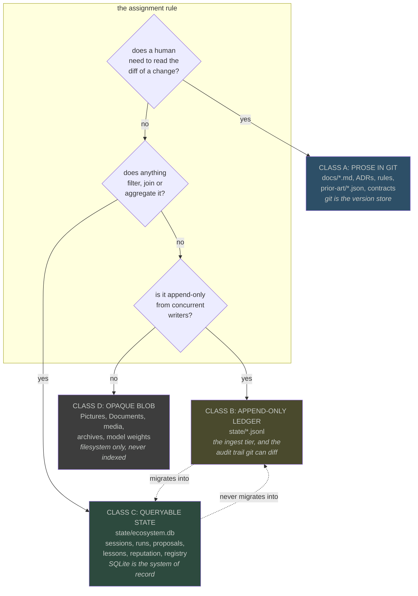
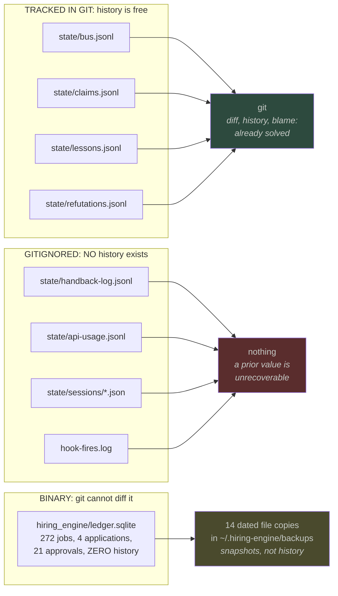
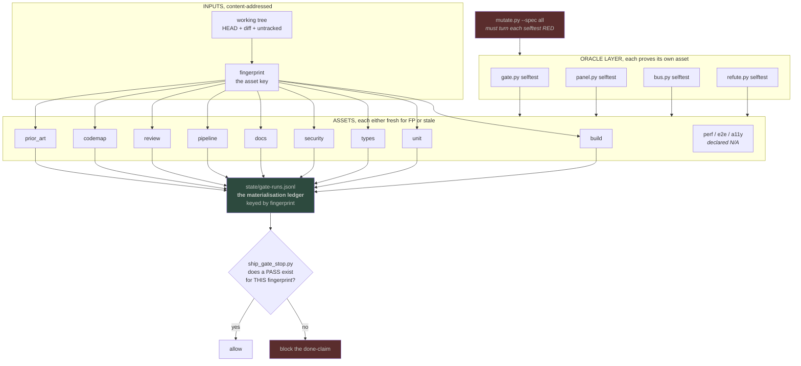
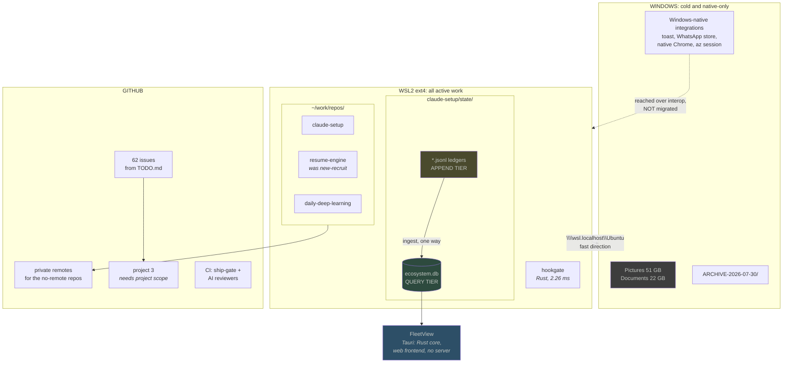

# Data architecture and orchestration: what SQLite is for, what git is for, and what shape the DAG actually is

- Date: 2026-07-30
- Status: PROPOSAL, pending operator approval. Nothing here is built.
- Supersedes nothing. Extends ADR-0010 (disk is memory) and ADR-0011 (one operational state db).
- Prompted by the operator's question: does SQLite fit `.git`, `.jsonl`, `.md` and the other
  forms, is DoltHub-style versioning warranted, and what is "the next form of DAGs suitable".

Three corrections up front, because the design changes if they are wrong.

**There is no `ledger.csv`.** The store the operator is thinking of is
`Downloads/new-recruit/hiring_engine/ledger.sqlite`, plus 14 dated copies under
`~/.hiring-engine/backups/`. So the hiring engine already runs on SQLite, and the question is
not whether to adopt it but whether to extend it.

**This is not big data.** Total operational state across the twelve `state/*.jsonl` ledgers is
under 4 MB. `state/resource-ledger.jsonl` is the largest at 1.7 MB, `gate-runs.jsonl` next at
1.1 MB. The largest single artifact anywhere in the estate is a 51 GB photo library that no
tool queries. What the operator is actually describing is **schema heterogeneity**, many small
shapes, not volume. That distinction decides the whole design: a volume problem wants
partitioning and columnar storage, a heterogeneity problem wants a schema and a query planner.
SQLite is the answer to the second and irrelevant to the first.

**The orchestration graph already exists, undeclared.** See section 4. `ship_gate_stop.py`
looks up whether a PASS exists for a *fingerprint of the current tree*, which is
content-addressed asset materialisation. That is the modern shape already, arrived at by
accident, and the work is to make it explicit rather than to adopt a framework.

## 1. The four storage classes, and the rule that assigns them

Every artifact in this estate belongs to exactly one of four classes. The rule is not
"structured versus unstructured", it is **who needs to diff it and who needs to query it**.

The arrow that matters is the dotted one, and it goes **one way only**. Ledgers feed the
database; the database never feeds back. That is what keeps the ledger honest: it is written by
whoever produced the event, at the moment it happened, with no read-modify-write.

## 2. Does SQLite fit each form: answered per class, not in general

| form | class | move to SQLite? | the reason that decides it |
|---|---|---|---|
| `docs/**/*.md`, ADRs, rules, specs | A | **No, and never** | ADR-0011 already says prose belongs in git. A markdown file's value IS its diff. Putting it in a table destroys review, blame and PR comment anchoring, and buys a query nobody runs. |
| `docs/prior-art/*.json`, `quality-contract.json` | A | **No** | These are *reviewed configuration*. The prior-art gate requires named alternatives and an expiry date, and a human reads that in a PR. A row in a table cannot be reviewed. |
| `~/.claude/.../memory/*.md` | A | **No** | Markdown with frontmatter, one fact per file, linked by `[[name]]`. The link graph is the query, and it is small enough to walk. |
| `state/bus.jsonl` | B | **No, blocked** | It is a **hash chain**: each row commits to its own content and to the row before it. `bus.py verify` is the check. That property does not survive a table, and it exists because a delivered row was once edited from "gate is RED" to "gate is GREEN". |
| `state/gate-runs.jsonl` (1.1 MB, largest) | B → C | **Yes, and it is the strongest case** | This is the one thing that IS queried, by fingerprint, on every turn. Growing linearly, scanned linearly. An index on the fingerprint turns an O(n) scan into O(log n). Keep the JSONL as the append tier. |
| `state/refutations.jsonl` (360 KB, 417 rows) | B → C | Yes | Joined against claims by lane and id. Currently that join is a Python loop over two files. |
| `state/claims.jsonl`, `claims-verify.jsonl` | B → C | Yes | The whole point of claims is cross-lane exclusion, which is a uniqueness constraint. A table enforces it; a JSONL file can only be checked after the fact. |
| `state/lessons.jsonl` | B → C | Yes, mirrored | ADR-0011 says "mirror", not "move". Lessons are read by humans in the session brief and queried by tooling. Both tiers earn their place. |
| `state/handback-log.jsonl`, `hook-fires.log`, `api-usage.jsonl`, `resource-ledger.jsonl` | B | **Keep as JSONL** | Written by hooks at turn boundaries, several while a gate is being fingerprinted. These are gitignored precisely because tracking them makes the gate self-invalidating. A SQLite write from a Stop hook would add a writer lock to the hottest path in the system for telemetry nobody joins. |
| `state/sessions/*.json`, `state/reviews/*.json` | B | Keep as files | Content-addressed by session id and commit sha. The filename IS the index. |
| `hiring_engine/ledger.sqlite` | C | **Already there** | 272 jobs, 4 applications, 21 approvals. The real defect is that it has **zero history**, see section 3. |
| Pictures, Documents, archives, model weights | D | **No** | 51 GB and 22 GB respectively, queried by nothing. Indexing them would be pure cost. |

The pattern: **SQLite wins where something joins or where a uniqueness constraint should be
enforced rather than audited.** It loses everywhere the artifact's value is its diff, and it
loses on the hook-hot path where a writer lock would serialise turn boundaries.

## 3. The versioning question, and where Dolt is actually warranted

`docs/analysis/2026-07-25-our-own-dolt.md` already worked this through in seven sections. Its
conclusion, restated rather than re-derived: three of Dolt's five features (diff, history,
blame) are already provided for `state/` by git, because the ledgers are append-only text, so
`git show <rev>:state/x.jsonl` answers "what did this say on the 25th".

That leaves a narrow, real gap, and it is the one ABSORB-02 names. It is not about `state/` at
all:

So the honest verdict on Dolt: **not warranted, and the reasoning is about cost of adoption
versus the size of the actual gap.** Dolt is a MySQL-compatible server. Adopting it means a
running daemon, a second SQL dialect, and a migration, to gain versioning for one 1 MB SQLite
file and a handful of gitignored telemetry logs. The repo rule "no server processes without an
owner" bites directly.

What covers the gap for a fraction of the cost:

1. **For `ledger.sqlite`: a session-table history pattern.** Add `valid_from` and `valid_to`
   columns, never UPDATE in place, and INSERT a superseding row instead. This is bitemporal
   modelling and it is decades old. It gives point-in-time reconstruction inside the same file
   with no daemon. The 14 dated backups become redundant.
2. **For the gitignored ledgers: decide per file whether history matters.** For most it does
   not, and that is why they are ignored. `handback-log.jsonl` is the exception worth arguing
   about, because it is the only measurement of the gate's own false-positive rate, and
   `.gitignore` already records the reason it cannot be tracked (the Stop hook writes it while
   reporting a green gate, invalidating the fingerprint it just earned). The fix is not Dolt,
   it is aggregating it into `ecosystem.db` on a schedule so the *rate* is durable even though
   the raw rows are not.

## 4. The DAG question: the graph exists, it is asset-shaped, and it is undeclared

The operator asked what "the next form of DAGs" is. The genuine state of the art moved twice,
and this estate has already landed on the second shift without naming it.

**Shift one, task DAGs to asset graphs.** Airflow models a graph of *tasks to run*. Dagster
models a graph of *assets that should exist*, and derives the work from what is stale. The
question changes from "run this at 3am" to "is this artifact current for this input".

**Shift two, orchestrator-centric to durable execution.** Temporal and Restate make the
workflow ordinary code whose progress is persisted, so there is no separate DAG definition at
all.

Here is what this repo already does, and why it is shift one:

`ship_gate_stop.py` refuses a completion claim unless `state/gate-runs.jsonl` holds a PASS
against a **fingerprint of HEAD plus the diff plus untracked filenames**. That is not a
schedule and not a task. It is a materialisation check: *does a verified artifact exist for
this exact input*. `state/reviews/<sha>.json` is the same idea keyed by commit. The 12-domain
contract is a set of assets with declared coverage, and `UNCOVERED fails` is the staleness rule.

So the recommendation on DAGs is **do not adopt an orchestrator**. Three reasons, in order of
weight:

1. **The graph is already asset-based and content-addressed**, which is the thing Airflow users
   migrate to Dagster to get. Adopting a task scheduler would be a step backwards.
2. **There is no distributed execution to coordinate.** One machine, one operator. Airflow,
   Dagster and Temporal all exist to coordinate work across workers, and every one of them
   requires a server, which the repo rule forbids without an owner.
3. **The eight existing cron jobs are a schedule, not a graph.** They have no inter-dependencies
   worth expressing. A scheduler would add a component to model an empty edge set.

What to build instead, and it is small: **declare the asset graph that already exists.**
`ecosystem.db` gets a `materializations` table keyed by `(asset, fingerprint)`, `gate-runs.jsonl`
becomes its ingest tier, and `gate.py` learns to skip a domain whose asset is already fresh for
the current fingerprint. That is the actual win available here, and it is a query, not a
framework: today every gate run re-executes all 12 domains even when 11 of their inputs did not
change, which is why a run costs 80 seconds.

The durable-execution shift (shift two) is worth watching and is not worth adopting: its value
appears when a workflow spans hours and can crash mid-flight, and the longest thing here is an
80-second gate run.

## 5. Proposed target state

## 6. What would falsify this design

- If `gate-runs.jsonl` never actually gets queried by fingerprint in practice, the strongest
  SQLite case collapses and the whole `ecosystem.db` argument weakens to "lessons and claims".
  Check: count `ship_gate_stop.py` fingerprint lookups against `state/handback-log.jsonl` rows.
- If a SQLite write from a Stop hook measurably costs less than the JSONL append it replaces,
  the class B/C split is wrong and more should move. Check: measure it, do not assume the
  writer lock is expensive at this scale.
- If the operator ever runs two machines, the "no distributed execution" premise fails and the
  orchestrator question reopens honestly.
- If `ledger.sqlite` grows past roughly 100 MB or gains concurrent writers, the bitemporal
  pattern in section 3 stops being sufficient and Dolt deserves a second look.
