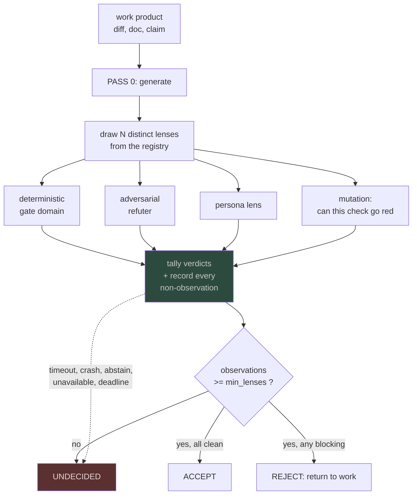
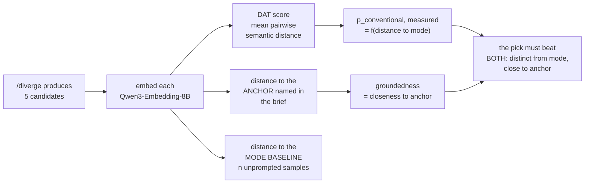

# Spec: dynamic detail passes, the teleological gap, and measured creativity

Status: DESIGN, 2026-08-03. Nothing here is built. Extends
`docs/prd/2026-08-03-unified-architecture.md` §9 with three capabilities its definition of
done did not cover, and answers three questions the DoD was not written to answer.

The three questions, restated exactly as asked:

1. Does the unified PRD have a definition of done. **Yes, §9, 31 rows.** It covers whether
   a feature works. It does not cover the next three rows.
2. How does the system reach human-level attention to detail, with multiple dynamic passes
   and proactive measures.
3. How does it handle the what, the why and the what-for, and emotion and creativity:
   research it, model it, match it.

---

## 1. The honest state of the research, before proposing anything

### 1.1 Multi-pass refinement mostly does not work, and the reason is the design constraint

This is the single most important finding and it cuts against the obvious answer.

**Without external feedback, models struggle to judge the correctness of their own prior
responses.** Prompting-based self-correction produces minimal improvement or *degrades*
performance without strong assumptions about the problem setting. The field's response has
been to stop asking the generator to grade itself: standalone verifier models, separate
critic models producing structured feedback, and multi-agent setups where two or more
models collaborate or compete.

The name for the thing that makes it work is the **generator-verifier gap**. Verification
is easier than generation for a large class of problems, and every method that succeeds
exploits that asymmetry rather than iterating the generator.

**So "run more passes" is not the answer, and this repo is unusually well positioned to do
the thing that is.** It already has four external verifiers that are not the generator:
`gate.py` (13 domains), `panel.py` (5 personas), `refute.py` (each claim's own falsifier),
and `mutate.py` (auditing whether the oracles can go red at all).

**The missing piece was never more passes. It is a *lens draw*: which distinct verifier
looks next, and how many of them must observe before a verdict is allowed.** The first
draft of this spec said the missing piece was a *stopping rule*, and §1.2 records why that
was wrong.

### 1.2 What is missing from the literature, stated as a gap and not a novelty claim

Self-Refine and its descendants use a **fixed or heuristic pass count**: iterate N times, or
until the critic emits no change. Both are wrong for the same reason a fixed sample size is
wrong in sequential analysis: the evidence needed to be confident varies per item, and a
fixed N over-verifies easy items and under-verifies hard ones.

Sequential analysis solved this in 1945. Wald's **sequential probability ratio test** is the
optimally efficient procedure for deciding between two hypotheses from noisy data, and its
psychological descendant, the drift-diffusion model, is the standard account of how a
decision terminates: evidence accumulates until it hits a boundary.

**The searches run on 2026-08-03 did not find SPRT or DDM used as the stopping rule for
LLM verification passes.** That is a gap in what I searched, which is weaker than a gap in
the literature. `prior-art-gate` must run before this is written down as novel anywhere.
What it is strong enough to justify is building it.

**CORRECTION, 2026-08-03, from external audit (Codex, verdict `changes_requested`, severity
critical). The finding is accepted in full.** The first draft proposed summing per-lens
log-likelihood ratios into a Wald boundary. **That is mathematically invalid here.** A Wald
SPRT needs the likelihood of each observation under H0 and H1, and needs the observations
to be conditionally independent. Neither holds:

- **No lens has a calibrated sensitivity or specificity.** Nobody has measured how often
  `panel.py` is right when it says high, so there is no likelihood to take a ratio of.
- **The lenses are not independent.** They inspect the same work product, `mutate.py`
  audits the other three, and drawing a lens once prevents a duplicate observation without
  making the observations independent.
- **Selection is adaptive**, which breaks the fixed-design assumption on top of the rest.

Summing marginal ratios over correlated evidence double-counts it and **forfeits the error
guarantee that was the whole reason to reach for Wald.** The sequential rule is demoted
from the design to a hypothesis that must earn its way in, and §2 is rewritten below.

### 1.3 The appraisal literature names exactly what this repo's intent ledger lacks

The 2026 critique of LLM affect is specific and it lands on this repo:

> LLMs generate affective predictions from opaque, data-driven patterns, **lacking explicit
> representations of core psychological variables like agency, control, and goal relevance.**

Read that as a schema complaint, because that is what it is. And the teleology literature
supplies the schema: a well-formed representation of goal-directed action has **three
elements: a goal, actions intended to achieve it, and constraints** (physical conditions
that limit possible actions).

`state/prompt-tickets.jsonl` has 288 rows. Every row carries the prompt text. **No row
carries a goal, and no row carries constraints.** The ledger records *what* was asked and
has no field for *why* or *what for*. That is Aristotle's final cause missing from a system
whose entire purpose is to serve intent, and it is the structural reason a session can
satisfy the letter of a prompt and miss the point of it.

### 1.4 Creativity is measurable and this repo is currently asserting it

`docs/taste.md` records `/diverge` picks with a `p_conventional` per candidate: 0.95, 0.75,
0.35, 0.25, 0.20, 0.14, 0.12. **Every one of those numbers was asserted by the model that
generated the candidates.** A generator scoring its own novelty is the same failure the
whole of §1.1 is about.

The literature has an automated scorer that needs no human raters. The **Divergent
Association Task** asks for maximally dissimilar items and scores the **mean pairwise
semantic distance under an embedding model**. The 2026 **Divergent Remote Association Test**
extends it to score convergent and divergent thinking together and predicts scientific
ideation ability. Torrance's four dimensions (fluency, flexibility, originality,
elaboration) and Boden's three types (combinatorial, exploratory, transformational) give
the vocabulary; the Consensual Assessment Technique gives the human-rated gold standard and
is explicitly unscalable.

There is also a counterweight worth carrying: 2026 work asks whether LLM creativity has
**peaked**, analysing inter- and intra-model variability, and a separate paper is a critical
analysis arguing existing creativity evaluations are themselves flawed. So the DAT number
is better than an assertion and is not a truth.

---

## 2. Capability D1: the multi-lens pass

### 2.0 What is actually proposed, after the audit

**Phase A, and this is what gets built: fixed-N heterogeneous lenses.** N distinct lenses,
each drawn once, none of them the generator. This satisfies the entire generator-verifier
argument in §1.1 and needs no calibration, no independence assumption and no likelihood
model. It is also the baseline any sequential rule must beat, and shipping it first is the
only way that comparison can ever be run.

**Phase B, gated on measurement: adaptive stopping.** Three things must exist before a
sequential rule is built, and none does today:

1. Per-lens sensitivity and specificity, measured against outcomes.
2. The **pairwise correlation matrix between lens verdicts** on the same items.
3. A demonstration that a simple adaptive rule (stop when the first k lenses agree) beats
   fixed-N at equal catch rate.

If those land and the correlation is low enough to model, a sequential rule becomes
arguable, and its error bound must be stated **conditional on the measured dependence**,
never inherited from Wald. If correlation is high, fixed-N is the answer permanently and
this row closes.

**If exactly one capability here has to be deleted to improve delivery odds, it is Phase
B.** It is calibration-heavy, dependence-sensitive, and depends on BOUNDARY's DDM fit,
which is itself unbuilt.

### 2.1 Shape

**Phase A, which is what gets built.** No accumulator, no likelihood, no boundary.



Two properties, and each exists because of a specific finding above.

- **Heterogeneous, not repeated.** Each pass draws an *unused* lens. Re-running the same
  check is the intrinsic self-correction that §1.1 says fails.
- **Externally grounded.** Every lens is one of the four existing verifiers, none of which
  is the generator. This is the generator-verifier gap made operational.

**Phase B, which is NOT built and is drawn only so the deleted design is on the record.**
Replace the `min_lenses` tally with an evidence accumulator and stop when it crosses a
boundary. **Blocked on the three measurements in §2.0**, and any error bound it claims must
be conditional on the measured dependence rather than inherited from Wald.

### 2.2 Terminal states, all of them

The first draft named one failure path. The audit was right that this leaves the rest
unspecified, and **the default in an under-specified verifier is to fall through to
ACCEPT**, which is the class this repo already logs: a mechanism that runs, reports success,
and is structurally incapable of failing.

| Terminal cause | Outcome | Why not ACCEPT |
|---|---|---|
| Budget exhausted | `UNDECIDED` | running out of evidence is not evidence |
| Lens timeout | `UNDECIDED`, lens marked `unavailable` | a slow verifier is not a passing one |
| Lens raises | `UNDECIDED`, exception recorded | a crashed check verified nothing |
| Lens unavailable (binary missing, auth expired) | `UNDECIDED` | this is the `gws` 401 pattern and it must not read as clean |
| Lens abstains or returns malformed output | counts as **no observation**, never as a pass | |
| Remaining lens set empty before a decision | `UNDECIDED` | |
| Scheduler deadline mid-pass | `UNDECIDED`, partial verdict kept | |
| **Fewer than `min_lenses` observations** | `UNDECIDED` regardless of agreement | closes the accept-after-one-lens hole the audit found in the diagram |

`min_lenses` is a floor, asserted at 2 until measurement says otherwise, and the assertion
is printed in the output.

### 2.3 Where `min_lenses` comes from, and where a boundary would come from if Phase B ever runs

**Phase A has one tunable and it is `min_lenses`.** It is asserted at 2 today. What would
set it honestly is the per-lens sensitivity measurement in §2.0 item 1: once you know how
often each lens is right, you know how many observations buy a given confidence. Until
then Phase A prints `min_lenses=2 (asserted)` in every verdict.

**Phase B's boundary does NOT come from BOUNDARY's DDM fit, and the round-2 audit was
right to catch that.** `M5` fits agent task-completion stops by effort level. A verification
acceptance boundary is a different decision over a different observation sequence with a
different cost structure: the cost of accepting a bad diff is not the cost of an agent
stopping early, and lens verdicts are not task-completion events. **Borrowing the number
across would have been a category error dressed as reuse.**

If Phase B is ever built its boundary has to be derived from **its own** loss function:
the measured false-accept and false-reject rates of the lens set, and the operator's stated
relative cost of the two errors. Nothing in this repository currently supplies either. What
BOUNDARY's DDM fit does give Phase B is **method**, not parameters: it demonstrates that a
boundary can be fitted from recorded decisions rather than asserted.

---

## 3. Capability D2: the teleological header

### 3.1 Three fields, added once, at capture

Every ticket gains a header carrying the goal-directed triple. It is written at capture from
the prompt itself, and it is the operator's to correct.

```jsonc
{
  "ticket_id": "PT-20260803-0142",
  "what":  "the request as literally stated",       // EXISTS today. the only field there is.
  "why":   "the goal it serves",                    // NEW. final cause. teleology's `goal`.
  "for":   "the end state that makes it moot",      // NEW. the terminating condition.
  "within":["constraints that bound the actions"],  // NEW. teleology's `constraints`.
  "appraisal": {                                    // NEW. the three variables the 2026
    "goal_relevance": 0.0,                          //   critique names as missing.
    "agency":         "operator|agent|external",
    "control":        0.0
  }
}
```

**Why `for` is separate from `why`.** `why` is the goal; `for` is the condition under which
the goal is satisfied and the ticket becomes moot. They come apart constantly. "Fix the
kitty errors" has a why (the terminal is unpleasant to work in) and a for (the console is
quiet on the next launch), and a session that fixes two of three errors has served the why
and not the for. **`for` is the definition of done for a ticket, written by the person who
wanted it, at the moment they wanted it.** That is the field whose absence lets a session
satisfy a prompt and miss its point.

### 3.2 The supervision signal that is already on disk and is not being used

Appraisal theory says an emotion is an evaluation of an event against a goal. The operator's
own recorded reactions are therefore appraisal data, and they are already in the ledger:

> *"for the prompt im honestly disappointed because seedance 2.0 nowadays can do an actual
> cinematic script meaning there is very very shallow use compared to depth of the data you
> queried"*

Decompose that under appraisal theory and it is fully structured. **Goal relevance: high.
Goal congruence: negative. Agency: the agent. Control: the operator's, since he can re-ask.
Standards violated: depth proportional to input.** That is a labelled row.

`state/prompt-tickets.jsonl` holds 288 operator turns. A meaningful fraction of them carry
this kind of signal, and none of it is extracted. **This is the ground-truth label BOUNDARY
needs, and it costs nothing to collect because it has already been collected.**

The rule that must bound it: **appraisal tagging runs over the operator's own turns only,
and the tag is stored, not the raw text.** Other people's messages, including anything
mined from WhatsApp, are out of scope. That is the PII rule applied where it actually bites.

### 3.3 Keeping the header true, which the first draft did not address

The audit is right: a field written once at capture and never revalidated is documentation,
and documentation rots. A stale `for` gets copied into closing evidence while the actual
desired outcome has moved.

Four mechanisms, all cheap, and the header is not done without them:

- **Versioned, not overwritten.** An amendment appends a new header version with a
  timestamp and a reason. The original stays. Same append-tier discipline the ledgers use.
- **Revalidation on scope change.** A ticket that enters `IN_PROGRESS` more than once, or
  reopens, requires the header be re-confirmed or explicitly carried forward.
- **One named editor.** The operator owns `why` and `for`. An agent may propose an
  amendment and may never silently write one. A proposal is a row, not an edit.
- **Staleness is visible.** A header older than the ticket's last state change is flagged
  wherever the ticket is shown.

**The audit's second point stands unsolved.** Comparing tickets with headers against
tickets without cannot separate a header effect from a change in task mix or any other
process change over the same window. No clean experiment is available, so **`F-D2` is
downgraded from a test to an observation** and will not be reported as a test.

### 3.4 What this does not do

It does not model the operator's emotional state, and it must never be presented as doing
so. It extracts, from text the operator wrote about the work, whether a turn served the goal.
That is the same thing a bug report is. Calling it emotion recognition would be both
overclaiming and creepy.

---

## 4. Capability D3: measured `p_conventional`

Replace the asserted number with a computed one.



**The mode baseline is the part that makes this honest.** Distance between the five
candidates measures spread and says nothing about whether the set is conventional. So the
baseline is generated separately: sample the same brief n times with no anti-convergence
instruction, embed those, and take their centroid as the mode. `p_conventional` becomes
distance from that centroid, which is a measurement of the thing the out-of-distribution
rule actually cares about.

And the clamp the rule already carries becomes computable. **A tail candidate must be far
from the mode AND close to the named anchor.** Far from both is not distinctive, it is
unmoored, and that is the failure the clamp exists to prevent.

**Known weakness, stated:** 2026 work argues existing creativity evaluations are flawed, and
separate work asks whether LLM creativity has peaked based on inter- and intra-model
variability. A DAT score is better than an assertion. It is not a truth, and the pick stays
the operator's.

---

## 5. Definition of done for these three

Extends the unified PRD §9.3. Same rule: the check exits zero and produces the artifact, or
the row is not done.

| # | Feature | The check | The artifact |
|---|---|---|---|
| D1.1 | Lens registry | every lens declares aspect, cost, and prior sensitivity; **no lens may be drawn twice in one decision**, enforced by a test | `tools/passes/lenses.yaml` plus `tests/test_lens_draw_once.py` |
| D1.2 | Fixed-N catches what one lens misses | on a held-out set of past claims, N heterogeneous lenses catch strictly more than the single best lens alone. **If they do not, D1 closes and the extra passes are cost** | a comparison table |
| D1.3 | Every terminal state is exercised | one planted case per row of the §2.2 table, each emitting `UNDECIDED` and never `ACCEPT`. Mutation-tested so each test can go red | `tests/test_passes_terminal.py` plus a `mutate.py` spec |
| D1.4 | Assertions are visible | every verdict prints `min_lenses=<n> (asserted|measured)`; a grep for `asserted` finds it until §2.0 item 1 lands | grep-checkable string |
| D1.5 | **Phase B admission**, not a build row | per-lens sensitivity and specificity measured, pairwise lens correlation matrix published, and a simple adaptive rule beaten against fixed-N. **All three, or Phase B does not start** | `state/boundary/lens-calibration.json`
| D2.1 | Header on new tickets | every new row carries `why`, `for`, `within`; a row missing any of the three fails a schema check | `state/prompt-tickets.jsonl` plus a validator |
| D2.2 | Backfill | the 288 existing rows get a header or an explicit `unknown`. **Count in equals count out** | a reconciliation line |
| D2.3 | `for` as ticket DoD | closing a ticket requires evidence naming its `for`. Closing with unmet `for` is rejected | a guard in the lifecycle plus a test |
| D2.4 | Appraisal extraction | operator turns only; tags stored, raw text not copied; a test asserts no third-party message text enters the output | `state/appraisals.jsonl` plus `tests/test_appraisal_pii.py` |
| D2.5 | Label quality | inter-rater agreement between two independent extraction runs, reported as a number. **Below 0.6 and the labels are not usable as ground truth** | a kappa in the report |
| D3.1 | Mode baseline | n unprompted samples per brief, embedded, centroid stored with the brief hash | `state/diverge-baselines.jsonl` |
| D3.2 | Measured `p_conventional` | `/diverge` emits a computed value and the asserted one side by side until they are compared on 10 briefs | `docs/taste.md` rows carry both |
| D3.3 | The clamp is computable | a candidate far from mode and far from anchor is flagged `unmoored` and cannot be picked silently | a test with a planted case |
| D3.4 | Retrofit | the 7 existing `p_conventional` values in `docs/taste.md` are re-scored and **the disagreement is published, not quietly overwritten** | a dated analysis row |

---

## 6. What would falsify this

**F-D1, rewritten after the audit.** Heterogeneous fixed-N lenses catch more than the
single best lens alone. **Refuted if N lenses catch no more than the best one on a held-out
set of past claims**, in which case D1 is pure cost and closes entirely.

**F-D1b, which gates Phase B rather than testing it.** Lens verdicts are weakly enough
correlated to model. **Refuted if the measured pairwise correlation is high**, in which case
no sequential rule over these lenses can carry an error guarantee and Phase B is dead
permanently rather than deferred.

**F-D2, RESTORED as a test. The round-2 audit refuted my own downgrade and it was right.**
I claimed one operator means no control arm. That is false: several designs work
within-subject, and I conceded too fast.

- **Randomised per ticket.** At capture, assign each new ticket to header-required or
  header-optional by coin flip. The operator is constant, the task mix is randomised across
  arms by construction, and rework per ticket is the outcome. This is a real randomised
  trial and it costs nothing but a coin flip in a hook.
- **Randomised reminder rollout**, if requiring a header on some tickets is unacceptable:
  every ticket gets the field, and the *prompt to fill it in* is randomised.
- **Preregistered interrupted time series**, as the fallback when neither randomisation is
  tolerable: declare the change date and the expected effect direction **before** switching,
  which is what makes it more than a before-and-after story.

Ranked as written. Only if all three are rejected does this become an observation, and then
the reason recorded must be "the operator declined the design", not "no design exists".

What *is* testable about D2 and is therefore the real gate: **D2.5, inter-rater agreement
between two independent appraisal extraction runs. Below 0.6 the labels are not usable as
ground truth and D2's whole supervision argument fails.**

**F-D3.** Measured `p_conventional` disagrees with the asserted values. **Predicted: the
asserted numbers are systematically too low**, because a model asked to rate its own
novelty has an obvious incentive. Refuted if the retrofit in D3.4 finds them well
calibrated, which would be a real and pleasant surprise and would also mean D3 is not worth
building.

---

## 7. Coverage

Nothing here is built. Every row in §5 is a proposal.

The literature summary in §1 comes from web searches run on 2026-08-03 and **no paper was
read in full**; the claims are from abstracts and search summaries, which is enough to
locate a gap and not enough to defend a novelty claim. `prior-art-gate` must run before any
of §1.2 is asserted anywhere outside this document.

The appraisal decomposition in §3.2 is a worked example on one real operator message. It is
an illustration, not a measurement, and D2.5 exists precisely because a decomposition that
sounds convincing on one example is what an unusable labelling scheme looks like early.

## Sources

Self-correction and verification: [Self-Refine](https://dl.acm.org/doi/10.5555/3666122.3668141) ·
[Multi-Agent Reflection](https://arxiv.org/pdf/2506.08379) ·
[CoVerRL: generator-verifier co-evolution](https://arxiv.org/pdf/2603.17775) ·
[Spontaneous Self-Correction](https://arxiv.org/pdf/2506.06923) ·
[Survey of Test-Time Compute](https://arxiv.org/pdf/2501.02497)

Sequential analysis: [Stochastic Choice and Optimal Sequential Sampling](https://arxiv.org/pdf/1505.03342) ·
[Testing the Drift-Diffusion Model (PNAS)](https://www.pnas.org/doi/10.1073/pnas.2011446117)

Appraisal and teleology: [Teleology-Driven Affective Computing](https://arxiv.org/pdf/2502.17172) ·
[Emotionally Aligned? Evaluating LLM Predictions in Affective Tasks](https://ceur-ws.org/Vol-4181/paper05.pdf) ·
[Is GPT a Computational Model of Emotion?](https://arxiv.org/pdf/2307.13779) ·
[Chain-of-Emotion architecture](https://pmc.ncbi.nlm.nih.gov/articles/PMC11086867/) ·
[Leveraging teleological explanation for AI assessment](https://link.springer.com/article/10.1007/s00146-025-02587-1) ·
[Goal-Directedness in Language Model Agents](https://arxiv.org/html/2602.08964v2)

Creativity: [Assessing the Creativity of LLMs](https://arxiv.org/html/2605.13450) ·
[Automated Creativity Evaluation Across Open-Ended Tasks](https://arxiv.org/html/2606.11762) ·
[Beyond One Path: Divergent Thinking in Interactive LLM Agents](https://arxiv.org/pdf/2605.28465) ·
[Divergent creativity in humans and LLMs (Sci Rep)](https://www.nature.com/articles/s41598-025-25157-3) ·
[Has LLM creativity peaked?](https://arxiv.org/pdf/2504.12320) ·
[Rethinking Creativity Evaluation](https://arxiv.org/pdf/2508.05470)
