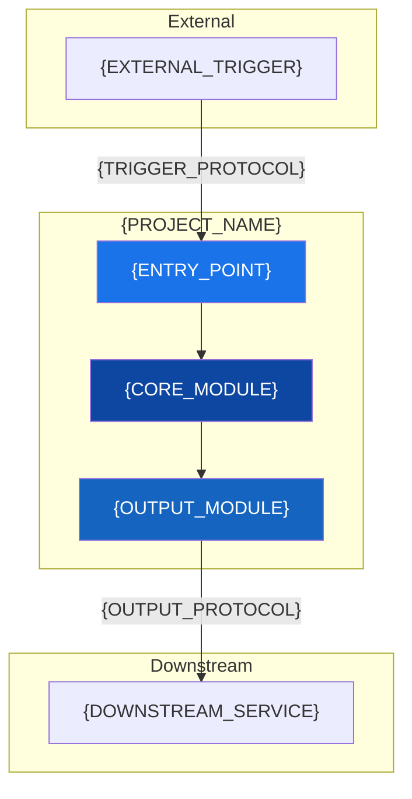
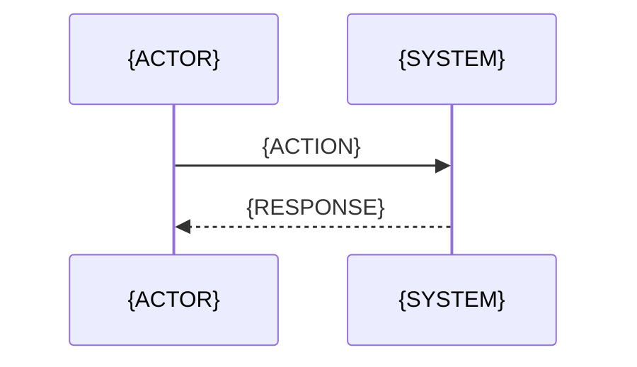
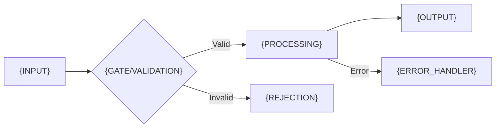
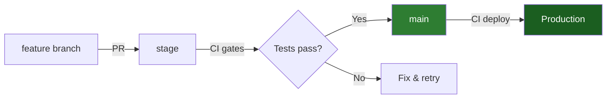

<!-- README Template — ISDD AI Department SOTA Standard -->
<!-- Instructions: Replace all {PLACEHOLDERS}. Remove sections that don't apply. -->
<!-- The skill will auto-detect and fill most values from the project. -->

<div align="center">


<pre style="font-family: monospace; line-height: 1.2;">
     ╭━━━━━●━━━━━╮    ╭━━━━━●━━━━━╮
   ╭━╯  ●━━━━━●  ╰━━━━╯  ●━━━━━●  ╰━╮
  ●╯   ●       ●   ╲╱   ●       ●   ╰●
   ╰━╮  ●━━━━━●  ╭━━━━╮  ●━━━━━●  ╭━╯
     ╰━━━━━●━━━━━╯    ╰━━━━━●━━━━━╯
</pre>

# {PROJECT_NAME}

**{ONE_LINE_DESCRIPTION}**

<!-- Badges: update URLs per project -->
[]()
[]()
[]()
[]()

</div>

---

## Status

| Metric | Value |
|--------|-------|
| **Version** | `{VERSION}` |
| **Runtime** | {RUNTIME_DESCRIPTION} |
| **CI/CD** | [{PIPELINE_NAME}]({PIPELINE_URL}) |
| **Last deploy** | {LAST_DEPLOY_DATE} |
| **Maintainer** | ISDD AI Department |

---

## Architecture



---

## Features

| Feature | Description |
|---------|-------------|
| {FEATURE_1} | {FEATURE_1_DESC} |
| {FEATURE_2} | {FEATURE_2_DESC} |
| {FEATURE_3} | {FEATURE_3_DESC} |

---

## Use Cases

<details>
<summary><strong>{USE_CASE_1_TITLE}</strong></summary>

**Scenario:** {USE_CASE_1_SCENARIO}



**Expected outcome:** {OUTCOME}

</details>

<details>
<summary><strong>{USE_CASE_2_TITLE}</strong></summary>

**Scenario:** {USE_CASE_2_SCENARIO}

**Expected outcome:** {OUTCOME}

</details>

---

## Quick Start

```bash
# Clone
git clone {REPO_URL}
cd {PROJECT_DIR}

# Install dependencies
{INSTALL_CMD}

# Configure
cp .env.example .env
# Edit .env with your values

# Run locally
{RUN_CMD}

# Run tests
{TEST_CMD}
```

---

## Request / Response Flow



---

## Configuration

| Variable | Required | Description | Default |
|----------|----------|-------------|---------|
| `{ENV_VAR_1}` | Yes | {DESC} | -- |
| `{ENV_VAR_2}` | No | {DESC} | `{DEFAULT}` |

> [!NOTE]
> Secrets are managed via Azure Key Vault (`{KV_NAME}`). Never commit `.env` files.

---

## API Reference

{LINK_OR_INLINE_API_DOCS}

<!-- If inline, use this format per endpoint: -->
<!--
### `{METHOD} {PATH}`

| Param | Type | Required | Description |
|-------|------|----------|-------------|
| `{param}` | `{type}` | {yes/no} | {desc} |

**Response:** `{STATUS}` — `{response_shape}`
-->

---

## Project Structure

```
{PROJECT_ROOT}/
├── src/                    # Source code
│   ├── {module_1}/         # {description}
│   └── {module_2}/         # {description}
├── tests/                  # Test suite
│   ├── unit/               # Unit tests
│   └── integration/        # Integration tests
├── docs/                   # Documentation
├── .env.example            # Environment template
├── {BUILD_FILE}            # Build configuration
└── README.md               # This file
```

---

## Good to Know

> [!TIP]
> {HELPFUL_TIP_FOR_NEW_CONTRIBUTORS}

> [!WARNING]
> {IMPORTANT_CAVEAT_OR_GOTCHA}

> [!NOTE]
> {CONTEXT_THAT_SAVES_DEBUGGING_TIME}

---

## Testing

```bash
# Unit tests
{UNIT_TEST_CMD}

# Integration tests (requires {DEPENDENCY})
{INTEGRATION_TEST_CMD}

# Lint + type check
{LINT_CMD}
```

| Suite | Command | Approx. time |
|-------|---------|--------------|
| Unit | `{CMD}` | {TIME} |
| Integration | `{CMD}` | {TIME} |
| Lint | `{CMD}` | {TIME} |

---

## Deployment



> [!WARNING]
> Never deploy directly from CLI. All deployments go through CI pipeline.

---

## Contributing

1. Branch from `main` (or `stage` if it exists)
2. Follow [Conventional Commits](https://www.conventionalcommits.org/) format
3. All tests must pass before PR
4. No TODO/FIXME in production code paths
5. Max 500 LOC per file, 50 LOC per function

---

<div align="center">
<sub>
Built by <strong>ISDD AI Department</strong>
</sub>
</div>
