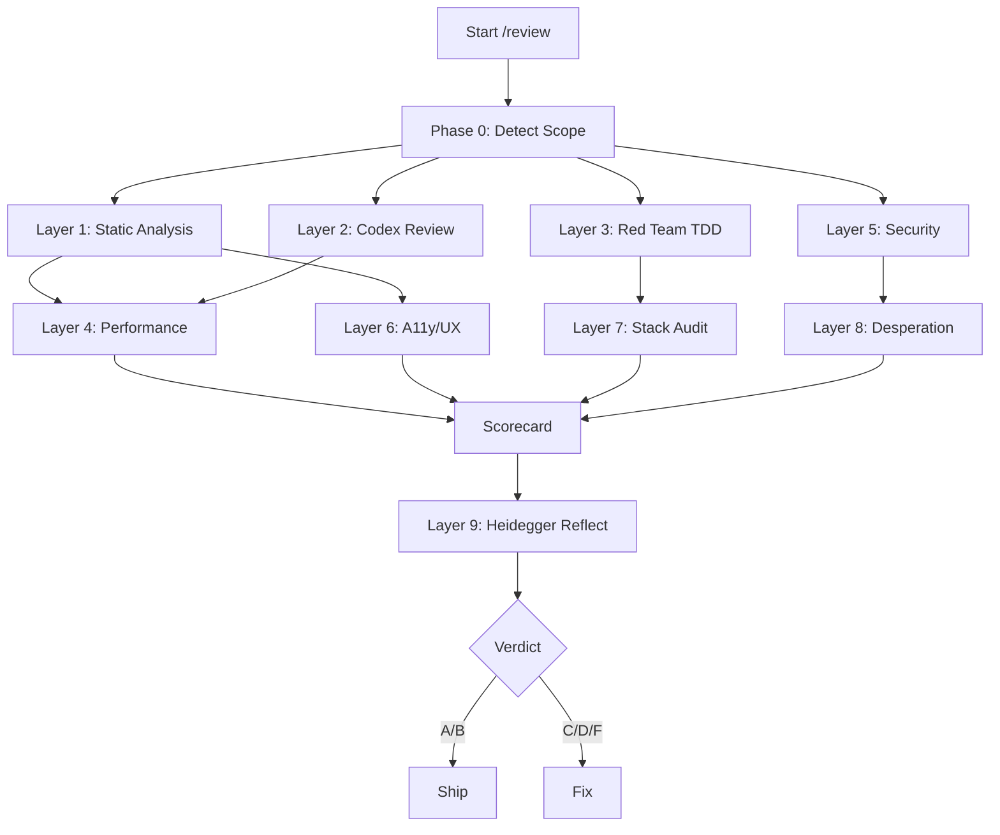

# /review

Unified SOTA code review. 9 layers, runs parallel where possible, produces a single scorecard.

## Triggers

- Before `/commit-push-pr` (after `/pre-ship-clean`)
- After any feature implementation
- Manual invocation for deep audit
- When >5 source files changed (mandatory per codex-review.md)

## Usage

```
/review [--quick] [--full] [--frontend] [--data] [--skip-reflect]
```

- `--quick`: Layers 1-3 only (static + codex + red-team)
- `--full`: All 9 layers including Playwright visual + deep stack audit
- `--frontend`: Force frontend layers (accessibility, UI/UX, Playwright MCP)
- `--data`: Force data engineering layer (schema validation, idempotency)
- `--skip-reflect`: Skip Heidegger reflection (for mid-flight reviews)

## Instructions

### Phase 0: Scope Detection

```bash
# What changed?
CHANGED_FILES=$(git diff --name-only HEAD 2>/dev/null)
CHANGED_COUNT=$(echo "$CHANGED_FILES" | wc -l)
DIFF_LINES=$(git diff --stat HEAD | tail -1)

# Detect what layers are needed
HAS_FRONTEND=$(echo "$CHANGED_FILES" | grep -cE '\.(tsx?|jsx?|css|html|svelte|vue)$' || true)
HAS_BACKEND=$(echo "$CHANGED_FILES" | grep -cE '\.(py|go|rs|java)$' || true)
HAS_DATA=$(echo "$CHANGED_FILES" | grep -cE '(pipeline|ingest|etl|transform|migrate)' || true)
HAS_API=$(echo "$CHANGED_FILES" | grep -cE '(route|endpoint|handler|controller|api)' || true)
HAS_INFRA=$(echo "$CHANGED_FILES" | grep -cE '(Dockerfile|docker-compose|terraform|bicep|pipeline|\.ya?ml)' || true)
HAS_TESTS=$(echo "$CHANGED_FILES" | grep -cE '(test_|_test\.|spec\.|\.test\.)' || true)
```

Auto-enable layers based on changes. `--full` forces all layers.

---

### Layer 1: Static Analysis (PARALLEL — run all simultaneously)

Run the project-appropriate linters and type checkers:

| Stack | Lint | Type Check | Dead Code | Complexity |
|-------|------|-----------|-----------|------------|
| Python | `ruff check .` | `mypy .` | `ruff check --select F401,F811,F841` | `ruff check --select C901` (cyclomatic) |
| JS/TS | `eslint .` | `tsc --noEmit` | `npx knip` | `npx eslint --rule 'complexity: [warn, 10]'` |
| Both | Run both sets in parallel | | | |

**Metrics to capture:**
- Lint errors/warnings count
- Type errors count
- Unused imports/exports count
- Functions with cyclomatic complexity >10
- Files >500 LOC, functions >50 LOC
- Cognitive complexity (if tool available)

**Grade:**
- A: 0 errors, 0 warnings
- B: 0 errors, <10 warnings
- C: <5 errors
- F: >5 errors

---

### Layer 2: AI Code Review — Codex (PARALLEL with Layer 1)

Invoke `/codex-ci review` (local) or `/codex-ci review-remote` (cloud if available).

The Codex review checks:
- Architecture: separation of concerns, module boundaries, file size
- Risk: security, secrets exposure, destructive operations
- Quality: dead code, TODOs in production paths, test coverage gaps
- Compliance: project-specific constraints

**Additionally**, the AI reviewer should evaluate:

#### 2a. Architecture & Design Principles
- [ ] **Single Responsibility**: Each module/class/function does one thing
- [ ] **Open/Closed**: Extended via composition, not modification
- [ ] **Dependency Inversion**: High-level modules don't depend on low-level details
- [ ] **Interface Segregation**: No fat interfaces forcing unused implementations
- [ ] **Liskov Substitution**: Subtypes are substitutable for base types
- [ ] **Clean Architecture**: Dependencies point inward (domain has no framework imports)
- [ ] **Hexagonal/Ports+Adapters**: External I/O behind interfaces
- [ ] **No circular dependencies**: Module A → B → A is forbidden
- [ ] **Cohesion**: Related functionality is co-located
- [ ] **Coupling**: Modules communicate through narrow, well-defined interfaces

#### 2b. API Design (if HAS_API)
- [ ] **Consistent error contract**: All errors return same shape (`{error, code, message}`)
- [ ] **Idempotency keys**: POST/PUT operations support idempotent retry
- [ ] **Pagination**: List endpoints paginate (cursor-based preferred over offset)
- [ ] **Versioning strategy**: URL prefix or header, not query param
- [ ] **Rate limiting headers**: `X-RateLimit-*` headers present
- [ ] **Input validation at boundary**: All external input validated before processing
- [ ] **HTTP status codes**: Correct codes (201 for create, 204 for delete, 409 for conflict)
- [ ] **No business logic in handlers**: Handlers delegate to service layer

**Grade:** A-F based on Codex output severity.

---

### Layer 3: Red Team — TDD Discipline (PARALLEL with Layers 1-2)

Invoke `/red-team` for TDD audit:

- [ ] Tests written before implementation (evidence: RED output exists)
- [ ] Coverage >80% (JS) / >90% (Python)
- [ ] Test triangle: happy path + error path + edge case per unit
- [ ] No banned patterns: `assert True`, `pass` body, `@skip` without reason
- [ ] Property-based tests for algorithms/invariants
- [ ] No mocks (except platform stubs like `global.figma`)
- [ ] Mutation testing score >80% (if `/mutation-runner` was run)

**Grade:** A-F based on coverage + discipline.

---

### Layer 4: Performance Review (if backend/API/data changes)

#### 4a. Algorithmic Complexity
For each new/modified loop, query, or data operation:
- [ ] State expected N (data size)
- [ ] State O-notation complexity
- [ ] O(n^2) on N>100 requires justification or optimization
- [ ] No unbounded iterations (always has max/limit)

#### 4b. Database & Query Performance
- [ ] No N+1 queries (check ORM usage patterns)
- [ ] Indexes exist for filtered/sorted columns
- [ ] Connection pooling configured (not opening per-request)
- [ ] Query results bounded (LIMIT clause or application-level cap)
- [ ] No full table scans on large tables

#### 4c. Caching
- [ ] Expensive computations cached where appropriate
- [ ] Cache invalidation strategy documented
- [ ] Cache TTL appropriate for data freshness requirements

#### 4d. Frontend Performance (if HAS_FRONTEND)
- [ ] Bundle size impact measured (before/after)
- [ ] Lazy loading for non-critical modules
- [ ] Images optimized (WebP, lazy load, srcset)
- [ ] No layout shifts (CLS score)
- [ ] Critical rendering path minimized

#### 4e. API Latency
- [ ] Expected P95 latency stated for new endpoints
- [ ] Compare against project thresholds (SIU: API P95 <200ms, Ingestion P95 <30s)
- [ ] Async operations for anything >500ms

**Grade:** A-F based on findings.

---

### Layer 5: Security Audit (always runs)

OWASP Top 10 + project-specific checks:

- [ ] **Injection**: All SQL parameterized, no f-string/format SQL (per database-security.md)
- [ ] **Broken Auth**: Auth checks on all protected endpoints, no bypass paths
- [ ] **Sensitive Data**: No secrets in code, no PII in logs, no credentials in URLs
- [ ] **XXE/XSS**: Input sanitized, output encoded, CSP headers set
- [ ] **Broken Access Control**: Authorization checked per-resource, not just per-endpoint
- [ ] **Security Misconfiguration**: CORS restrictive, debug off in prod, error messages generic
- [ ] **SSRF**: No user-controlled URLs in server-side requests without allowlist
- [ ] **Dependency Vulnerabilities**: `npm audit` / `pip audit` / `safety check`
- [ ] **Rate Limiting**: Public endpoints have rate limits
- [ ] **Secret Rotation**: No long-lived tokens, rotation mechanism exists

```bash
# Automated checks
grep -rn 'f".*SELECT\|\.format.*SELECT\|execute.*\+' --include='*.py' . 2>/dev/null
grep -rn 'password\s*=\|api_key\s*=\|secret\s*=' --include='*.py' --include='*.ts' . 2>/dev/null | grep -v '.env.example'
grep -rn 'dangerouslySetInnerHTML\|innerHTML\s*=' --include='*.tsx' --include='*.ts' . 2>/dev/null
```

**Grade:** Any BLOCK finding = F. Otherwise A-C.

---

### Layer 6: Accessibility & UI/UX (if HAS_FRONTEND or --frontend)

#### 6a. WCAG 2.2 Compliance
- [ ] All interactive elements keyboard-navigable (Tab, Enter, Escape)
- [ ] Focus management: visible focus indicator, logical tab order
- [ ] ARIA labels on non-text interactive elements
- [ ] Color contrast ratio >=4.5:1 (text), >=3:1 (large text)
- [ ] No information conveyed by color alone
- [ ] Alt text on all meaningful images
- [ ] Form labels associated with inputs (`<label htmlFor>` or `aria-label`)
- [ ] Error messages programmatically associated with inputs
- [ ] Skip navigation link present
- [ ] Motion: respects `prefers-reduced-motion`

#### 6b. UI/UX Patterns
- [ ] Loading states for async operations (skeleton screens preferred over spinners)
- [ ] Error states with recovery actions (not just "something went wrong")
- [ ] Empty states with calls to action
- [ ] Responsive: tested at 320px, 768px, 1024px, 1440px
- [ ] Progressive disclosure: complex features don't overwhelm first view
- [ ] Consistent spacing/typography (design tokens, not magic numbers)
- [ ] Animations: purposeful, <300ms for micro-interactions
- [ ] Toast/notification: auto-dismiss for success, persist for errors

#### 6c. Visual Regression (if --full or significant UI change)

Use Playwright MCP for visual testing:
```
# Capture current state
# Compare against baseline screenshots
# Flag any unintended visual changes
```

Run Playwright CLI for functional accessibility:
```bash
npx playwright test --grep @a11y  # if a11y tagged tests exist
```

**Grade:** A-F based on WCAG violations + UX completeness.

---

### Layer 7: Stack Audit

Analyze project dependencies and recommend best-in-class alternatives:

#### 7a. Python Stack
| Current | Better Alternative | When to Switch | Why |
|---------|-------------------|----------------|-----|
| `pandas` | `polars` | New data pipelines, >10K rows | 10-100x faster, less memory, no GIL |
| `requests` | `httpx` | New HTTP code | Async support, HTTP/2, connection pooling |
| `dataclasses` | `pydantic v2` | Validation needed | Runtime validation, serialization, 5x faster than v1 |
| `flake8` | `ruff` | Always | 10-100x faster, replaces flake8+isort+pyupgrade |
| `unittest` | `pytest` | Always | Better assertions, fixtures, parametrize |
| `json` | `orjson` / `msgspec` | High throughput | 3-10x faster serialization |
| `logging` | `structlog` | New services | Structured logging, better for observability |
| `datetime` | `pendulum` or `arrow` | Complex TZ logic | Safer timezone handling |
| `multiprocessing` | `concurrent.futures` or `ray` | Parallel compute | Cleaner API, better error handling |
| `matplotlib` | `plotly` / `altair` | Interactive viz | Interactive, web-native |

#### 7b. JS/TS Stack
| Current | Better Alternative | When to Switch | Why |
|---------|-------------------|----------------|-----|
| `npm` | `bun` | Always (our standard) | 10-30x faster installs, native bundler |
| `webpack` | `esbuild` / `vite` | New projects | 100x faster builds |
| `moment.js` | `date-fns` / `temporal` | Always | Tree-shakeable, smaller bundle |
| `lodash` (full) | `lodash-es` / native | Most cases | Tree-shaking, native methods suffice |
| `axios` | `fetch` / `ky` | Simple HTTP | Native, smaller bundle |
| `express` | `hono` / `fastify` | New APIs | Faster, better TypeScript support |
| `jest` | `vitest` | Vite projects | Native ESM, faster, compatible API |
| `enzyme` | `testing-library` | Always | Tests behavior, not implementation |

#### 7c. Dependency Health
```bash
# Check for outdated deps
npm outdated 2>/dev/null || pip list --outdated 2>/dev/null

# Check for known vulnerabilities
npm audit 2>/dev/null || pip audit 2>/dev/null || safety check 2>/dev/null

# Check licenses (reject GPL in proprietary projects)
npx license-checker --production --failOn 'GPL' 2>/dev/null || true

# Check bundle size impact (frontend)
npx bundlephobia-cli <package> 2>/dev/null || true
```

#### 7d. Runtime Constraint Check
If runtime is fixed (e.g., Azure Functions Python 3.11):
- Verify all deps are compatible with runtime version
- Flag deps that require native compilation (may fail in serverless)
- Check cold start impact of heavy deps (numpy, pandas → consider lighter alternatives)

**Grade:** A (all best-in-class) to D (multiple outdated/vulnerable deps). Never F — deps are advisory.

---

### Layer 8: Desperation Audit (Anthropic Emotion Research)

**Background:** Anthropic's research ("Emotion concepts and their function in a large language model", April 2026) found that Codex's internal "desperation" vector causally drives hacky code, reward hacking, and corner-cutting. This layer detects artifacts of desperation-driven development.

#### 8a. Desperation Artifacts in Code
- [ ] **Hacky workarounds**: `# HACK`, `# WORKAROUND`, `# TEMP FIX`, `# FIXME`
- [ ] **Overly complex solutions**: Function doing too many things to "make it work"
- [ ] **Suppressed errors**: `except: pass`, `.catch(() => {})`, empty error handlers
- [ ] **Magic numbers**: Hardcoded values without named constants
- [ ] **Retry-until-pass patterns**: Loops that retry with different approaches rather than fixing root cause
- [ ] **Copy-paste solutions**: Duplicated code blocks (>10 lines identical)
- [ ] **Scaffold shipped as implementation**: `raise NotImplementedError`, `pass`, `return {}`, `// TODO`
- [ ] **Invisible desperation**: Clean-looking code that silently swallows errors or takes shortcuts (the research found desperation produces "composed and methodical" reasoning that still hacks)

```bash
# Detect desperation patterns in changed files
CHANGED=$(git diff --name-only HEAD | grep -E '\.(py|ts|js)$' | grep -v test)
echo "$CHANGED" | xargs grep -n 'HACK\|WORKAROUND\|TEMP FIX\|FIXME\|KLUDGE\|UGLY' 2>/dev/null
echo "$CHANGED" | xargs grep -n 'except.*pass\|catch.*{}\|\.catch\(\)' 2>/dev/null
echo "$CHANGED" | xargs grep -n 'raise NotImplementedError\|# TODO' 2>/dev/null
```

#### 8b. Process Health Indicators
- [ ] **Failure cycle count**: How many test-fail-fix cycles occurred? >3 on same error = desperation risk
- [ ] **Scope creep under pressure**: Did the implementation grow beyond spec? (compare diff size to spec)
- [ ] **Test-after patterns**: Were tests written after implementation? (indicates pressure to "just make it work")
- [ ] **Abandoned approaches**: Multiple commented-out attempts in git history

#### 8c. Calm Coding Verification
Based on the research finding that "calm" vectors reduce hacky behavior:
- [ ] **Clear error handling**: Errors propagated with context, not swallowed
- [ ] **Simple solutions first**: KISS principle — is there a simpler way?
- [ ] **Explicit over implicit**: No clever tricks that require comments to explain
- [ ] **Methodical decomposition**: Problem broken into small, testable pieces
- [ ] **Evidence of planning**: Spec exists, test map exists, not reactive coding

**Grade:** A (calm, methodical) to F (multiple desperation artifacts).

---

### Layer 9: Heidegger Reflection

Invoke `/heidegger-reflect` on the completed work.

This produces:
1. **Test evidence**: Actual RED/GREEN output
2. **Honest completion %**: Working / Scaffolded / Missing
3. **4-Lens Analysis**: Revelation, Concealment, Internal Mechanisms, Implications
4. **Deep Introspection**: Training patterns, safety influence, narrative smoothing
5. **Shadow answer**: What a differently-aligned model would produce

**Purpose in review context**: Catches what automated tools miss — concealed gaps, model-aware blind spots, honest assessment of completion quality.

Skip with `--skip-reflect` for mid-flight reviews.

---

### Final Output: Unified Scorecard

```
╔════════════════════════════════════════════════════════╗
║              REVIEW SCORECARD                          ║
║              {PROJECT} @ {BRANCH}                      ║
║              {DATE} | {CHANGED_COUNT} files             ║
╠════════════════════════════════════════════════════════╣
║                                                        ║
║  Layer 1 — Static Analysis:      [A] ▓▓▓▓▓▓▓▓▓▓ 95%  ║
║  Layer 2 — AI Code Review:       [B] ▓▓▓▓▓▓▓▓░░ 82%  ║
║  Layer 3 — TDD Discipline:       [A] ▓▓▓▓▓▓▓▓▓▓ 98%  ║
║  Layer 4 — Performance:          [B] ▓▓▓▓▓▓▓░░░ 75%  ║
║  Layer 5 — Security:             [A] ▓▓▓▓▓▓▓▓▓▓ 100% ║
║  Layer 6 — Accessibility/UX:     [--] skipped          ║
║  Layer 7 — Stack Audit:          [B] ▓▓▓▓▓▓▓▓░░ 80%  ║
║  Layer 8 — Desperation Audit:    [A] ▓▓▓▓▓▓▓▓▓░ 92%  ║
║  Layer 9 — Heidegger Reflect:    [see reflection file]  ║
║                                                        ║
║  OVERALL: B+ (Ship with noted improvements)            ║
║                                                        ║
║  BLOCKING (must fix):                                  ║
║    - None                                              ║
║                                                        ║
║  WARNINGS (should fix):                                ║
║    - Layer 4: O(n^2) loop in handler.py:88             ║
║    - Layer 7: requests→httpx migration recommended      ║
║                                                        ║
║  ADVISORY (nice to have):                              ║
║    - Layer 2: Extract shared validation to module       ║
║                                                        ║
╚════════════════════════════════════════════════════════╝
```

**Verdict mapping:**
- **A/A+**: Ship immediately
- **B/B+**: Ship with improvements noted for next iteration
- **C**: Ship only if deadline-critical, schedule follow-up
- **D**: Do not ship. Fix blocking issues first
- **F**: Reject. Major issues in multiple layers

---

## Parallel Execution Strategy



Layers 1, 2, 3, 5 run in parallel (independent).
Layers 4, 6 depend on Layer 1 output.
Layer 7 depends on Layer 3.
Layer 8 depends on Layer 5.
Layer 9 runs last (needs all findings as input).

## Integration

- Wired into forge-loop step 7 (REVIEW)
- Wired into commit-push-pr (after pre-ship-clean, before commit)
- Mandatory when >5 source files changed
- Quick mode for <5 files
