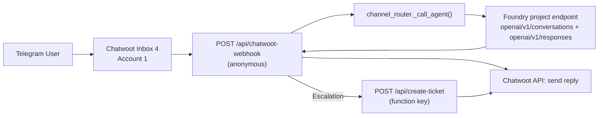

# Axia & Seekapa CS Agents

<p align="center">
  
</p>

<p align="center">
  Azure Functions + Azure AI Foundry runtime for Chatwoot customer support automation.
</p>

## Current Runtime (Deployed)

| Item | Value |
|---|---|
| Function App | `func-cs-agents-dev` |
| Base URL | `https://func-cs-agents-dev.azurewebsites.net` |
| Active Functions | `chatwoot_handler`, `channel_router`, `create_ticket` |
| Chatwoot Account | `1` |
| Allowed Inbox IDs | `4` |
| Default Brand | `seekapa` |

## Interactive Architecture (for meeting/demo)

- Main interactive flow page:
  - [`docs/diagrams/yasha-function-io-flow.html`](docs/diagrams/yasha-function-io-flow.html)

This page contains:
- Clickable input/output scenarios
- Exact URLs
- Exact JSON payloads
- Manual trigger commands
- Telegram scope checks

## Mermaid Nutshell (same flow as HTML)



## Function Contracts

### 1) `chatwoot_handler`

- Endpoint: `POST /api/chatwoot-webhook`
- Auth: `anonymous`
- Purpose: receives Chatwoot webhook, filters allowed traffic, calls Foundry agent, sends reply to Chatwoot
- Required webhook conditions:
  - `event == "message_created"`
  - `message_type == 0` (incoming)
  - `private == false`
  - `sender.type == "contact"`
  - `inbox.id in CHATWOOT_ALLOWED_INBOX_IDS` (currently `4`)

### 2) `channel_router`

- Endpoint: `POST /api/channel-router?code=<FUNCTION_KEY>`
- Auth: `function`
- Purpose: normalized request -> Foundry agent call -> normalized response
- Multi-turn: uses Foundry `conversation` IDs (`conv_...`) via:
  - `POST <PROJECT_ENDPOINT>/openai/v1/conversations`
  - `POST <PROJECT_ENDPOINT>/openai/v1/responses`

### 3) `create_ticket`

- Endpoint: `POST /api/create-ticket?code=<FUNCTION_KEY>`
- Auth: `function`
- Purpose: escalation path (label, private note, set conversation `open`)

## Yasha Interaction Runbook

### A) Real production path (Telegram/Chatwoot)

1. Customer sends message in Telegram account routed to Chatwoot inbox `4`.
2. Chatwoot sends webhook to `chatwoot_handler`.
3. Bot responds in same conversation.

### B) Direct smoke test path (recommended for validation)

1. Get function key:

```bash
az functionapp function keys list \
  -g AZAI_group \
  -n func-cs-agents-dev \
  --function-name channel_router \
  --query default -o tsv
```

2. Turn 1:

```bash
curl -X POST "https://func-cs-agents-dev.azurewebsites.net/api/channel-router?code=<FUNCTION_KEY>" \
  -H "Content-Type: application/json" \
  -d '{
    "channel":"widget",
    "brand":"seekapa",
    "user_id":"demo-user",
    "message":{"message":"My account ID is 777321. Reply ACK."}
  }'
```

3. Turn 2 with returned `conversation_id`:

```bash
curl -X POST "https://func-cs-agents-dev.azurewebsites.net/api/channel-router?code=<FUNCTION_KEY>" \
  -H "Content-Type: application/json" \
  -d '{
    "channel":"widget",
    "brand":"seekapa",
    "user_id":"demo-user",
    "conversation_id":"conv_...",
    "message":{"message":"What account ID did I give you?"}
  }'
```

## Telegram Scope Answer (Account 1 / Inbox 4)

Yes, this scope works in code and deployed config.

It will work end-to-end only if Telegram messages are actually reaching Chatwoot inbox `4`.  
If Telegram -> Chatwoot delivery is broken, no webhook is sent, and functions will not trigger.

## Repository Conventions

- Python tooling: `uv`
- JS/TS tooling: `bun`/`bunx`
- CI pipeline: `azure-pipelines.yml`
- Design/diagram assets: `docs/diagrams/`
